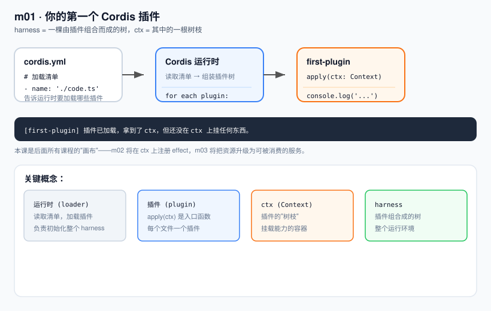

# m01 · 你的第一个 Cordis 插件

> 系列：`learn-deepseek-harness-ts`（用 TypeScript 对齐真实 `deepseek-harness` 运行时）
> 前置：**无需** 克隆 `deepseek-harness` 仓库。课程目录自洽，依赖已随 `package.json` 安装。
> 本课在上一课基础上的定位：**起点课，无前置依赖**

---

## 1. 为什么要先学"插件"而不是先学"AI"

`deepseek-harness` 的内核不是某个 Agent 框架，而是 **Cordis**——一个插件运行时。
在 dsh 里，模型、工具、会话、提示词、甚至整个 Agent 循环，全都是「插件」。

所以第一课我们刻意**不讲任何 AI 概念**，先把最小单元搞清楚：

| 名词 | 含义 |
|---|---|
| **运行时 (loader)** | 读取 `cordis.yml`，把每个插件文件加载成一棵插件树 |
| **插件 (plugin)** | 一个被运行时激活的函数 `apply(ctx)`，在里面做事 |
| **ctx (Context)** | 插件挂载时拿到的"树枝"，后续所有能力都挂在它上面 |
| **cordis.yml** | 告诉运行时"要加载哪些插件"的清单 |

一句话：**harness = 一棵由插件组合而成的树，ctx 是其中的一根树枝。**

---

## 2. 本课代码

文件结构：

```
m01-first-plugin/
├── code.ts          # 插件本体
├── cordis.yml       # 加载清单
├── package.json     # 依赖与 start 脚本
├── node_modules/    # 已安装的 Cordis + tsx（npm install 生成）
├── images/
│   └── architecture.svg
└── README.zh.md
```

### `cordis.yml`（加载清单）

```yaml
- name: './code.ts'
```

运行时按列表把每个文件加载为一个插件。

### `code.ts`（插件本体）

```ts
import type { Context } from '@deepseek-ai/cordis'

// 插件标识，养成"每个插件都有名字"的习惯
export const name = 'first-plugin'

// apply：插件入口。运行时 new 一个 Context 并传给它
export function apply(ctx: Context) {
  console.log('[first-plugin] 插件已加载，拿到了 ctx，但还没在 ctx 上挂任何东西。')
}
```

注意：本课刻意**没有在 ctx 上注册任何东西**，只为证明"插件被激活、且拿到了 ctx"。

---

## 3. 环境准备（只需一次）

课程依赖已写入 `package.json`，在**课程根目录** `m01-first-plugin/` 下安装即可：

```bash
cd m01-first-plugin
npm install
```

这会安装 `@deepseek-ai/cordis`、`@deepseek-ai/cordis-plugin-loader`、`@deepseek-ai/cordis-plugin-include` 与 `tsx`，无需任何全局工具，也无需 deepseek-harness 仓库。

> 说明：这里用的是 npm 上发布的稳定版 `@deepseek-ai/cordis@4.0.1`，
> 其 API（`apply(ctx)` / `cordis.yml` loader）与 dsh 生产代码内核一致，
> 因此本系列所有课程都能和真实 dsh 源码直接对照。

---

## 4. 运行方式

在本课程目录内执行（用课程自带依赖里的 Cordis 启动器）：

```bash
cd m01-first-plugin
node --import tsx ./node_modules/@deepseek-ai/cordis/bin.js
```

或者用 `npm start`（已等价于上面这条）：

```bash
npm start
```

> 关键：`bin.js` 以"当前工作目录"为 `baseUrl` 读取 `./cordis.yml`，
> 并通过本目录的 `node_modules` 解析 `@deepseek-ai/cordis` 与 `tsx`。
> 因此**务必 cd 到课程目录后再运行**，且不要移动文件而不带 `node_modules`。

---

## 5. 运行结果

```
[first-plugin] 插件已加载，拿到了 ctx，但还没在 ctx 上挂任何东西。
```

退出码为 `0`，说明插件已成功被运行时加载并激活。

---

## 6. 心智模型图



- 运行时读取 `cordis.yml` → 为插件 `new Context` → 调用 `apply(ctx)`；
- `apply` 一旦被调用，插件就算"激活"；
- 本课 `ctx` 还是空的——下一课我们往它上面挂第一个"可撤销的资源"。

---

## 7. 本课要点回顾

1. `deepseek-harness` 的一切能力都从「插件」这个最小单元长出来。
2. 一个插件 = 一个 `apply(ctx)` 函数 + 可选的 `name`。
3. `cordis.yml` 是加载清单，运行时据此组装插件树。
4. 本课 `ctx` 是空的，这是后面所有课程的"画布"。

---

## 8. 下一课预告（m02）

在 `ctx` 上用 `ctx.effect(cleanup)` 注册一个**可被撤销**的资源，
并观察运行时卸载时清理函数被逆序调用——这是 Cordis "一切皆可逆"的核心。
我们会在本课基础上**增加**这部分能力，而不是另起炉灶。
