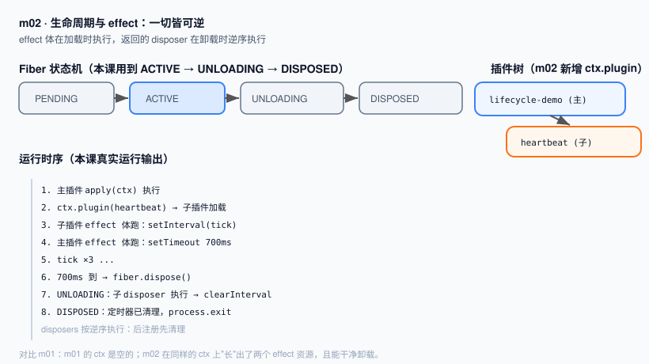

# m02 · 生命周期与 effect：一切皆可逆

> 系列：`learn-deepseek-harness-ts`
> 前置课程：**m01**（已建立"插件 = `apply(ctx)` 函数 + `cordis.yml` 加载"的心智模型）
> 本课在 m01 基础上的定位：**在 m01 那个"空的 ctx"上，长出第一个有生命周期的资源**

---

## 1. 衔接 m01：我们之前缺了什么

m01 里，插件的 `apply(ctx)` 只打了一行日志，然后什么都不做。那时的 `ctx` 是一块干净的画布。

但真实运行时不会被"永久占用"：配置热更新、显式卸载、依赖缺失都会让一个插件**消失**。
如果一个插件在加载时开了定时器、建了连接、起了监听，却没人负责关掉——进程里就会留下"孤儿资源"。

m02 要建立的认知是：

> **Cordis 里"一切注册都是可逆的"。你通过 Cordis 的 API 挂上去的东西，卸载时会被自动收掉；**
> **凡是 Cordis 管不了的（定时器、连接、文件监听），就用 `ctx.effect()` 包起来，并交还一个"清理函数"。**

这就是标题说的——**一切皆可逆**。

---

## 2. 本课核心 API

| API | 作用 | 在何时执行 |
|---|---|---|
| `ctx.effect(body)` | 注册一个 effect；`body` 返回 `disposer` | `body` 在**加载时**执行，`disposer` 在**卸载时**执行 |
| `ctx.plugin(fn)` | 从**代码里**（而非 YAML）再挂一个子插件 | 立即加载，返回它的 `fiber` 句柄 |
| `fiber.dispose()` | 主动卸载一个插件实例 | 触发其所有 disposer，并递归卸载它挂载的子插件 |

> **重要顺序约定**：disposers 按**逆注册顺序**执行（后注册的先清理）。多个异步 disposer 之间并发执行；
> 若清理步骤必须串行，请把它们放进**同一个** disposer 里依次 `await`。

---

## 3. 本课代码（含 m01→m02 的继承标记）

文件结构：

```
m02-effect-and-lifecycle/
├── code.ts          # 插件本体（标注了从 m01 继承 / m02 新增）
├── cordis.yml       # 加载清单（与 m01 相同）
├── package.json     # 依赖与 start 脚本
├── node_modules/    # 已安装 Cordis + tsx
├── images/
│   └── lifecycle.svg
└── README.zh.md
```

### `cordis.yml`（与 m01 完全一致）

```yaml
- name: './code.ts'
```

> 衔接说明：m01 用这个清单加载一个"空"插件；m02 同样的清单，但插件内部多挂了资源。
> **加载机制不变，只是插件"变重了"。**

### `code.ts`（关键片段）

```ts
// —— 从 m01 继承：插件仍是 apply(ctx) 入口 + 可选 name ——
export const name = 'lifecycle-demo'

// 子插件：从代码挂载，不需要 apply 方法，Cordis 直接调用它
function heartbeat(ctx: Context) {
  console.log('[heartbeat] 子插件加载，开始计时')
  ctx.effect(() => {
    const timer = setInterval(() => console.log('[heartbeat] tick'), 200)
    return () => {                    // ← disposer
      clearInterval(timer)
      console.log('[heartbeat] 定时器已清理（disposer 执行）')
    }
  })
}

export function apply(ctx: Context) {
  // —— 继承自 m01 —— 证明插件被激活、拿到了 ctx
  console.log('[lifecycle-demo] 主插件加载，拿到了 ctx')

  // —— 新增 m02 —— 在代码里挂载子插件，保留 fiber 句柄
  const fiber = ctx.plugin(heartbeat)

  // —— 新增 m02 —— 注册一个延时卸载，演示 disposer 被逆序执行
  ctx.effect(() => {
    const stopper = setTimeout(async () => {
      console.log('[lifecycle-demo] 700ms 到，准备卸载子插件...')
      await fiber.dispose()          // 触发 heartbeat 的 disposer
      console.log('[lifecycle-demo] 子插件已卸载，退出')
      process.exit(0)
    }, 700)
    return () => clearTimeout(stopper)
  })
}
```

完整代码见 `code.ts`（文件内用 `// —— 继承自 m01 ——` 与 `// —— 新增 m02 ——` 注释区分了两课边界）。

---

## 4. 环境准备（只需一次）

```bash
cd m02-effect-and-lifecycle
npm install
```

依赖已写入 `package.json`，无需任何全局工具，也无需 deepseek-harness 仓库。

---

## 5. 运行方式

```bash
cd m02-effect-and-lifecycle
npm start
# 等价于：node --import tsx ./node_modules/@deepseek-ai/cordis/bin.js
```

---

## 6. 运行结果

```
[lifecycle-demo] 主插件加载，拿到了 ctx
[heartbeat] 子插件加载，开始计时
[heartbeat] tick
[heartbeat] tick
[heartbeat] tick
[lifecycle-demo] 700ms 到，准备卸载子插件...
[heartbeat] 定时器已清理（disposer 执行）
[lifecycle-demo] 子插件已卸载，退出
```

退出码 `0`。观察要点：

1. 子插件通过 `ctx.plugin(heartbeat)` 被加载，定时器开始 `tick`；
2. 700ms 后主插件主动 `fiber.dispose()`；
3. Cordis 进入卸载流程，**先执行子插件的 disposer**（`clearInterval`），再确认整个子树被拆掉；
4. **没有任何"孤儿定时器"在进程退出后继续跑**——这正是 `ctx.effect` 的价值。

---

## 7. 心智模型图



- 左：Fiber 状态机——本课用到了 `ACTIVE → UNLOADING → DISPOSED` 这一段；
- 右：插件树——主插件在代码里挂了一个子插件，二者通过 `fiber` 句柄关联；
- 下：运行时序——`effect` 体在加载时执行、disposer 在卸载时逆序执行。

---

## 8. 技术阐述：为什么 effect 是 dsh 的"地基"

在 `deepseek-harness` 里，模型、工具、会话、提示词、Agent 循环，**全都是插件**，也全都是 effect。

这意味着一件反直觉但强大的事：

- 你想"动态加一个工具"？挂一个注册 `ctx.tools` 的插件即可；
- 想"在某个会话里临时换一套提示词"？挂一个带作用域的插件，卸载即还原；
- 想"热更新配置"？Cordis 会先卸载旧插件（跑完所有 disposer），再加载新插件。

**没有 effect，就没有"可组合的运行时"。** 你会在 m03 看到 effect 之上如何长出"服务"（Service），
在 m07 之后看到 Agent 的每一个组件都是建立在 effect 上的可卸载能力。

---

## 9. 本课要点回顾

1. 通过 Cordis API 注册的东西，卸载时自动回收；Cordis 管不了的，用 `ctx.effect()` 包起来并交还 disposer。
2. `ctx.effect(body)`：`body` 加载时执行，返回的 `disposer` 卸载时逆序执行。
3. `ctx.plugin(fn)` 可**在代码里**挂子插件，返回 `fiber` 句柄；`fiber.dispose()` 主动卸载并递归清理子插件。
4. 这是 m01"空 ctx"之上的**第一次生长**，且所有生长都是可逆的。

---

## 10. 下一课预告（m03）

m02 的资源只能"自己用"。m03 我们把资源**升级成服务（Service）**：
通过 `ctx.greeter` 这样的"命名能力"注册到 ctx 上，并让**另一个插件**用 `inject: ['greeter']` 声明依赖来使用它。
届时你会看到——乐高式的"声明依赖、自动装配"是怎么来的。
