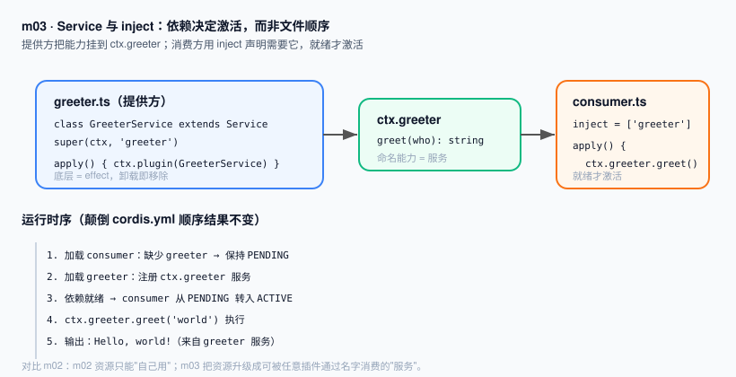

# m03 · Service 服务与 inject 依赖注入

> 系列：`learn-deepseek-harness-ts`
> 前置课程：**m01**（插件 = `apply(ctx)` + `cordis.yml`）、**m02**（ctx.effect 可撤销资源）
> 本课在 m02 基础上的定位：**把"自己用的资源"升级成"可被任意插件按名字消费的命名服务"**

---

## 1. 衔接 m01/m02：我们之前缺了什么

- m01 里，插件拿到了 `ctx`，但什么都没挂——`ctx` 是一块空画布。
- m02 里，我们用 `ctx.effect` 在 `ctx` 上挂了一个**可撤销的资源**（定时器）。但这个资源"只能自己用"，别的插件拿不到它。

真实运行时里，`ctx.tools`、`ctx.llm`、`ctx.agents` 都是公开的"能力"——任何插件都可以通过名字去用，而不需要 import 提供方。
这就是本课要建立的认知：

> **Service = 一个插件提供、其他插件通过 `ctx.<name>` 消费的命名能力。**
> 提供方卸载 → 服务自动消失；消费方用 `inject` 声明依赖 → 依赖就绪才激活，**加载顺序无关**。

这把 m02 的"可撤销资源"从"私有"变成了"可共享、可替换"的乐高积木。

---

## 2. 本课核心 API

| API | 作用 |
|---|---|
| `class X extends Service` + `super(ctx, 'name')` | 把实例注册到 `ctx.name`；底层是 effect，卸载即移除 |
| `declare module '@deepseek-ai/cordis' { interface Context { x: X } }` | 编译期声明合并，让 `ctx.x` 有类型（无运行时开销） |
| `export const inject = ['name']` | 声明本插件依赖哪些服务；Cordis 在依赖就绪前保持 `PENDING` |
| `ctx.plugin(ServiceSubclass)` | 以"类插件"形式挂载一个 Service |

---

## 3. 本课代码（含 m01→m03 的继承标记）

文件结构：

```
m03-service-and-inject/
├── code.ts          # 【当前入口】单文件整合版：provider + consumer 都写在这里，
│                    #   由 cordis.yml 唯一加载，内部用 ctx.plugin 挂子插件，
│                    #   并在 2 秒后 fiber.dispose() 演示卸载。
├── greeter.ts       # 【分文件对照版】服务提供者（与 code.ts 的 provider 等价）
├── consumer.ts      # 【分文件对照版】服务消费者（与 code.ts 的 consumer 等价）
├── cordis.yml       # 加载清单（当前只列 ./code.ts）
├── package.json     # 依赖与 start 脚本
├── node_modules/    # 已安装 Cordis + tsx
├── images/
│   └── service.svg
└── README.zh.md
```

> 衔接说明：m01 的 `cordis.yml` 只列一个空插件；m02 同样只列一个插件（内部用 `ctx.plugin`）；
> **m03 第一次在清单里列"一个文件但内部挂多个子插件"**。
> 下面重点讲 `code.ts`（当前运行的就是它）；`greeter.ts` / `consumer.ts` 留作"分文件对照版"，
> 演示"一个文件一个角色"的写法，逻辑与 `code.ts` 等价，可自行改 `cordis.yml` 切换体验。

### `code.ts`（当前入口 · 单文件整合版）

```ts
import { Service, type Context } from '@deepseek-ai/cordis'

// —— 新增 m03 —— 声明合并，仅编译期类型
declare module '@deepseek-ai/cordis' {
  interface Context {
    greeter: GreeterService
  }
}

// —— 新增 m03 —— Service 子类，本身就是一个插件
export class GreeterService extends Service {
  constructor(ctx: Context) {
    super(ctx, 'greeter')   // 注册到 ctx.greeter（底层是 effect）
  }
  greet(who: string): string {
    return `Hello, ${who}!（来自 greeter 服务）`
  }
}

// —— 新增 m03 —— provider 写成"插件对象"，待被父插件 ctx.plugin 挂载
const provider = {
  name: 'greeter-provider',
  apply(ctx: Context) {
    ctx.plugin(GreeterService)
    console.log('[greeter-provider] 已注册 ctx.greeter 服务')
  },
}

// —— 新增 m03 —— consumer 同样写成插件对象，用 inject 声明依赖
const consumer = {
  name: 'greeter-consumer',
  inject: ['greeter'],
  apply(ctx: Context) {
    console.log(ctx.greeter.greet('world'))
    // —— 继承自 m02 —— 用 effect 注册清理，依赖消失时触发
    ctx.effect(() => {
      return () => {
        console.log('[greeter-consumer] 卸载：依赖消失时我也会被一起拆掉')
      }
    })
  },
}

// —— 入口插件：cordis.yml 唯一加载项 ——
// 一个文件不能平铺两个 export const name/apply（后者覆盖前者），
// 所以用"一个入口 + 内部 ctx.plugin 挂子插件"的方式整合。
export const name = 'demo-entry'
export function apply(ctx: Context) {
  const providerFiber = ctx.plugin(provider)
  const consumerFiber = ctx.plugin(consumer)

  setTimeout(async () => {
    // dispose() 是异步的，必须 await，否则 process.exit 会在清理前杀进程
    await providerFiber.dispose()  // → ctx.greeter 移除，consumer 因依赖消失自动卸载
    await consumerFiber.dispose()
    console.log('[demo-entry] 已整体卸载，进程结束')
    process.exit(0)
  }, 2000)
}
```

### `cordis.yml`（当前指向单文件版）

```yaml
- name: './code.ts'
```

### 分文件对照版（可选体验）

把 `cordis.yml` 改成下面这样即可改用 `greeter.ts` + `consumer.ts`（逻辑等价）：

```yaml
- name: './greeter.ts'
- name: './consumer.ts'
```

> 把这两行颠倒顺序运行，结果完全一致——这正是 `inject` 的价值：激活顺序由依赖决定，而非文件行序。
> 注意：分文件版不演示"卸载日志"（没有显式 dispose），只有单文件版 `code.ts` 会在 2 秒后打印卸载日志。

---

## 4. 环境准备（只需一次）

```bash
cd m03-service-and-inject
npm install
```

---

## 5. 运行方式

```bash
cd m03-service-and-inject
npm start
# 等价于：node --import tsx ./node_modules/@deepseek-ai/cordis/bin.js
```

---

## 6. 运行结果

```
[greeter-provider] 已注册 ctx.greeter 服务
Hello, world!（来自 greeter 服务）
[greeter-consumer] 卸载：依赖消失时我也会被一起拆掉
[demo-entry] 已整体卸载，进程结束
```

进程约 2 秒后自动退出（退出码 `0`）。观察要点：

1. 提供方插件挂载 `GreeterService`，`ctx.greeter` 就绪；
2. 消费方因 `inject: ['greeter']`，在同一 ctx 树上、provider 已就绪后激活，直接 `ctx.greeter.greet('world')` 成功；
3. 2 秒后 `providerFiber.dispose()` 移除 `ctx.greeter`，Cordis 让依赖它的 consumer **自动卸载** → 触发其 `ctx.effect` 的清理函数，打印"卸载"日志；
4. `await` 两个 fiber 的 dispose 后再 `process.exit(0)`，确保清理函数完整执行。

**加载机制补充**（回答"为什么单文件要这么写"）：

- loader 只执行 `cordis.yml` 里列出的文件；当前只列 `./code.ts`。
- 一个文件若平铺多个 `export const name` / `export function apply`，loader 只认其中一个（后者覆盖前者）。因此 `code.ts` 用"一个入口插件 `demo-entry` + 内部 `ctx.plugin` 挂 provider/consumer 子插件"来整合。
- `Context` 是 proxy，**没有 `ctx.dispose` 方法**（直接调会报 `cannot get property "dispose" without inject`）。正确卸载是用 `ctx.plugin()` 返回的 **fiber** 对象调用 `fiber.dispose()`，且它是异步的，必须 `await`。

**分文件对照版验证**：把 `cordis.yml` 改成 `greeter.ts` 在前、`consumer.ts` 在后（或颠倒），再跑，前两条日志完全一致——说明 Cordis 不依赖文件顺序，consumer 先加载时进入 `PENDING`，等 greeter 就绪才转入 `ACTIVE`。（分文件版不演示卸载日志。）

---

## 7. 心智模型图



- 左：提供方 `greeter.ts` 把能力注册到 `ctx.greeter`；
- 中：`ctx.greeter` 是命名服务（底层是 effect，卸载即移除）；
- 右：消费方 `consumer.ts` 用 `inject` 声明依赖，就绪才激活；
- 下：时序——颠倒顺序结果不变，依赖而非行序决定激活。

---

## 8. 技术阐述：为什么 Service + inject 是 dsh 的"乐高接口"

在 `deepseek-harness` 里，**一切能力都是 Service**：

- `ctx.tools` 是"工具服务"，谁能提供工具谁就 `ctx.plugin` 一个 tools 提供方；
- `ctx.llm` 是"模型服务"，本地 mock、云端 API、不同厂商，都是可替换的 provider；
- `ctx.agents` 是"子代理服务"，不同 agent 是不同的 provider 实现。

`inject` 带来两个反直觉但强大的属性：

1. **加载顺序无关**：你不用手动排"先装工具再装 loop"，依赖图自己决定；
2. **可热替换**：卸载某个 provider、挂上另一个同名的，所有 `inject` 它的插件会**自动卸载再重新加载**到新实现上——这就是 dsh 配置驱动"换一套模型/换一套工具"却不改业务代码的底层机制。

下一课（m04）你会看到：当多个 Service 之间形成依赖链（A 依赖 B 依赖 C），Cordis 会按依赖图**自动**排好激活顺序——这正是 m03 `inject` 的自然延伸。

---

## 9. 本课要点回顾

1. Service = 一个插件提供、其他插件通过 `ctx.<name>` 消费的命名能力；底层仍是 effect（m02 继承）。
2. `super(ctx, 'name')` 注册服务；`declare module` 只补类型，无运行时开销。
3. 消费方用 `export const inject = [...]` 声明依赖；Cordis 在依赖就绪前保持 `PENDING`，**加载顺序无关**。
4. 这是 m02"私有资源"第一次变成"可共享、可替换的乐高积木"。

---

## 10. 下一课预告（m04）

m03 是一个 provider + 一个 consumer。m04 我们串成**依赖链 A → B → C**：
让 C 依赖 B、B 依赖 A，验证 Cordis 自动按依赖图排序激活，且乱序写配置也能跑。
届时你会完整看到 dsh "声明依赖、自动装配"的威力。
