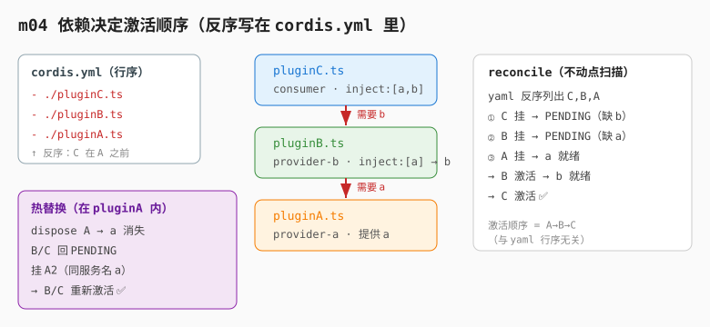

# m04：依赖决定激活顺序（不是 cordis.yml 行序）

> 衔接：[m01 第一个插件](../m01-first-plugin/) → [m02 effect 与生命周期](../m02-effect-and-lifecycle/) → [m03 服务与注入](../m03-service-and-inject/) → **`m04`** → m05 …

> **参考说明**：本课的脉络参考了 Python 版 `learn-deepseek-harness` 的 **s04（依赖激活）**，
> 但**不照抄**——代码全部用 TypeScript 跑在真实 Cordis 上，并与本系列 m01~m03 的写法连贯。
> 思路对齐点：① 依赖决定激活而非列表顺序；② 同一机制管启动顺序与热替换；③ 依赖命名的是"服务"不是"插件身份"。

---

## 1. 问题（从 m03 自然延伸）

m03 我们已经用 `inject` 解耦了"服务"和"具体实现"：consumer 只声明 `inject: ['greeter']`，不关心 greeter 是谁提供的、何时就绪。

但 m03 的 `cordis.yml` 是**按依赖顺序**列的（`greeter.ts` 在前、`consumer.ts` 在后）。这隐藏了一个脆弱约定：

```yaml
- name: './greeter.ts'   # 必须先有提供者
- name: './consumer.ts'  # 消费者后挂
```

如果把它**颠倒**，m03 仍能跑（因为我们验证过），但这靠的是"运行时已就绪"。在真实系统里，配置项可能并发启动、bundle 从多处插入、provider 可能在热重载时卸载——**不能靠手工排好拓扑顺序**。

> 配置项应该回答"应用包含什么"，而不是手工编码一个脆弱的激活顺序。

更深层的问题：**依赖必须支配整个生命周期，不只是启动阶段**。
如果 `greeter` 在 consumer 捕获它之后消失，consumer 会保留一个过期引用；重新挂载 provider 时，老 consumer 仍调旧对象。

---

## 2. 解决方案：依赖决定激活



每个插件声明它**所需的能力**（服务名），而不是"必须哪个插件先跑"：

```ts
const pluginB = {
  name: 'provider-b',
  inject: ['a'],          // 需要服务 a（能力名，不是插件名）
  apply(ctx) { ctx.plugin(ServiceB) },
}
```

挂载（`ctx.plugin`）始终创建一个 fiber，但在所有必需服务都存在之前，这个 fiber 保持 **PENDING**：

```text
挂 C（缺 b）→ PENDING
挂 B（缺 a）→ PENDING
挂 A       → a 就绪 → B 激活 → b 就绪 → C 激活
```

这套机制**同时处理**初始顺序和热替换：

```text
A 卸载      → B/C 因依赖消失回到 PENDING
A2 挂载     → a 就绪 → B 激活 → C 用新 a 重新激活
```

consumer 源码完全不变，只是"重新跑了一遍 apply"，解析到的是**当前**服务。这就是可替换 shell / 存储后端 / 模型适配器 / loop driver 背后的最小语义。

---

## 3. 本课代码（含 m01→m04 的继承标记）

文件结构：

```
m04-dependency-activation/
├── pluginA.ts       # 独立插件：链首 provider，提供 a；并自包含"热替换"演示
├── pluginB.ts       # 独立插件：链中 provider，要求 a、提供 b
├── pluginC.ts       # 独立插件：末端 consumer，要求 a、b，打印整条链
├── cordis.yml       # 故意【反序】列出 C、B、A（反序真正在 yaml 层）
├── package.json     # 依赖与 start 脚本（复用 m03 的 node_modules 软链）
├── tsconfig.json
├── images/
│   └── dependency-activation.svg
└── README.zh.md
```

> 关键：三个角色是**互不 import 的独立文件**，没有"入口文件"去 `ctx.plugin` 它们。
> 它们只由 `cordis.yml` 加载，激活顺序完全由各自的 `inject` 依赖图决定。
> 这比 m03 的"单文件内部反序"更直观——**反序直接写在 yaml 里，行序与激活顺序脱钩**。

> 衔接：m01 只挂空插件；m02 用 `ctx.plugin` 挂子插件 + `fiber.dispose()`；
> m03 用 `inject` 解耦服务与实现（单文件内部挂 provider/consumer）；
> **m04 把三个角色拆成独立文件，让 `inject` 沿依赖链 `A→B→C` 跨文件生效，并在 yaml 层反序验证"行序无关"**。

### `pluginA.ts`（链首 provider + 热替换演示）

```ts
import { Service, type Context } from '@deepseek-ai/cordis'

// —— 新增 m04 —— 声明 a 的服务类型 ——
declare module '@deepseek-ai/cordis' {
  interface Context { a: ServiceA }
}

// —— 新增 m04 —— 链首 provider：提供 a ——
export class ServiceA extends Service {
  constructor(ctx: Context) { super(ctx, 'a') }
  whoami() { return 'A' }
}

export const name = 'provider-a'
export function apply(ctx: Context) {
  // 挂载 ServiceA（提供 a），返回 fiber 以便热替换时 dispose
  const fiberA = ctx.plugin(ServiceA)
  console.log('[A] 已注册 ctx.a 服务')

  setTimeout(async () => {
    // —— 演示"热替换"：只拆链首 A，B/C 因依赖消失自动回到 PENDING ——
    console.log('\n--- 演示热替换：只拆链首 A，挂载 A2（同服务名不同实现）---')
    await fiberA.dispose()

    // A2：同服务名 'a'，不同实现（whoami 返回 'A2'）
    const pluginA2 = {
      name: 'provider-a2',
      apply(ctx2: Context) {
        ctx2.plugin(class extends ServiceA {
          whoami() { return 'A2' }
        })
        console.log('[A2] 已注册 ctx.a 服务（新实现）')
      },
    }
    ctx.plugin(pluginA2) // a 就绪 → B 激活 → C 用新 a 重新激活

    setTimeout(() => {
      console.log('[provider-a] 演示结束，进程退出')
      process.exit(0)
    }, 500)
  }, 500)
}
```

### `pluginB.ts`（链中 provider）

```ts
import { Service, type Context } from '@deepseek-ai/cordis'

// —— 新增 m04 —— 声明 b 的服务类型 ——
declare module '@deepseek-ai/cordis' {
  interface Context { b: ServiceB }
}

// —— 新增 m04 —— 链中 provider：要求 a，提供 b ——
export class ServiceB extends Service {
  constructor(ctx: Context) { super(ctx, 'b') }
  whoami() { return 'B' }
}

export const name = 'provider-b'
export const inject = ['a'] // 模块级导出：声明本插件需要服务 a
export function apply(ctx: Context) {
  // a 未就绪时本插件 PENDING，apply 暂不执行；a 一到才激活
  ctx.plugin(ServiceB)
  console.log('[B] 已注册 ctx.b 服务（依赖 ctx.a 已就绪）')
}
```

### `pluginC.ts`（末端 consumer）

```ts
import type { Context } from '@deepseek-ai/cordis'

// —— 新增 m04 —— 末端 consumer：要求 a、b，打印整条链（纯消费者，不注册新服务）
export const name = 'consumer-c'
export const inject = ['a', 'b'] // 模块级导出：需要服务 a 和 b
export function apply(ctx: Context) {
  console.log(`[C] 链路打通：a=${ctx.a.whoami()} → b=${ctx.b.whoami()} → c=ok`)
}
```

### `cordis.yml`（反序在 yaml 层）

```yaml
# m04：故意【反序】列出 C、B、A，证明"依赖决定激活、与 cordis.yml 行序无关"。
# 三个文件都是独立插件，互不 import；激活顺序由依赖图（inject）决定，不是这里的行序。
- name: './pluginC.ts'
- name: './pluginB.ts'
- name: './pluginA.ts'
```

---

## 4. 运行方式

依赖通过软链接复用 m03 已安装的 `node_modules`（无需重复 `npm install`）：

```bash
cd learn-dsh-ts/m04-dependency-activation
npm start
# 等价于：node --import tsx ./node_modules/@deepseek-ai/cordis/bin.js
```

---

## 5. 运行结果

```
[A] 已注册 ctx.a 服务
[B] 已注册 ctx.b 服务（依赖 ctx.a 已就绪）
[C] 链路打通：a=A → b=B → c=ok

--- 演示热替换：只拆链首 A，挂载 A2（同服务名不同实现）---
[A2] 已注册 ctx.a 服务（新实现）
[B] 已注册 ctx.b 服务（依赖 ctx.a 已就绪）
[C] 链路打通：a=A2 → b=B → c=ok
[provider-a] 演示结束，进程退出
```

观察要点：

1. **反序挂载仍跑通**：`cordis.yml` 故意反序列出 `pluginC.ts`、`pluginB.ts`、`pluginA.ts`（C 在前），但激活顺序由依赖图决定为 `A → B → C`。注意输出里 `[B]` 出现在 `[A]` 之后、`[C]` 最后——与 yaml 行序（C、B、A）完全脱钩。
2. **依赖命名的是服务不是插件**：B 声明 `inject:['a']`，不关心 a 是 pluginA 还是 pluginA2 提供的。
3. **热替换**：`dispose` 链首 A 后，B/C 因依赖消失回到 PENDING；挂载 A2（同服务名 `'a'`、不同实现）→ B/C **重新激活**，C 用新的 `a.whoami()==='A2'` 重新打印链路。
4. **consumer 源码零改动**：切换 provider 不需要改 C 一行代码。

### 实验：交换挂载顺序

把 `cordis.yml` 里三行的顺序任意打乱（例如改成 A、C、B 或 B、A、C），输出完全相同——证明激活由依赖图决定，而非 yaml 行序或 `ctx.plugin` 调用顺序。

---

## 6. 心智模型

```text
                  inject 声明（所需能力）
   pluginC ──需要 b──▶ pluginB ──需要 a──▶ pluginA
   (consumer)          (provider-b)        (provider-a)
                        提供 b              提供 a

   reconcile 不动点扫描：
     缺前置 → PENDING（apply 不运行，不持有半配置资源）
     前置齐 → ACTIVE
     前置失 → 回 PENDING（仍挂载，等服务重现）
```

与 m03 的关系：m03 是"两个角色（provider/consumer）点对点解耦"；m04 把解耦**沿链扩展**为"多跳依赖 + 生命周期跟随"。`inject` 在 m03 解决"启动时不耦合"，在 m04 解决"整个生命周期不耦合"。

---

## 7. 课程边界

m04 改变的是**激活调度**，不是服务契约：

```diff
 插件对象写法（m03 已引入）
+  inject 可串成依赖链（A→B→C）
+  反序挂载 / 配置顺序无关
+  热替换：provider 身份可变，服务名不变，consumer 重新激活
```

它仍然没有通用事件总线。当"无关插件想观察某个事实（工具结果、会话追加、状态变化）"时，让每个观察者都变成必需服务又会把生产者/消费者重新耦合——这正是 m05（Events 事件/瀑布）要解决的。

---

## 8. 接下来是什么

→ **m05 Events**：通过 `ctx.on` / `ctx.emit` 发布事实，无需知道谁在监听；监听器注册跟随各自的插件 fiber。

---

## 9. 需要注意的点

1. 挂载是"声明存在"，激活等"能力前置条件"满足（`inject` 全就绪）。
2. 依赖命名**服务**（`inject:['a']`），不要命名**插件身份**（那样只是把耦合挪到配置里）。
3. provider 卸载 → 依赖它的 consumer 先回到 PENDING，再随新 provider 重新激活。
4. 同一套机制同时解决"启动顺序"和"热替换"，无需两套代码。
5. `fiber.dispose()` 需 `await`（异步）；只拆链首即可演示热替换，**不要** dispose 整个 consumer 链（否则 consumer 被彻底销毁，不会自动重现）。
