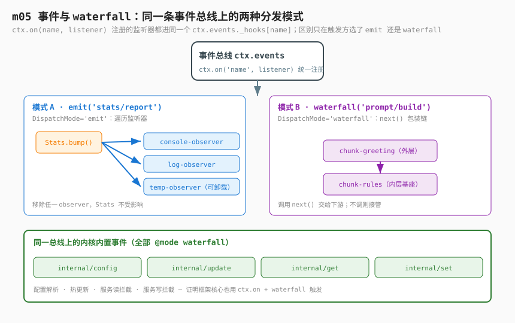

# m05：事件与 waterfall（单向观察 + 包装链）

> 衔接：[m01 第一个插件](../m01-first-plugin/) → [m02 effect 与生命周期](../m02-effect-and-lifecycle/) → [m03 服务与注入](../m03-service-and-inject/) → [m04 依赖激活](../m04-dependency-activation/) → **`m05`** → m06 …

> **参考说明**：本课脉络参考 Python 版 `learn-deepseek-harness` 的 **s05（事件）** 与 **s06（waterfall）**，
> 但**不照抄**——代码全部用真实 Cordis 的 `ctx.on` / `ctx.emit` / `ctx.waterfall` 实现，并与本系列 m01~m04 连贯。
> 思路对齐：① 生产者只命名"事实"，不知道谁在监听；② waterfall 用 `next()` continuation 串成包装链；③ 监听器是 effect，随 fiber 自动卸载。

---

## 1. 问题（从 m03/m04 自然延伸）

m03 用 `inject` 解耦了"服务"和"实现"，m04 证明了依赖图驱动整个生命周期。但有一类通信**不该建模成服务**：

- 某个会话追加了一条事件；
- 某个 agent 状态变化；
- 某个工具执行完成；
- 一条计数被提交。

如果生产者直接 `import` 每一个观察者，扩展性无从谈起：

```ts
// ❌ 把观察者硬编进生产者，移除 telemetry 甚至可能导致 session 无法工作
session.append(event)
jsonl_persistence.write(event)
telemetry.record(event)
web_ui.push(event)
```

更糟的是：若观察者变成**必需服务**，移除 `telemetry` 会让 `session` 都加载不了——尽管 session 没有它也能工作。**观察变成了激活依赖**。

我们需要一种**单向通知**机制：生产者只知道"事件名 + 负载"，不知道谁在监听、有没有人监听。

---

## 2. 解决方案



Cordis 的 `Context` 内置事件总线，方法 mix 到 `ctx` 上：

```ts
ctx.on('stats/report', (name, count) => { /* 观察 */ })   // 注册监听器（effect）
ctx.emit('stats/report', name, count)                     // 广播事实（忽略返回值）
const result = await ctx.waterfall('prompt/build', base, (t) => t) // 包装链
```

- **事件（emit）**：生产者只命名事实，零个/多个 observer 独立收到；返回值被忽略。
- **waterfall**：每个 listener 收到 `(...args, next)`，调用 `next(...)` 把控制交给下游；不调用而直接返回则"接管/否决"。最后组装结果。

**监听器是一种 effect**（m02 已讲）：注册时绑定到当前插件 fiber，插件卸载时自动消失。

### 事件与 waterfall 是同一条总线上的两种分发模式

这是本课最容易被忽略、也最关键的一点：**`emit` 和 `waterfall` 不是两套机制，而是同一条事件总线（`ctx.events`）的两种「分发模式（DispatchMode）」**。

回顾第 2 节开头三行：`ctx.on('stats/report', …)` 注册的监听器、`ctx.emit('stats/report', …)` 触发的广播、`ctx.waterfall('prompt/build', …)` 触发的包装链——它们的监听器**都是同一个 `ctx.on(name, listener)` 注册进去的，存进同一个 `_hooks[name]` 列表**。

区别只在「触发时怎么把监听器排成一条管线」：

```text
                          ctx.on(name, listener)  ← 注册，两者完全一样
                                       │
                  ┌────────────────────┴────────────────────┐
                  │                                          │
          emit('name', ...args)                      waterfall('name', ...args, base)
                  │                                          │
   DispatchMode='emit'：                            DispatchMode='waterfall'：
   遍历 _hooks[name]，逐个调用；                    遍历 _hooks[name]，但把"下一个"
   返回值被丢弃（只观察）；                          包成 next() 串成洋葱链；
   监听器之间互不知道彼此。                          返回值沿 next() 向上传递、可层层包裹。
                  │                                          │
          stats/report / prompt/ready                 prompt/build（greeting 包 rules）
```

对应到 Cordis 源（与本课所用真实库同构）：

- `emit(...)` 只是 `dispatch('emit', args).map(cb => cb(...args))`——**遍历、调用、丢弃返回值**；
- `waterfall(...)` 把最后一个参数当作最内层基座 `inner`，再生成一个 `next()`：`cbs.shift() ?? inner`——**每调一次 `next()` 就进入下一个监听器，直到基座**。

**那么"谁是外层、谁是内层"由什么决定？** 答案是**监听器进入 `_hooks[name]` 数组的先后**——不是文件名字母序、不是依赖关系、不是魔法，就是数组下标：

```js
// Cordis 源：register —— 监听器进数组的位置
const method = options.prepend ? "unshift" : "push";
hooks[method]({ ctx, callback, ...options })   // 默认 push：追加到尾部

// Cordis 源：dispatch —— 触发时直接返回数组（不再排序）
return (this._hooks[name] || [])
  .filter(hook => hook.global || !filter || filter.call(thisArg, hook.ctx))
  .map(hook => hook.callback.bind(thisArg))     // 顺序 = 数组顺序

// Cordis 源：waterfall —— 从数组头部开始 shift
const cbs = this.dispatch("waterfall", args);
const next = () => (cbs.shift() ?? inner)(...args);  // 先 shift 的是最外层
```

推演三条铁律：

1. **默认（不传 `prepend`）：谁先被 `ctx.on` 注册，谁在数组最前面 → 谁就是最外层**；最后注册的在最内层（紧挨着基座 `inner`）。
2. **`ctx.on(name, fn, true)`（即 `prepend:true`）：用 `unshift` 插到数组最前 → 它强制成为最外层**，哪怕它是最后才写的代码。
3. **`dispatch` 不做二次排序**——数组顺序就是触发顺序，所以"外层/内层"完全等价于"注册顺序（或 prepend 插入位置）"。

对应到本课：`chunkGreeting.ts` 与 `chunkRules.ts` 都是普通 `ctx.on`（没传 `prepend`），因此**谁先被加载、谁的 `apply` 先跑，谁就在外层**。而加载顺序由 `cordis.yml` 的列表行序决定——`chunkGreeting.ts` 写在 `chunkRules.ts` 之前，所以 greeting 先 `apply`、先 `push` → 成为最外层（先拿到 `text`，调 `next()` 交给内层）；rules 后 `push` → 最内层、紧挨基座。

> 反过来说：如果你把 `cordis.yml` 里两行对调，`chunkRules` 先注册就会变成最外层——它本应"不调 next 直接返回"的基座行为不变，但会先收到 `text` 并直接 return，greeting 的 `next()` 永远拿不到内层结果，**包装层级就反转了**。这就是第 5 节"实验"要演示的。

所以「事件」和「waterfall」的本质区别只有一句话：**监听器收到的是普通参数，还是 `(...args, next)`**。生产者用 `emit` 还是 `waterfall` 触发，决定监听器处于「单向观察」还是「包装链」角色——**监听器本身不知道自己会被哪种方式触发**，这正是为什么它们可以共享、可独立卸载、可复用。

> 一句话心智模型：`on` 是「订阅话题」，`emit`/`waterfall`/`parallel`/`serial`/`bail` 是「这个话题被喊话时，听众以什么队形应答」。本课只用其中两种（emit 观察、waterfall 包装），其余三种（parallel 并发、serial 串行收集、bail 首个有效值）是同一总线上的兄弟模式。

### Cordis 自己的内核也在用同一套设施（内置事件全是 waterfall）

最能证明「事件总线 + 多种分发模式在同一套设施上共存」的，是 **Cordis 连自己的核心机制——配置解析、服务读写、热更新——都是用 `ctx.on` 注册、再 `waterfall` 触发的**。这些不是某个业务插件的能力，而是框架本身。在 Cordis 的事件类型声明里，有一组以 `internal/` 为前缀的内置事件，其中 4 个明确标注 `@mode waterfall`：

```ts
// 来自 Cordis 内核的 Events 接口声明（节选）
export interface Events {
  /** Resolve raw plugin config after the fiber's injections become active.
   *  @mode waterfall */
  'internal/config'(this: Fiber, config: any, next: () => any): any
  /** Waterfall: a fiber config update is being applied; skip next() to veto. */
  'internal/update'(this: Fiber, config: any, noSave: boolean, next: () => void | Promise<void>): void | Promise<void>
  /** Waterfall: a service is being read through the context proxy. */
  'internal/get'(ctx: Context, name: string, error: Error, next: () => any): any
  /** Waterfall: a service is being written through the context proxy. */
  'internal/set'(ctx: Context, name: string, value: any, error: Error, next: () => boolean): boolean
}
```

含义对照：

| 内置事件 | 触发场景 | waterfall 的意义 |
|---|---|---|
| `internal/config` | 插件 fiber 的依赖（inject）激活后，解析它的原始 config 时 | 各层 listener 可改写/插值配置，**最后一层 `next` 才是「不处理直接返回」的基座**——和你本课 `prompt/build` 的 `(base)=>base` 一模一样 |
| `internal/update` | 调用 `fiber.update(newConfig)` 热更新配置时 | 各 listener 可在 `next()` 前后做持久化/日志；**不调 `next()` 即否决本次更新**（m06 的 HMR 正是挂在这里） |
| `internal/get` | 通过 `ctx.xxx` 读取一个服务时（Context 是 proxy） | 读拦截器：可缓存、可替换返回值、可抛错；`next()` 才是真正的「去表里取值」 |
| `internal/set` | 通过 `ctx.xxx = …` 写入一个服务时 | 写拦截器：返回 `false` 即拒绝写入；`next()` 才是真正的「落库」 |

而 Cordis 自己正是用 `ctx.on` 在这些内置事件上挂监听器，再用 `waterfall(...)` 触发——和你在本课 `prompt.ts` 里 `this.ctx.waterfall('prompt/build', '', base => base)` 的写法**同构**：

```ts
// Cordis 内核：fiber 解析配置 —— 与你的 prompt/build 包装链同构
private _resolveConfig(config: any) {
  config = this.context.waterfall(this, 'internal/config', config, () => config)
  //                                                          ^^^^^^^^^ 最内层基座，不处理直接返回
  return this.runtime ? resolveConfig(this.runtime, config) : config
}

// Cordis 内核：loader 用 ctx.on 挂一个 internal/config 的改写器（插值 ${ENV}）
ctx.on('internal/config', function (this: Fiber, _config, next) {
  const config = next()
  if (!this.entry || this.parent.fiber?.entry === this.entry) return config
  return interpolate(this.ctx, config)   // 在外层包裹：把 ${...} 替换为环境变量
}, { global: true })

// Cordis 内核：服务读拦截器
return ctx.events.waterfall('internal/get', ctx, prop, error, () => {
  //                                          ^^^^^^^^^ 基座：真正去 ctx 表里取值
  return ctx.reflect.get(prop, error)
})
```

**这彻底坐实了本课的论点**：

1. 你手写业务插件的 `stats/report`（emit 观察）和 `prompt/build`（waterfall 包装），与 Cordis 内核的 `internal/config`/`internal/update`/`internal/get`/`internal/set`（waterfall 拦截），**注册用的都是 `ctx.on`，底层都是同一个 `ctx.events._hooks` 总线**。
2. 区别只在于触发方选了哪种 DispatchMode：**emit（观察事实）vs waterfall（包装/拦截/否决）**。同一个总线，既能让 logger 单向观察，也能让配置解析被层层改写、让服务读写被拦截——这就是「事件总线 + 多种分发模式」在同一套设施上共存的最佳证明。
3. 反过来读：当你未来在 dsh 真实源码里看到 `ctx.on('internal/get', …)` 或 `fiber.waterfall('internal/update', …)`，你一眼就认出——**那不是魔法，就是 m05 这课讲的事件与 waterfall**。

### 何时用事件 / 服务 / waterfall

| 需求 | 机制 |
|---|---|
| 调用一个能力并用其结果 | 服务方法（`ctx.xxx.do()`） |
| 向独立观察者宣布一个事实 | 事件（`ctx.emit`） |
| 请求一条链来转换/否决某个行为 | waterfall（`ctx.waterfall`） |

---

## 3. 本课代码（含 m01→m05 的继承标记）

文件结构：

```
m05-events-and-waterfall/
├── stats.ts            # 服务：计数器 + bump 后 emit('stats/report')（事件生产者）
├── reporterConsole.ts  # 事件观察者之一：打印
├── reporterLog.ts      # 事件观察者之二：收集到数组
├── prompt.ts           # 服务：build 用 waterfall 组装 + emit('prompt/ready')
├── chunkGreeting.ts    # waterfall 外层：调用 next 包裹问候语
├── chunkRules.ts       # waterfall 内层基座：不调 next，返回规则文本
├── promptWatcher.ts    # 事件观察者：监听 prompt/ready 打印最终提示词
├── runner.ts           # 入口：触发事件与 waterfall，演示 observer 卸载
├── cordis.yml          # 列出所有角色（watcherfall 的 chunk 顺序有语义）
├── package.json / tsconfig.json
├── images/events-waterfall.svg
└── README.zh.md
```

> 衔接：m01 只挂空插件；m02 引入 `ctx.effect`/`fiber.dispose`；m03 引入 `inject` 解耦服务；
> m04 让 `inject` 串成依赖链 + 热替换；
> **m05 引入"单向观察"（事件）与"包装链"（waterfall），让生产者无需知道观察者**。

### `stats.ts`（事件生产者）

```ts
import { Service, type Context } from '@deepseek-ai/cordis'

// —— 继承自 m03 —— 声明服务类型合并
declare module '@deepseek-ai/cordis' {
  interface Context { stats: StatsService }
  // —— 新增 m05 —— 事件词汇表：stats 子系统拥有 'stats/report'
  interface Events {
    'stats/report'(name: string, count: number): void
  }
}

export class StatsService extends Service {
  private counts: Record<string, number> = {}
  constructor(ctx: Context) { super(ctx, 'stats') }

  // —— 继承自 m03 —— 服务方法返回权威结果（能力调用）
  bump(name: string): number {
    const count = (this.counts[name] ?? 0) + 1
    this.counts[name] = count
    // —— 新增 m05 —— 状态先提交，再广播"已提交的事实"
    this.ctx.emit('stats/report', name, count)
    return count
  }
}
export const name = 'stats-provider'
export function apply(ctx: Context) { ctx.plugin(StatsService) }
```

### `reporterConsole.ts`（事件观察者之一）

```ts
import type { Context } from '@deepseek-ai/cordis'

export const name = 'reporter-console'
export function apply(ctx: Context) {
  // —— 新增 m05 —— on 返回的 disposer 随本 fiber 自动卸载
  ctx.on('stats/report', (name: string, count: number) => {
    console.log(`[console-observer] ${name} -> ${count}`)
  })
}
```

### `reporterLog.ts`（事件观察者之二）

```ts
import type { Context } from '@deepseek-ai/cordis'

export const name = 'reporter-log'
export function apply(ctx: Context) {
  const log: string[] = []
  ctx.on('stats/report', (name: string, count: number) => {
    log.push(`${name}:${count}`)
    console.log(`[log-observer] 已记录，当前历史=${JSON.stringify(log)}`)
  })
}
```

### `prompt.ts`（waterfall 生产者）

```ts
import { Service, type Context } from '@deepseek-ai/cordis'

declare module '@deepseek-ai/cordis' {
  interface Context { prompt: PromptService }
  interface Events {
    // waterfall：每个 chunk 收到 (text, next)
    'prompt/build'(text: string, next: (t: string) => string): string
    'prompt/ready'(text: string): void
  }
}

export class PromptService extends Service {
  constructor(ctx: Context) { super(ctx, 'prompt') }
  async build(): Promise<string> {
    // —— 新增 m05 —— waterfall 最后一个参数是"最内层基座 continuation"
    const text = await this.ctx.waterfall(
      'prompt/build',
      '' as string,
      (base: string) => base,  // 基座：不调外层 next，直接返回
    )
    // —— 新增 m05 —— 组装完成是已提交事实，广播给 observer
    this.ctx.emit('prompt/ready', text)
    return text
  }
}
export const name = 'prompt-provider'
export function apply(ctx: Context) { ctx.plugin(PromptService) }
```

### `chunkGreeting.ts` / `chunkRules.ts`（waterfall 包装链）

```ts
// chunkGreeting.ts —— 外层，调用 next 把控制交给下游，再包裹结果
export const name = 'chunk-greeting'
export function apply(ctx: Context) {
  ctx.on('prompt/build', (text: string, next: (t: string) => string) => {
    const built = next(text)
    console.log('[chunk-greeting] 外层包装，在内层结果前加问候语')
    return `【系统】${built} 你好，我是 AI 助手。`
  })
}

// chunkRules.ts —— 内层基座，不调用 next()，直接返回基础文本（链的终点）
export const name = 'chunk-rules'
export function apply(ctx: Context) {
  ctx.on('prompt/build', (text: string) => {
    console.log('[chunk-rules] 内层基座，返回基础规则文本（不调用 next）')
    return `${text}你必须用中文回答；保持简洁。`
  })
}
```

> **注册顺序语义**：Cordis waterfall 中**先注册的 listener 在最外层**。因此 `cordis.yml` 里 `chunk-greeting` 必须列在 `chunk-rules` 之前——greeting 包在 rules 外层。事件 observer 的注册顺序则无关。

### `runner.ts`（入口）

```ts
import type { Context } from '@deepseek-ai/cordis'

export const name = 'runner'
export const inject = ['stats', 'prompt'] // 驱动需要这两个服务
export function apply(ctx: Context) {
  console.log('--- 事件：stats/report 广播给独立 observer ---')
  ctx.stats.bump('tool_call')
  ctx.stats.bump('tool_call')
  ctx.stats.bump('prompt')

  console.log('\n--- waterfall：prompt/build 多层包装 ---')
  ctx.prompt.build()

  // —— 演示 observer 卸载：动态注册一个临时 observer，再卸载它 ——
  const tempOff = ctx.on('stats/report', (name, count) => {
    console.log(`[temp-observer] 我会随 disposer 消失：${name} -> ${count}`)
  })
  ctx.stats.bump('temp_test') // 三个 observer 都收到

  setTimeout(() => {
    tempOff() // 只卸载 temp-observer，不影响 console/log observer
    console.log('\n[runner] 已卸载 temp-observer，再 bump 一次：')
    ctx.stats.bump('tool_call') // 只剩 console/log observer 收到
  }, 150)

  setTimeout(() => { console.log('\n[runner] 进程结束，退出'); process.exit(0) }, 500)
}
```

### `cordis.yml`

```yaml
# m05：事件 + waterfall。普通事件 observer 顺序无关；
# waterfall 的 chunk 有外层/内层语义，故 chunk-greeting 列在 chunk-rules 之前。
- name: './stats.ts'
- name: './reporterConsole.ts'
- name: './reporterLog.ts'
- name: './prompt.ts'
- name: './chunkGreeting.ts'
- name: './chunkRules.ts'
- name: './promptWatcher.ts'
- name: './runner.ts'
```

---

## 4. 运行方式

依赖通过软链接复用 m03 已安装的 `node_modules`：

```bash
cd learn-dsh-ts/m05-events-and-waterfall
npm start
# 等价于：node --import tsx ./node_modules/@deepseek-ai/cordis/bin.js
```

---

## 5. 运行结果

```
--- 事件：stats/report 广播给独立 observer ---
[console-observer] tool_call -> 1
[log-observer] 已记录，当前历史=["tool_call:1"]
[console-observer] tool_call -> 2
[log-observer] 已记录，当前历史=["tool_call:1","tool_call:2"]
[console-observer] prompt -> 1
[log-observer] 已记录，当前历史=["tool_call:1","tool_call:2","prompt:1"]

--- waterfall：prompt/build 多层包装 ---
[chunk-rules] 内层基座，返回基础规则文本（不调用 next）
[chunk-greeting] 外层包装，在内层结果前加问候语
[console-observer] temp_test -> 1
[log-observer] 已记录，当前历史=[...,"temp_test:1"]
[temp-observer] 我会随 disposer 消失：temp_test -> 1
[prompt-watcher] 系统提示词组装完成：
  【系统】你必须用中文回答；保持简洁。 你好，我是 AI 助手。

[runner] 已卸载 temp-observer，再 bump 一次：
[console-observer] tool_call -> 3
[log-observer] 已记录，当前历史=[...,"tool_call:3"]
```

观察要点：

1. **事件广播**：`bump` 一次，console/log 两个独立 observer 同时收到，且它们互不 import、不是彼此的依赖。
2. **observer 可独立卸载**：`temp-observer` 通过 `ctx.on` 返回的 disposer 卸载后，再次 `bump` 只有 console/log 收到——生产者 `Stats` 完全不受影响。
3. **waterfall 包装**：`chunk-rules`（内层基座）先返回基础文本，`chunk-greeting`（外层）调用 `next()` 拿到内层结果再包裹问候语，最终 `【系统】规则 你好，我是 AI 助手。`
4. **结果再广播**：`prompt/ready` 事件把组装结果交给 `prompt-watcher`，与 prompt 服务无依赖关系。

### 实验：颠倒事件 observer 顺序

把 `cordis.yml` 里 `reporterConsole.ts` / `reporterLog.ts` 任意调换，输出中两者仍都收到，仅打印先后可能变化——证明事件 observer 与文件顺序无关。
**注意**：`chunkGreeting.ts` 与 `chunkRules.ts` 不要颠倒，否则包装层级反转（greeting 变内层基座）。

### 实验：颠倒两个 chunk 看"外层/内层"反转

把 `cordis.yml` 末尾两行对调，让 `chunkRules.ts` 先加载：

```yaml
- name: './chunkRules.ts'    # 现在先 apply → 先 push → 最外层
- name: './chunkGreeting.ts' # 后 apply → 后 push → 最内层（紧挨基座）
```

重跑，观察输出——`chunk-rules` 会先打印（它成了最外层，先收到 `text`），但因为它不调 `next()` 直接 return，greeting 这一层的 `next(text)` 会**直接命中基座 `inner`（`() => text`）**，拿到的只是空串：

```text
[chunk-rules] 外层（已颠倒）…  你好，我是 AI 助手。
# 注意 greeting 的"【系统】…你必须用中文回答…"消失了 —— 因为它没机会包到 rules 的结果
```

这实证了第 2 节的铁律：**外层/内层 = `_hooks['prompt/build']` 数组里的注册顺序**，而本课两个 chunk 都没传 `prepend`，所以顺序完全由 `cordis.yml` 行序决定。要让代码"不依赖 yml 行序也正确"，可显式写 `ctx.on('prompt/build', fn, true)` 强制某层在最外层，或把基座用 `prepend:false`（默认）保证在最后——但更直观的做法就是本课这种：用 yml 行序表达"先 greeting 后 rules"。

> 内核 `internal/update` 正是用 `prepend:true` 把自己插到最外层（`lib/index.js:247`），确保它先于用户插件拿到配置更新、有权否决；这再次印证"谁外层谁说了算"是 Cordis 自己也在用的排序手段。

### 实验：日志时序溯源（一个 await 引发的"伪乱序"）

跑 `npm start` 后，你大概率会注意到一个**看似乱序**的现象：

```text
--- waterfall：prompt/build 多层包装 ---
[chunk-rules] 内层基座，返回基础规则文本（不调用 next）
[chunk-greeting] 外层包装，在内层结果前加问候语
[console-observer] temp_test -> 1              ← 这三条本该在 prompt-watcher 之后
[log-observer] 已记录，当前历史=[...,"temp_test:1"]
[temp-observer] 我会随 disposer 消失：temp_test -> 1
[prompt-watcher] 系统提示词组装完成：          ← 它反而排到了 temp 三行之后
  【系统】你必须用中文回答；保持简洁。 你好，我是 AI 助手。
```

直觉上 `prompt-watcher` 由 `ctx.prompt.build()` 内部 `emit('prompt/ready')` 触发，应该在 `build()` 返回之后、temp-observer 注册之前打印。**但它没有——这不是 bug，是 microtask 调度**。

根因在 `runner.ts` 曾经漏写 `await`：

```ts
// 错：build() 是 async，这里没 await
ctx.prompt.build()   // 调用后立刻返回一个 pending Promise，函数体在 await 处挂起

// 而 build() 内部：
async build(): Promise<string> {
  const text = await this.ctx.waterfall('prompt/build', '', base => base)  // ← 这里有 await
  this.ctx.emit('prompt/ready', text)   // ← emit 在 await 之后，被推入 microtask 队列
  return text
}
```

执行时序（未 await 版本）：

```text
runner:23  ctx.prompt.build()  被调用
           → waterfall 同步跑完 → 打印 [chunk-rules] / [chunk-greeting]
           → 遇到 await → build() 挂起，返回一个 pending Promise
           → emit('prompt/ready') 被推迟到 microtask 队列（还没跑）
runner:27  const tempOff = ctx.on('stats/report', ...)   ← 继续同步往下
runner:30  ctx.stats.bump('temp_test')                   ← 同步！立刻打印 temp 三行
           ── 当前同步栈清空 ──
事件循环   执行刚才挂起的 build() 的 microtask → 才 emit('prompt/ready') → [prompt-watcher] 打印
```

一句话：**`await` 让 `emit('prompt/ready')` 滑进了 microtask，于是它"晚于"后面那段同步的 temp-observer 代码**。这就是"伪乱序"。

修法（已在 `runner.ts` 落地）：给 `build()` 加 `await`，并把 `apply` 改为 `async`：

```ts
export async function apply(ctx: Context) {
  // ...
  await ctx.prompt.build()   // 等 build() 真正跑完（含 emit），再继续注册 temp-observer
}
```

修复后，同步栈在 `build()` 完成（含 `prompt-watcher` 打印）之后才继续，`temp_test` 三行自然排在它后面：

```text
[chunk-rules] → [chunk-greeting] → [prompt-watcher] 系统提示词组装完成
→ 然后 [console-observer] temp_test → [log-observer] → [temp-observer]
```

**本课要点**：事件/waterfall 的"打印顺序"取决于触发方是同步还是异步。`build()` 一旦被 `async` + `await` 包住，哪怕 waterfall 内部全是同步 listener，后续 `emit` 也会落入 microtask——任何依赖"build 完成后再做某事"的代码，都必须 `await build()`。这也是为什么 m03 里说过：**`fiber.dispose()` 是异步的，也必须 `await`**，否则 `process.exit` 会先杀进程把后续日志吞掉——同属"异步边界必须 await"这一类坑。

---

## 6. 心智模型

```text
事件（emit）：           waterfall（包装链）：           ← 同一 ctx.events 总线上的两种 DispatchMode
producer ──事实──▶ ┌─ console-observer        outer-listener ──next()──▶ inner-listener
                   ├─ log-observer            (包裹结果)                (基座/接管)
                   └─ temp-observer（可卸载）
   生产者不知道观察者；观察者随 fiber 自动离开

总线还有兄弟模式：parallel（并发）/ serial（串行收集）/ bail（首个有效值）
                                          ↑
        Cordis 内核自己也在用这条总线：
        internal/config / internal/update / internal/get / internal/set —— 全是 @mode waterfall
        （配置解析、配置热更新、服务读写拦截，都是 ctx.on 注册 + waterfall 触发）
```

与 m03/m04 的关系：m03 让"能力"可替换，m04 让"激活"由依赖图驱动；m05 解决第三类通信——**生产者无需知道谁在观察、也不构成激活依赖**。事件/waterfall 的监听器都是 effect（m02），随插件卸载自动消失。

**再强调一次本课论点**（见第 2 节新增两小节）：emit 与 waterfall 不是两套机制，而是同一个 `ctx.events` 总线的两种分发模式；连 Cordis 自身核心（`internal/*` 四个内置事件）都用 `ctx.on` 注册、用 `waterfall` 触发——这就是「事件总线 + 多种分发模式」在同一套设施上共存的最佳证明。你在 dsh 真实源码里将来看到的 `internal/get`、`internal/update` 等，本质就是 m05 这课的 events + waterfall。

---

## 7. 课程边界

m05 增加的是单向观察与包装：

```diff
  Context
+  on(event, listener)   # effect 拥有的监听器（emit 与 waterfall 共用)
+  emit(event, ...args)  # 仅观察，忽略返回值
+  waterfall(event, ...args, next)  # 调用 next 串成包装链
+  Events 接口声明合并   # 事件名与负载的类型化词汇表
   ──────────────────────────────────────────────
+  Cordis 内核也走同一条总线（@mode waterfall）：
+    internal/config   # 插件配置解析：层层改写/插值
+    internal/update   # 配置热更新：不调 next() 即否决（m06 HMR 挂这里）
+    internal/get      # 服务读取拦截：先经过监听器再落到 ctx 表
+    internal/set      # 服务写入拦截：返回 false 即拒绝
+  → 注册都是 ctx.on，触发都是 waterfall；业务事件与框架核心共用一套设施
```

它不增加：

- 返回值收集（事件忽略返回值；要收集用 serial/bail）；
- 显式否决授权（事件不能"阻止"生产者，那是 waterfall 语义；内核 `internal/update` 用不调 `next()` 实现否决）；
- 并发分发（`parallel` 本课未演示）；
- 事件持久化（实时事件 ≠ 持久 session 事件）。

---

## 8. 接下来是什么

事件适合"已经发生的、不可变的事实"。但当某个扩展点**必须在行为发生前**做决定——权限在工具运行前拒绝、重试中间件包装分发、提示词转换候选结果——这些是显式控制流，不是观察。

→ **m06 waterfall 深入 / 决策事件**（或进入 Agent 主干 m07+）：把"决策点"与"事实观察"清晰分开，避免让 logger 偷偷变成授权策略。

---

## 9. 需要注意的点

1. 生产者命名**事实**，不是观察者；移除任意 observer 不影响生产者。
2. `ctx.on` 返回的 disposer 绑定当前 fiber，插件卸载时监听器自动消失。
3. 事件 `emit` **忽略** listener 返回值——logger 不能变成授权策略。
4. waterfall 的最后一个参数是**最内层基座 continuation**（不调 next 即接管）；其余 listener 用 `next()` 串成包装链。
5. waterfall 注册顺序有语义：**先注册者最外层**；事件 observer 注册顺序无关。
6. 自定义事件名需通过 `declare module` 合并 `Events` 接口获得类型（否则 TS 报错）。
