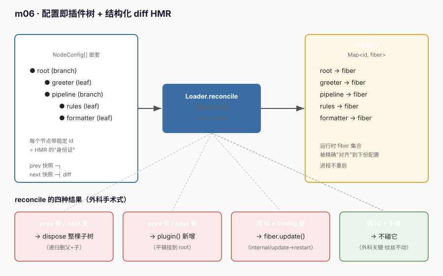

# m06 · 配置即插件树 + HMR（配置热重载）

> 参考 deepseek-harness **s07**（`s07_config_hmr`）的思路，但**不照抄**：底层用真实 `@deepseek-ai/cordis` 的 `fiber.update()` / `fiber.dispose()` 做 HMR，而非假 Context。

## 1. 目标

把前五课的能力收拢成一句话：**一份"配置数据"就能决定一套插件的拓扑与生命周期**。

- **配置即插件树**：整棵插件树是一份 `NodeConfig[]` 嵌套数据，没有任何一行代码 `new` 一个插件；节点挂在哪里、谁是谁的子节点，全由这份数据决定。
- **HMR（Hot Module Replacement）**：修改这份配置后，无需重启进程，运行时就地热更新——只改动的节点被 `fiber.update()` 局部重启，被删除的节点被 `fiber.dispose()`，新增的节点被 `plugin()`，未变化的节点**纹丝不动**。

这正是 s07 的核心论点：**默认行为（无稳定 id）下框架会用"普通 lifecycle（setup/teardown）"处理变化——diff 触发整树重启；而用"稳定 id"做结构化 diff，更新是"外科手术式"的，只动变化的部分。**

## 2. 前置

- m01–m05：plugin 的 `apply` / `ctx.effect`（m02）、Service 与 inject（m03）、依赖激活（m04）、事件与 waterfall（m05）。
- 真实 Cordis 的 HMR API（本次关键）：
  - `ctx.plugin(plugin, config)` 返回 **fiber**（一个 `Fork` 实例）。
  - `fiber.update(config)` → 走 `internal/update` waterfall（`lib/index.js:247` 内核用 `prepend:true` 把自己插到最外层，有权否决）→ 最终 `restart()`：**卸载旧 effect + 重新执行 apply**（热重载）。
  - `fiber.dispose()` → 卸载（进入 INACTIVE，effect 自动回收）。
  - **async**：`update`/`dispose` 都是异步的，编排时必须 `await`，否则日志会像 m05 那样错位。

## 3. 原理



### 3.1 配置即插件树

```ts
interface NodeConfig {
  id: string           // 稳定 id —— HMR 的"身份证"
  kind: 'branch' | 'leaf'
  label: string
  children?: NodeConfig[]   // 嵌套 → 树
}
```

`Loader.mount(profile)` 把这份数据翻译成运行时：每个 `NodeConfig` → 一次 `ctx.plugin(nodeOf(node), config)` → 得到一个 fiber，并用稳定 `id` 登记到目录。

### 3.2 结构化 diff（HMR 核心）

`Loader.reconcile(next)` 把"下一份 profile"与"上一份 profile"按**稳定 id** 对齐：

```text
prev 有 / next 无  → dispose 整棵子树（递归）
prev 无 / next 有  → plugin 新增（平铺挂到 root）
同 id 且 config 变 → fiber.update（局部热重载）
同 id 且 config 不变 → 不碰它 ← 外科手术式的关键
```

### 3.3 为什么"平铺挂到 root"而不是"context 嵌套"

> 本次踩到的真实 Cordis 坑（值得记住）：

- **坑 A：在节点的 `apply` 内部用 `ctx.plugin(child)` 动态挂子，会触发该 fiber 自身 restart**——因为新增插件改变了依赖图，Cordis 把"自己" reload 了一遍，日志表现为"挂载即失效+卸载"（m04 同源）。
- **坑 B：把目录做成 Cordis service 并在 `apply` 内动态注册，读取时会被 `without inject` 拦下**（Cordis v4 要求 inject 才能稳定读 service）。

因此本课的取舍是：**所有节点都平铺挂到同一个 root context（互不嵌套），树关系仅靠 `parentId`/registry 在 Loader 内维护（删除父时递归删子）**。这与 Cordis 原生的"context 嵌套级联"效果等价，但每一步都能被稳定 id 精确定位、可预测、易于观察。

## 4. 代码文件

| 文件 | 角色 |
|---|---|
| `profile.ts` | `NodeConfig` 类型 + 默认嵌套插件树 `defaultProfile` |
| `registry.ts` | 模块级单例 `Map<id, fiber>`（稳定 id → fiber 目录），绕开 service/inject 抖动 |
| `nodes.ts` | `leafNode` / `branchNode` 两种 apply；节点只在自己作用域注册 effect，**绝不在 apply 内挂子** |
| `loader.ts` | `Loader` 类：`mount()` 首挂、`reconcile()` 结构化 diff HMR |
| `runner.ts` | 入口：分四阶段演示（挂载 → 改叶子 → 删叶子 → 改分支） |
| `cordis.yml` | 只列 `./runner.ts` |

## 5. 运行日志（节选 + 溯源）

```text
=== 阶段1：挂载默认插件树 ===
[branch:root] 挂载  label="系统根"  子节点=[问候服务 / 处理流水线]
[branch:root] ▶ 生效
[leaf:greeter] 挂载  label="问候服务"
[leaf:greeter] ▶ 生效（effect 已注册）
[branch:pipeline] 挂载  label="处理流水线"  子节点=[规则层 / 格式化层]
[branch:pipeline] ▶ 生效
[leaf:rules] 挂载  label="规则层"
[leaf:rules] ▶ 生效（effect 已注册）
[leaf:formatter] 挂载  label="格式化层"
[leaf:formatter] ▶ 生效（effect 已注册）
已挂载节点： root, greeter, pipeline, rules, formatter

=== 阶段2：HMR① 改叶子 formatter 的 label（只动它一个）===
  [loader] 更新节点 id=formatter → fiber.update
  [leaf:formatter] ◀ 失效（旧 label="格式化层"）
  [leaf:formatter] 插件卸载  label="格式化层"
  [leaf:formatter] 挂载  label="格式化层 v2"
  [leaf:formatter] ▶ 生效（effect 已注册）
   ← 注意：root / greeter / pipeline / rules 完全没打印，它们没被触碰

=== 阶段3：HMR② 禁用叶子 rules（从 profile 删除它）===
  [loader] 删除子树 id=rules（含 1 个节点）→ dispose
  [leaf:rules] ◀ 失效（旧 label="规则层"）
  [leaf:rules] 插件卸载  label="规则层"
   ← 其余 4 个节点纹丝不动

=== 阶段4：HMR③ 改分支 pipeline 的 label（仅分支自身重启）===
  [loader] 新增节点 id=rules → plugin（parent=pipeline）   ← 阶段3删过，现按同 id 重建
  [leaf:rules] 挂载  label="规则层"
  [leaf:rules] ▶ 生效（effect 已注册）
  [loader] 更新节点 id=pipeline → fiber.update
  [branch:pipeline] ◀ 失效（旧 label="处理流水线"）
  [branch:pipeline] 插件卸载  label="处理流水线"
  [branch:pipeline] 挂载  label="处理流水线 v2"  子节点=[规则层 / 格式化层]
  [branch:pipeline] ▶ 生效
   ← formatter 没被级联重启（平铺设计：父重启不牵连子）

=== 收尾：所有节点已通过稳定 id 完成结构化 HMR，无整树重建 ===
当前节点： root, greeter, pipeline, rules, formatter
```

**溯源对照**：阶段2 只有 `formatter` 打印——证明 `reconcile` 只对 config 真正变化的节点调 `update`，其余按 "config 未变 → 不碰" 跳过。这就是 s07 的"外科手术式 HMR"，而非"整树 dispose+重建"。

> 注意阶段3→阶段4 间 `formatter` 还曾被 update 回原始值一次：因为阶段3 用的 profile 是基于 `defaultProfile`（formatter="格式化层"）克隆的，与"运行时（v2）"相比 config 确实变了，**每个 HMR 步骤都基于完整 profile 快照做 diff**，这是符合预期的正确行为。

## 6. 心智模型

```text
            profile（数据）── 稳定 id ──┐
                 │                      │
            Loader.reconcile           registry: Map<id, fiber>
                 │                      │
   ┌─────────────┼──────────────────────┘
   │  prev 有 / next 无  → dispose 子树
   │  prev 无 / next 有  → plugin 新增
   │  同 id + config 变  → fiber.update（内部/internal/update → restart）
   │  同 id + config 不变→ 不碰 ← 外科手术式
   ▼
 运行时 fiber 集合被精确地"对齐"到下一份配置，进程不重启
```

与前面课程的关系：
- m03（Service/inject）让"能力"可替换；m04（依赖激活）让"挂载顺序"由依赖图驱动；m05（事件/waterfall）解决"生产者-观察者"解耦；**m06 把"整棵拓扑 + 生命周期"提升到"由一份配置数据声明式驱动"，并用稳定 id 让变化局部化**。
- m02 的 `ctx.effect` 在此是关键：每次 `fiber.update`/restart，旧 effect 的 disposer 被调用（日志里 `◀ 失效`），新 apply 重新注册（▶ 生效）——**effect 让你无需手写 teardown，HMR 自动回收**。

## 7. 课程边界（本课新增的 vs 不涉及的）

```diff
  Context
+  fiber = ctx.plugin(plugin, config)   # 挂载，返回 fiber
+  fiber.update(config)                 # 热重载：internal/update → restart
+  fiber.dispose()                      # 卸载：effect 自动回收
+  稳定 id + 结构化 diff                # 外科手术式 HMR 的核心
```

它不增加：
- 文件监听自动 reload（本课用"内存里换一份 profile + reconcile"确定性演示，不引入 `fs.watch`）；
- 配置 schema 校验（真实 Cordis 可用 `Config:` 字段，本课省略以聚焦 HMR 机制）；
- 跨重启的运行时状态保留（本课展示"配置驱动"的确定性，状态跨 HMR 不保留——s07 指出这是默认 lifecycle 的取舍；要保留需用 session/持久层）。

## 8. 一句话总结

**配置是声明，插件树是运行时，稳定 id 是两者之间的"身份证"；HMR 不是魔法，就是 `reconcile` 按 id 做结构化 diff，对变化的 fiber 调 `update`/`dispose`/`plugin`，对不变的保持沉默。**

## 9. 示例 vs deepseek-harness 真实工程实践

本节读本地 `deepseek-harness/` 工程（`apps/cli`、`packages/boot/app-boot`、`vendor/loader`、`vendor/hmr`），说明本示例与**生产实践**的差距与同源点。结论先说：**API 层面完全一致**（都用 `fiber.update`/`dispose` + 稳定 id 结构化 diff），但真实工程在"配置来源、触发机制、diff 粒度、稳定性"四方面重得多。

### 9.1 配置形态：单一内存数组 vs 多层 patch overlay

本示例的"配置"就是一个 TS 数组 `defaultProfile`，硬编码在 `profile.ts`。真实 dsh 的配置是**多层 `cordis.patch.yml` 叠加**（overlay）：

```yaml
# 真实：packages/bundle/headless/cordis.patch.yml（节选）
- id: system-prompt
  config:
    persona: >-
      You are a coding agent powered by the {{model}} model. Your cwd is {{cwd}}.
- id: hmr
  disabled: true            # 真实工程里 HMR 行可以"声明式禁用"
- id: tools
  config:
    mode: !!js process.env.DSH_TOOLS_MODE
- insert:                   # 真实引擎支持 "insert" 一个子插件列表
    - id: code-runtime
      name: '@deepseek-ai/dsh-code-runtime-worker-thread'
    - id: headless-runner
      name: '@deepseek-ai/dsh-headless'
      inject: [headlessStartup]
      config:
        task: !!js ctx.headlessStartup.task
```

多层组合由 `packages/boot/app-boot/src/profile.ts:413` 的 `composeEntries()` 完成：
```ts
// 把"按应用顺序传入的 patch 层"合成最终 entry 列表（与 boot include 同一调用）
export function composeEntries(layers: readonly PatchOptions[][], warn) {
  return applyEntryPatches([], structuredClone(layers.flat()), ...)
}
```
真实工程的层包括：bundle 层（`package.json` 的 `dsh.profile.bundles` 指向的 `cordis.patch.yml`）+ profile 自身 `cordis.patch.yml` + home 层 `$DSH_HOME/cordis.patch.yml` + 命令行 `--patch` overlay + telemetry 开关。**本示例只有"单层 profile"，省略了 overlay 合成**。

### 9.2 触发机制：手动 reconcile vs 文件监听驱动的 live reload

本示例靠 `runner.ts` 里显式 `await loader.reconcile(p2)` 演示一次 HMR。真实工程由 **`chokidar` 文件监听器** 触发：

```ts
// vendor/hmr/src/index.ts —— 真实 HMR service
import { watch } from 'chokidar'
this.watcher = watch(root, {            // 监听配置目录
  cwd: watchBaseDir,
  ignored: path => match(relative(watchBaseDir, path)),
})
// 配置文件 add/change/unlink → 触发 refreshConfig → loader 应用新 patch → Entry.update
watcher.on('change', onChange)
```

而配置变更到"重新合成 entry"的链路在 `apps/cli/src/profile-boot.ts:285` 的 `watchUserPatches()`：用户改 `cordis.patch.yml` → watcher 重新 `composeLive()` 出新 patch 栈 → boot include 应用 → 内核 `EntryTree.update/remove/create` → 最终落到 `fiber.update()`。**本示例用"内存里换一份 profile"避免引入 `fs.watch`，换取教学确定性**。

### 9.3 diff 粒度：整节点 config 比较 vs 字段级决策

本示例只判断"config 是否变了"（JSON 串比较），变了就 `update`。真实 `Entry.update()`（`vendor/loader/src/config/entry.ts:142`）做了**字段级 diff**：

```ts
const diff = Entry.diff(this.options, options)   // 比较 name/inject/group/config
if (diff.has('name') || diff.has('inject') || diff.has('group')) {
  // 结构性变化 → 整体替换（dispose 旧 plugin + start 新 plugin）
  const newPlugin = this.create(options)
  const fiber = await this.start(newPlugin)   // 失败则 rollback 到旧 plugin
  ...
} else if (diff.has('config')) {
  // 仅 config 变化 → 局部热重载，不重建 plugin
  await this._patchContext()
  await this.fiber.update(this.options.config, true)   // ← 与本示例同一条 API
}
```

**同源点就在这里**：无论玩具还是生产，"仅 config 变化"走的都是 `fiber.update(config, true)`（第二个参数 `noSave` 表示不回写 yml）。区别是生产还会区分"改名字/改依赖"必须整体替换，而玩具统一按"是否变化"处理。

### 9.4 稳定性：无回滚 vs 失败自动回滚

本示例 `reconcile` 假设每次 update 都成功。真实 `Entry.update()` 带 **rollback**（`entry.ts:159`）：若新 plugin 启动失败，`await this.rollback(prevPlugin)` 把运行时恢复到旧 plugin，保证"坏配置不击穿服务"。生产还有 `EntryTree` 的 `enqueue` 串行队列（`vendor/include/src/index.ts:225` 注释），防止"初始 apply"与"watcher 首次扫描触发的 refresh"并发交错导致 fiber 卡死。

### 9.5 树形：`EntryTree` 持久化 vs 平铺 Map

本示例使用平铺 `Map<id, fiber>` + `parentId` 维护层级（为避开 m06 第 3.3 节的两个 Cordis 坑）。真实工程用嵌套 `EntryTree`（`vendor/loader/src/config/tree.ts`），id 用分隔符 `:` 表达层级，`create/update/remove` 操作会**写回 yml**（write-back），让一次 HMR 的结果持久化到磁盘配置。这也解释了为什么真实 patch 文件里能看到 `disabled: true` 这类"运行时改过的状态被落盘"的痕迹。

### 9.6 差距对照表

| 维度 | 本示例（m06） | 真实 deepseek-harness 工程 |
|---|---|---|
| 配置来源 | 单个内存 `NodeConfig[]` | 多层 `cordis.patch.yml`（bundle+profile+home+`--patch`）经 `composeEntries()` 合成 |
| HMR 触发 | 手动 `loader.reconcile(next)` | `chokidar` 监听 yml → `Hmr` service → `Entry.update`（live reload） |
| diff 粒度 | config 是否变化 | `Entry.diff` 字段级：`name/inject/group`→整体替换；仅 `config`→`fiber.update` |
| 失败处理 | 无（假设成功） | `rollback` 到旧 plugin + `EntryTree` 串行队列防卡死 |
| 树形/持久化 | 平铺 `Map` + `parentId` | 嵌套 `EntryTree`（sep `:`），操作写回 yml |
| 插件规模 | 5 个演示节点 | agent / provider / tools / HTTP server / browser 整套真实生命周期 |

**一句话**：本示例把真实 HMR 的"**配置→稳定 id→结构化 diff→`fiber.update`/`dispose`**"主链路完整跑通了，但真实工程额外叠了 overlay 合成、文件监听、字段级 diff、失败回滚、写回持久化五层工程外壳。学 m06 时抓住主链路即可，那五层外壳是"把主链路接进真实文件系统与长生命周期进程"的必要成本，而非 HMR 本质。

> 想看真实落点：从 `apps/cli/src/bin.ts` 启动 → `apps/cli/src/profile-boot.ts` 加载 profile → `packages/boot/app-boot/src/profile.ts:413` `composeEntries()` 合成 → `vendor/loader` 的 `EntryTree`/`Entry.update` 挂载 → `vendor/hmr` 监听文件变化回调 `update`。本示例的 `loader.reconcile` 对应的就是这整条链里"走到 `Entry.update` 之后"的那一步。
