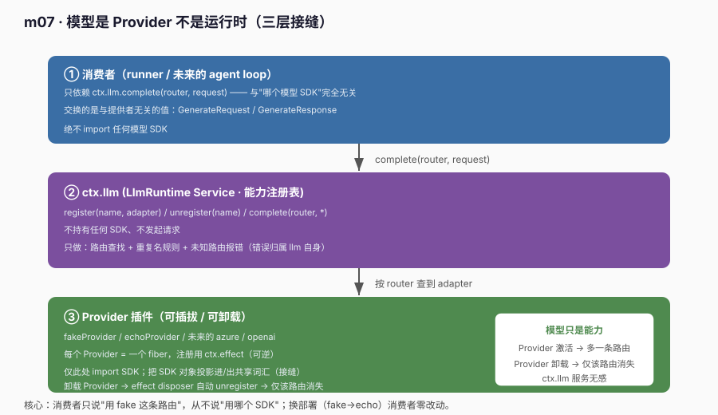
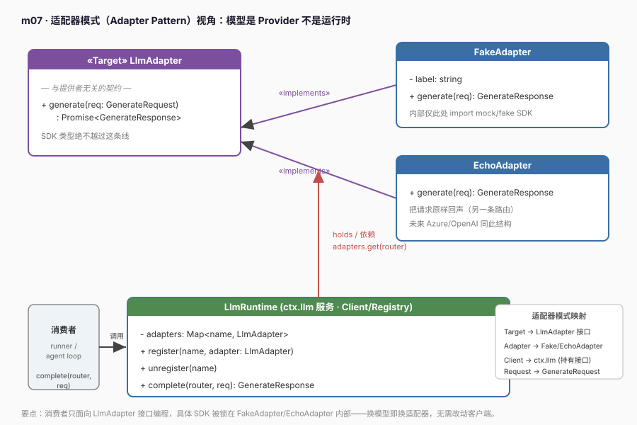

# m07 · 模型是 Provider 不是运行时

> 参考 deepseek-harness **s08**（`s08_llm_capability`）的思路，但**不照抄**：底层用真实 `@deepseek-ai/cordis` 的 `Service` + `ctx.effect` 注册表，模型用 fake/echo 适配器（确定性输出、无需 key）。

## 1. 目标

把"模型能力"从 agent 主干里**解耦**出来，确立一个贯穿后续所有课程的原则：

> **模型是 Provider（提供者），不是运行时（runtime）。**

- harness 拥有稳定的"请求能力"（统一请求/响应词汇 + 路由注册表）；
- 具体模型（azure / deepseek / openai / 本课的 fake / echo）只是**可插拔、可卸载的 Provider 插件**；
- 消费者（runner / 未来的 agent loop）只发"与提供者无关"的请求，永远不 import 任何模型 SDK。

这正是 s08 的核心论点：**模型很重要，但重要不等于它就是内核。**

## 2. 前置

- m03（Service 与 inject）：本课 `ctx.llm` 就是一个 `Service` 子类。
- m02（`ctx.effect`）：Provider 注册用 effect 实现"可逆"。
- 真实 Cordis API（本次关键）：
  - `class LlmRuntime extends Service`：`super(ctx, 'llm')` 把实例注册到 `ctx.llm`（Service 是 effect，卸载即移除）。
  - `ctx.effect(() => { register(); return () => unregister() })`：Provider 注册是**可逆 effect**，卸载 Provider 的 fiber 只移除该路由。

## 3. 原理：三层接缝



```text
┌─────────────────────────────────────────────────────────────┐
│ 消费者（runner / agent loop）                                 │
│   仅依赖 ctx.llm.complete(router, request)  ← 与提供者无关    │
└───────────────────────────┬─────────────────────────────────┘
                            │ complete()
┌───────────────────────────▼─────────────────────────────────┐
│ ctx.llm  (LlmRuntime 服务 / 注册表)                           │
│   register(name, adapter) / unregister / complete(router,*)  │
│   ← 不持有任何 SDK、不发起请求，只做路由 + 重复名规则         │
└───────────────────────────┬─────────────────────────────────┘
                            │ 按 router 查到 adapter
┌───────────────────────────▼─────────────────────────────────┐
│ Provider 插件（fake / echo / 未来的 azure）                  │
│   class FakeAdapter implements LlmAdapter                    │
│   仅此处 import SDK；把 SDK 对象投影进/出共享词汇             │
└─────────────────────────────────────────────────────────────┘
```

## 3.1 适配器模式（Adapter Pattern）视角

本课的结构恰好对应 GoF **适配器模式**：具体模型 SDK 千差万别（azure / deepseek / openai 各有专属请求/响应对象），而消费者需要一套统一的调用方式——`LlmAdapter` 接口就是那道"接缝"（Target），`FakeAdapter` / `EchoAdapter` 是实现该接口的适配器（Adapter），`LlmRuntime`（`ctx.llm`）作为 Client 只持有 `LlmAdapter` 引用，把请求按路由转给具体适配器。



```text
Target   : LlmAdapter（generate(req) → GenerateResponse）   —— 与提供者无关的契约
Adapter  : FakeAdapter / EchoAdapter / 未来的 AzureAdapter —— 仅此处 import SDK，做"投影"
Client   : LlmRuntime（ctx.llm）—— 持有 LlmAdapter，按 router 查表转发
Request  : GenerateRequest / GenerateResponse              —— 不携带任何 provider 专属字段
```

适配器模式的收益在本课得到印证：**消费者只面向 `LlmAdapter` 接口编程，把 `FakeAdapter` 换成 `AzureAdapter` 时，runner 一行都不用改**。这就是 s08「模型是 Provider 不是运行时」在设计模式层面的落点。

## 4. 代码文件

| 文件 | 角色 |
|---|---|
| `adapter.ts` | 共享词汇：`GenerateRequest` / `GenerateResponse` / `LlmAdapter` 接口（接缝两侧的契约，与提供者无关） |
| `llm.ts` | `LlmRuntime extends Service`：路由注册表，声明 `ctx.llm` |
| `providers.ts` | `fakeProvider` / `echoProvider`：两个 Provider 插件，用 `ctx.effect` 注册可逆路由 |
| `runner.ts` | 消费者 + 四个实验 |
| `cordis.yml` | 列 `./llm.ts`（服务先于 runner）与 `./runner.ts` |

## 5. 运行日志（节选 + 溯源）

```text
[fake-provider] 插件激活
[llm] 注册路由：fake
[echo-provider] 插件激活
[llm] 注册路由：echo

-- 消费者请求 router="fake"（代码与具体模型解耦）--
provider=fake finish=stop text=FAKE(default) 对"什么是 Provider？"的回复

-- 实验1：请求未知路由 "azure"（该 Provider 未挂载）--
捕获错误（归属 llm 服务）： llm: 未知 provider "azure"（已注册：fake, echo）

-- 实验2：再注册同名 "fake"（应被路由表拒绝）--
捕获错误： llm: provider "fake" 已注册，重复路由被拒绝

-- 实验3：请求 router="echo"（换部署，消费者不改一行）--
provider=echo text=[echo] system=你是一个简洁的助手 | last=什么是 Provider？

-- 实验4：卸载 fake-provider（effect 回收路由）--
[fake-provider] 插件卸载
[llm] 移除路由：fake
当前路由： echo
再次请求 fake 报错（路由已随 Provider 卸载而消失）： llm: 未知 provider "fake"（已注册：echo）
echo 仍可用： [echo] system=你是一个简洁的助手 | last=什么是 Provider？
```

**四个实验的归因（对齐 s08 的"故障归属"）**：
- 实验1/2：未知路由 / 重复名 → **错误归属 `llm` 服务本身**，而不是消费者悄悄换一个后备客户端。配置错误在最早掌握事实的节点上失败。
- 实验4：卸载 Provider fiber → effect 的 disposer 自动 `unregister` → 该路由从注册表消失；但 `llm` 服务本身和其他路由（echo）照常运行——**模型只是可插拔能力，不是运行时**。

## 6. 心智模型

```text
ctx.llm 是"能力"，不是"模型"：
  ctx.llm.complete('fake', req)   ← 消费者只说"用 fake 这条路由"，不说"用哪个 SDK"
  ctx.llm.complete('echo', req)   ← 换部署，消费者代码零改动

Provider 是"插件"，不是"内核"：
  fakeProvider 激活  → llm 多一条路由
  fakeProvider 卸载  → 仅该路由消失，llm 服务无感

消费者交换的是"与提供者无关的值"（GenerateRequest/Response），
SDK 对象绝不越过 llm 这条接缝泄漏给消费者。
```

与前面课程的关系：
- m03（Service）让"能力"可替换；**m07 把"能力"具体到"模型"，并证明模型是可插拔的 Provider**。
- m02 的 `ctx.effect` 在此是关键：Provider 注册 = "setup 注册路由 / disposer 注销路由"，卸载即自动回收——**这就是 s08 说的"适配器注册是一种可逆效果"**。

## 7. 课程边界（本课新增的 vs 不涉及的）

```diff
  Context
+  ctx.llm (LlmRuntime Service：register/unregister/complete)
+  LlmAdapter 接口（Provider 契约）
+  GenerateRequest / GenerateResponse（与提供者无关的共享词汇）
+  fakeProvider / echoProvider（可卸载的 Provider 插件）
```

它还没有加入（留给后续课程）：
- 流式分块（`stream()` / SSE）—— 大纲 m07 提到"封装 stream()"，本示例用一次性 `complete` 演示接缝，流式在 m08+ 真实会话里扩展；
- 工具调用（tool_calls）；
- 多层 Provider 配置（deployment / API-version / 凭据引用）；
- 请求中间件（重试 / 退避）。

> 注意：本示例用 fake/echo 适配器（确定性、无需 key）跑通"模型是 Provider"的接缝，避免真实 Azure 的网络与密钥依赖。换成真实 `AzureAdapter` 时，**只需把 `FakeAdapter.generate()` 内部替换为 SDK 调用**，消费者 `runner.ts` 一行都不用改——这正是本课的工程收益。

## 8. 真实工程对照（deepseek-harness）

本示例的 `ctx.llm` 注册表，对应真实工程的 `@deepseek-ai/dsh-llm` 能力服务；Provider 插件对应 `@deepseek-ai/dsh-llm-azure` / `dsh-llm-deepseek` 等适配器插件。真实工程里：
- `register(providerId, adapter)` 通过 `ctx.llm` 注册（与本合同一致）；
- 消费者（如 `session-title-llm`）调用 `generateSessionTitleWithLlm(ctx, ...)` 时只传 `provider`/`model` 路由，不接触 SDK；
- 路由策略、超时、配额、重试都收敛在 adapter 内部，与 s08 的"适配器配置属于提供者"完全一致。

一句话：**本示例把 s08 的主链路（能力服务 + Provider 插件 + 与提供者无关的请求）在真实 Cordis 上完整跑通了**；真实工程只是把这个骨架接上真实的 SDK、配置层与流式管线。
