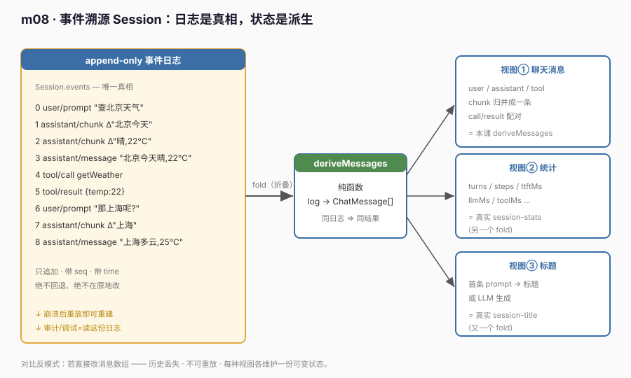
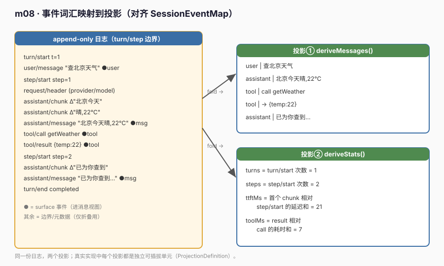

# m08 · 事件溯源 Session

> 参考 deepseek-harness **session 包**（s07 思路）+ 本地 Python 学习材料 **s09** 的事件溯源内核，但**不照抄**：用最小可运行模型把"会话真相 = append-only 事件日志，状态 = 对日志的折叠"这条主线讲透。事件词汇对齐真实 `SessionEventMap`。真实 Cordis 仅用于加载入口（module 级 `apply`）。

## 1. 目标

把"会话状态从哪来"这件事换个底层范式：

> **会话的真相不是一份可变消息数组，而是一条 append-only 事件日志；所有可见状态（聊天消息、统计、标题……）都是对这条日志做折叠（fold）派生出来的视图。**

这正是 deepseek-harness session 包的核心论点：**`Session.events` 是事实唯一来源，`deriveMessages()` 只是其中一个投影（projection）**。

## 2. 前置

- m05（事件总线）：`Session.append` 同时触发 `onAppend` 订阅，事件流就是天然的总线输出口。
- m07（Provider/适配）：会话不关心"谁"产生的事件，只要事件符合词汇（`SessionEvent`）。
- 真实 Cordis API（仅加载用）：module 级 `export async function apply` 作为 loader entry。

## 3. 原理：日志是真相，状态是派生





```text
┌──────────────────────────────────────────────────────────────┐
│ append-only 事件日志  Session.events  ← 唯一真相               │
│   turn/start · user/message · step/start · request/header     │
│   assistant/chunk · assistant/message · tool/call · …        │
└───────────────────────────┬──────────────────────────────────┘
                            │ fold（纯折叠，同日志 ⇒ 同结果）
            ┌───────────────┼────────────────┐
            ▼               ▼                ▼
    投影① 聊天消息    投影② 统计        投影③ 标题
    deriveMessages   deriveStats       sessionTitle
    (本课实现)       (本课实现)        (真实包)
```

三条铁律（与真实实现一致）：
1. **只追加**：`append` 强制 `seq === 当前日志长度`，日志下标即序号，绝不回退。
2. **整值快照**：`append` 时深拷贝 `data`（JSON 不可变快照），调用方后续改动不影响日志真相。
3. **派生可逆**：恢复会话 = 把同一份日志灌入新 `Session` 再派生；同日志必然同视图。

## 4. 代码文件

| 文件 | 作用 |
|------|------|
| `events.ts` | 领域词汇：`SessionEvent` 联合类型（对齐 `SessionEventMap`）+ 派生的 `ChatMessage` / `SessionStats` |
| `session.ts` | `Session` 类：`events` 日志 + `append`（深拷贝+seq 校验）+ `onAppend` + `deriveMessages()` / `deriveStats()` 两个纯折叠 |
| `runner.ts` | 插件入口：演示追加事件、两个投影、重放恢复、不可变性 |
| `cordis.yml` | 仅 `runner.ts` 作 entry（`session.ts` 由 runner 内部 import） |

### 4.1 `Session` 的真相只有日志

```ts
export class Session {
  private readonly log: SessionEvent[] = []   // ← 唯一真相
  get seq() { return this.log.length }
  get events() { return this.log }            // 只读快照，供任意 fold
  append(event: SessionEvent): void {
    if (event.seq !== this.log.length) throw new Error('seq 必须严格递增')
    const frozen = { ...event, data: snapshot(event.data) } // 深拷贝，不可变
    this.log.push(frozen)
    for (const fn of this.subscribers) fn(frozen)   // 事件总线输出口
  }
}
```

### 4.2 两个投影：纯折叠派生

状态完全由日志决定——不存消息数组、不存统计对象，只存折叠函数：

```ts
deriveMessages(): ChatMessage[] {        // surface 事件 → 聊天消息
  for (const e of this.log) switch (e.type) {
    case 'user/message':      out.push({ role:'user', ... })
    case 'assistant/chunk':   buffer[`${turn}:${step}`] += delta
    case 'assistant/message': /* 定稿该 step 缓冲为一条 assistant 消息 */
    case 'tool/call':         out.push({ role:'tool', callId, ... })
    case 'tool/result':       out.push({ role:'tool', callId, ... })
    /* turn/start|end|step/start|request/header 仅为元数据，不进视图 */
  }
}
deriveStats(): SessionStats {           // 边界/工具事件 → 统计
  /* turns=turn/start 数, steps=step/start 数,
     ttftMs=首个 chunk 相对 step/start 延迟和, toolMs=result 相对 call 耗时和 */
}
```

## 5. 运行验证

```bash
npm start
```

输出（节选，事件词汇对齐真实 `SessionEventMap`）：
```
[event] seq=0 turn/start
[event] seq=1 user/message
[event] seq=2 step/start
[event] seq=3 request/header
[event] seq=4 assistant/chunk
[event] seq=6 assistant/message
[event] seq=7 tool/call
[event] seq=8 tool/result
[event] seq=12 turn/end

[deriveMessages] ...
  turn=1 user      | 帮我查下北京天气
  turn=1 assistant | 北京今天晴，22℃。
  turn=1 tool      | call getWeather({"city":"北京"})
  turn=1 tool      | → {"temp":22,"sky":"clear"}
[deriveStats] 派生的统计： {"turns":1,"steps":2,"ttftMs":21,"toolMs":7}
[重放恢复] 消息一致： ✅  | 统计一致： ✅
[不可变性] append 后改调用方对象，日志是否仍干净： ✅ 未被篡改
```

`✅` 三连是事件溯源的招牌性质：**同一份日志，重放后所有视图必然一致**；而深拷贝快照让"真相"与"调用方的可变草稿"彻底隔离。

## 6. 心智模型

- **反模式**："会话 = 一个会被 push/splice 的消息数组"——历史丢失、不可重放、每种视图各维护一份可变状态。
- **事件溯源**："会话 = 一条只会增长的事件日志"，所有状态都是 `fold` 的返回值。
- **推论**：持久化只需存日志（或日志 + 投影缓存）；崩溃后用日志重建即可；审计/调试 = 直接读日志。

## 7. 示例 vs deepseek-harness 真实工程实践

本节读本地 `deepseek-harness/`（`packages/core/session`、`packages/session/*`）与 Python 学习材料 `learn-deepseek-harness/s09`，说明本示例与**生产实践**的差距与同源点。结论先说：**事件溯源内核完全一致**（append-only 日志 + 折叠派生 + 不可变快照），但真实工程在"词汇可扩展性、投影单元化、序列化与校验、liveness/fork、压缩"五方面重得多。

### 7.1 事件词汇：收窄集合 vs plugin-merge 可扩展 `SessionEventMap`

本示例把 `SessionEvent` 写成一个固定联合类型（9 种）。真实 `packages/core/session/src/types.ts` 用 **merge-extensible 的 `SessionEventMap`**：

```ts
export interface SessionEventMap {
  'turn/start': { turn: number }
  'turn/end':   { turn: number; reason: TurnEndReason }
  'step/start': { turn: number; step: number }
  'user/message': UserMessage
  'assistant/chunk': { turn: number; step: number; chunk: StreamChunk }
  'assistant/message': { turn: number; step: number; message: AssistantMessage; usage?: TokenUsage }
  'tool/call':   { turn: number; step: number; callId: CallId; name: string; arguments: string }
  'tool/result': { ...; meta?: JsonValue }
  'request/header': { header: EpochHeader; reason: RequestHeaderReason }
  'request/context': RequestContext
  'todo/write':  { todos: TodoItem[] }   // UI 日志态，非派生历史
  'session/end-seed': Record<string, never>
}
export type SessionEvent<T extends SessionEventType = SessionEventType> = { ... }
```

关键点：
- 词汇是 **plugin-merge 的**——Provider/工具插件能往 `SessionEventMap` 里加新事件类型，核心 `deriveMessages` 不感知具体新类型；本课是封闭联合。
- 真实 `SessionEvent` 是 **discriminated union over `type`**（`switch (e.type)` 自动收窄 `data`），本课同构。
- 真实事件带 `surfaceOp` / `sourceEventSeqs`（压缩替换用），本课省略。

### 7.2 投影单元：两个方法 vs `ProjectionDefinition` 独立可插拔

本示例把两个视图写成 `Session` 上的 `deriveMessages()` / `deriveStats()`。真实实现把**每个派生视图**建模成独立可插拔单元 `ProjectionDefinition`（来自 `packages/session/session-projection`）：

```ts
interface ProjectionDefinition<S, V, E extends SessionEvent> {
  readonly name: string
  init(ctx: Context): S                              // 初始状态
  apply(state: S, event: E): S                       // 纯折叠（返回新状态）
  view(state: S): V                                  // 导出视图
  readonly stateVersion: number                      // 状态版本（崩溃恢复用）
}
```

`packages/session/session-stats/src/projection.ts` 就是这样一个定义：它的 `apply` 把 `step/start`→`assistant/message`、`tool/call`→`tool/result` 折叠成 `turns / steps / ttftMs / llmMs / toolMs`——与本课 `deriveStats()` **同构**，只是它叠加了真实流式质量指标（ttft/llmMs）和 `stateVersion` 容错。本课的 `deriveMessages()` 则对应 `session-projection` 里把 surface 事件折叠成 `ChatMessage[]` 的那个投影。

### 7.3 不可变快照：深拷贝 vs `isJsonValue` 校验 + 冻结

本示例用 `JSON.parse(JSON.stringify(data))` 做深拷贝快照，保证调用方后续改对象不污染日志。真实 `Session.append` 更进一步：用 **`isJsonValue` 运行时校验**（非 JSON 可序列化值直接拒绝，因为日志要原样落盘），且把通过校验的事件 **冻结（freeze）** 成不可变记录。两者目标一致——"真相是发布那一刻的不可变快照"。

### 7.4 恢复 / 分叉：灌入 seed vs `CreateSessionOptions.seed` + `firstLiveSeq`

本示例用 `new Session(id, seed)` 灌入已有日志来"恢复/分叉"。真实实现用 `CreateSessionOptions.seed`（resume/fork 的历史）+ `meta.seedLength` + `session/end-seed` 标记区分"继承的历史"与"本次 live 生产的事件"（见 `SessionEventMap['session/end-seed']` 注释）。本课省掉了 liveness 边界，但"恢复 = 把日志灌回来再派生"这条主链路一致。

### 7.5 压缩：本课无 vs 真实 `compaction` 替换节点

真实 `SurfaceOp` 支持 `{ op: 'replace', start, end }`——把一段 surface 节点压缩成一个摘要节点（上下文窗口管理），并靠 `sourceEventSeqs` 引用被遮蔽的源事件。本课没实现压缩，但事件词汇本身已为它留好结构（`sourceEventSeqs` 在真实词汇里是 surface 事件的必备字段）。

### 7.6 差距对照表

| 维度 | 本示例 | 真实 deepseek-harness | 同源点 |
|------|--------|------------------------|--------|
| 真相来源 | append-only `events` 数组 | `Session.events`（append-only） | ✅ 同 |
| 派生方式 | `deriveMessages/Stats` 纯 fold | `ProjectionDefinition.apply/view` | ✅ 折叠同构 |
| 不可变性 | JSON 深拷贝 | `isJsonValue` 校验 + freeze | ✅ 快照同 |
| 事件词汇 | 封闭联合（9 种） | plugin-merge `SessionEventMap`（可扩展） | ⚠️ 本示例封闭 |
| 多视图 | 两个方法 | 独立可插拔投影单元 | ⚠️ 本示例未单元化 |
| 恢复/分叉 | `seed` 灌入 | `seed` + `end-seed` liveness 边界 | ⚠️ 本示例无 liveness |
| 压缩 | 无 | `SurfaceOp.replace` + `sourceEventSeqs` | ❌ 本示例无 |
| 持久化 | 无 | 日志原样落盘 + 投影缓存 | ❌ 本示例无 |

**一句话**：本示例把真实事件溯源的"**append-only 日志 → 整值快照 → 纯折叠派生多视图**"主链路完整跑通了，并对齐了 `SessionEventMap` 的 turn/step 词汇；真实工程额外叠了词汇可扩展、投影单元化、序列化校验、liveness/fork 边界、压缩、持久化六层工程外壳。学 m08 时抓住主链路即可，那六层外壳是"把主链路接进长生命周期进程与文件系统"的必要成本，而非事件溯源本质。
