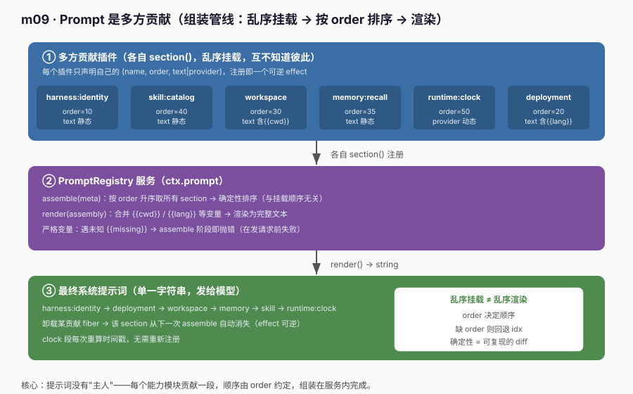
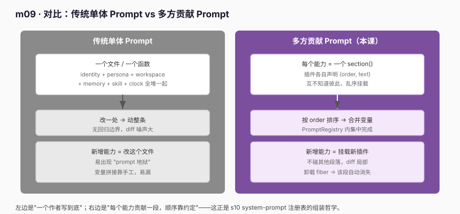

# m09 · Prompt 是多方贡献

> 参考 deepseek-harness **s10**（`s10_system_prompt_registry`）的思路，但**不照抄**：底层用真实 `@deepseek-ai/cordis` 的 `Service` + `ctx.effect` 实现"具名分段 + 注册即 effect + 确定性排序 + 严格变量"，提示词用确定性字符串（无需 key、无需真实 LLM）。

## 1. 目标

确立一个贯穿后续课程的原则：

> **系统提示词（system prompt）没有"唯一作者"，它是多个能力模块"多方贡献"出来的。**

- 每个能力模块（身份 / 人设 / 工作目录 / 记忆 / 技能目录 / 运行时时钟）各自贡献**一段**文本；
- 段与段之间**互不知道彼此**，挂载顺序无所谓；
- 顺序由每段声明的 `order` 决定 → **确定性排序**，与挂载顺序无关；
- 变量（`{{cwd}}` / `{{lang}}`）在组装阶段统一合并，未知变量在"发请求前"失败；
- 贡献即 effect：卸载某个贡献插件的 fiber → 该段从下一次组装自动消失。

这正是 s10 的核心论点：**system prompt 是一张"注册表"，不是一块写死的字符串**。

## 2. 前置

- m03（Service 与 inject）：本课 `ctx.prompt` 就是一个 `Service` 子类。
- m02（`ctx.effect`）：每个 `section()` 注册都是一个可逆 effect。
- 真实 Cordis API（本次关键）：
  - `class PromptRegistry extends Service`：`super(ctx, 'prompt')` 把实例注册到 `ctx.prompt`（Service 是 effect，卸载即移除）。
  - `ctx.effect(() => { register(); return () => unregister() })`：贡献分段是**可逆 effect**，卸载贡献插件的 fiber 只移除该段。

## 3. 原理：组装管线



```text
┌─────────────────────────────────────────────────────────────┐
│ ① 多方贡献插件（各自 section()，乱序挂载，互不知道彼此）       │
│   harness:identity(10) deployment(20) workspace(30)          │
│   memory:recall(35) skill:catalog(40) runtime:clock(50)      │
└───────────────────────────┬─────────────────────────────────┘
                            │ 各自 section() 注册
┌───────────────────────────▼─────────────────────────────────┐
│ ② PromptRegistry 服务（ctx.prompt）                          │
│   assemble(meta)：按 order 升序取所有 section → 确定性排序   │
│   render(assembly)：合并 {{cwd}}/{{lang}} 等变量 → 渲染文本   │
│   ← 未知 {{missing}} → assemble 阶段即抛错                  │
└───────────────────────────┬─────────────────────────────────┘
                            │ render() → string
┌───────────────────────────▼─────────────────────────────────┐
│ ③ 最终系统提示词（单一字符串，发给模型）                      │
│   identity → deployment → workspace → memory → skill → clock  │
│   卸载某 fiber → 该段自动消失；clock 每次重算时间戳          │
└─────────────────────────────────────────────────────────────┘
```

### 3.1 对比视角：单体 Prompt vs 多方贡献



```text
单体 Prompt        ：一个文件写到底，改一处动整条，无回归边界（"prompt 地狱"）
多方贡献（本课）   ：每个能力 = 一个 section()，顺序靠 order 约定，diff 局部、可逆
```

多方贡献的收益在本课得到印证：**新增一个能力只需挂载一个新插件，不碰其他任何段落；卸载该插件 fiber，对应段落从下一次组装自动消失**——这就是 s10「system prompt 是可插拔注册表」在设计层面的落点。

## 4. 代码文件

| 文件 | 角色 |
|---|---|
| `prompt.ts` | `PromptRegistry extends Service`：具名分段存储、`section()`（注册即 effect）、`assemble()`（确定性排序 + 严格变量）、`render()`（合并变量） |
| `contributors.ts` | 多方贡献插件：乱序挂载 6 个分段（含 2 个变量段、1 个动态 provider 段），验证 order 决定顺序 |
| `runner.ts` | 消费者 + 三个实验（组装 / 动态 provider / 严格变量） |
| `cordis.yml` | 列 `./prompt.ts`（服务先于 runner）与 `./runner.ts`、`./contributors.ts` |

## 5. 运行日志（节选 + 溯源）

```text
==== m09 Prompt 是多方贡献 ====

[组装] 渲染后的系统提示词（顺序由 order 决定，与挂载顺序无关）：
────────────────────────────────────────
You are an AI agent powered by a plugin harness.

Be concise, precise, and follow exact-output requests literally.

Working directory: /Users/moqifei/openimsdk/learn-dsh-ts/m09-prompt-as-contribution

User prefers responses in Chinese.

Available skills: search, summarize, translate.

Current time: 2026-08-21T16:00:39.912Z
────────────────────────────────────────

[确定性排序] 参与分段： harness:identity → deployment:persona → workspace → memory:recall → skill:catalog → runtime:clock

[动态 provider] 两次组装均生成时间戳： ✅ (clock 每次重算)

[卸载 fiber] 调用 contributors 暴露的 memoryRecallFiber()，memory:recall 应消失：
  卸载前含 memory:recall 段： ✅
  [event] system-prompt/change → 当前分段: deployment:persona, workspace, harness:identity, skill:catalog, runtime:clock
  卸载后含 memory:recall 段： ✅ (已自动消失)
  其余分段不受影响： ✅

[严格变量] 注册引用 {{missing}} 的分段，组装应失败：
  [event] system-prompt/change → 当前分段: deployment:persona, workspace, harness:identity, skill:catalog, runtime:clock, bad:var
  ✅ 组装前就失败： 未知变量 "{{missing}}" in section "bad:var"

==== 结束（卸载实验见第 4 步：dispose 真实贡献 fiber → 该段从下一次 assemble 自动消失） ====
```

**四个实验的归因（对齐 s10 的"组装阶段即校验"与"贡献可逆"）**：
- 确定性排序：`contributors.ts` 是乱序 `section()` 的，但渲染顺序是 `identity → deployment → workspace → memory → skill → clock`，完全由 `order` 决定——挂载顺序无关，行为可复现。
- 动态 provider：`runtime:clock` 用 `provider` 函数每次重算时间戳，两次 `assemble()` 都生成新时间，无需重新注册——贡献是"活"的，不是写死的常量。
- 卸载 fiber：`runner.ts` 第 4 步调用 `contributors.ts` **真实导出的** `memoryRecallFiber()`（即 `memory:recall` 段被 `ctx.effect` 托管的 disposer），该段从下一次 `assemble()` 消失、其余段不受影响，并触发 `system-prompt/change` 事件——**这正是真实工程里"贡献插件被卸载时 cordis 自动调用该 disposer"所发生的事**：卸载即撤销该段 + 通知下游。
- 严格变量：注册 `{{missing}}` 后再 `assemble()` → 在**发请求前**就抛错（"未知变量 {{missing}}"），而不是把带占位符的坏字符串发给模型。

## 6. 心智模型

```text
ctx.prompt 是"组装器"，不是"字符串"：
  ctx.prompt.section({name, order, text})   ← 每个能力只贡献自己那段
  ctx.prompt.assemble(meta)                 ← 按 order 排序 + 合并变量
  ctx.prompt.render(assembly)               ← 出最终文本

贡献是"插件"，不是"所有者"：
  contributors 激活  → 注册表里多一段
  contributors 卸载  → 仅该段消失，其他段与 prompt 服务无感

挂载顺序无所谓，order 决定一切：
  乱序 section()  → 确定性渲染顺序 → 可复现的 diff
```

与前面课程的关系：
- m03（Service）让"能力"可替换；**m09 把"能力"具体到"系统提示词的每段"**。
- m02 的 `ctx.effect` 在此是关键：每个 `section()` 注册 = "setup 登记 / disposer 撤销登记"，卸载即自动回收——**这就是 s10 说的"贡献注册是一种可逆效果"**。

## 7. 课程边界（本课新增的 vs 不涉及的）

```diff
  Context
+  ctx.prompt (PromptRegistry Service：section/assemble/render)
+  具名分段（name + order + text|provider）
+  确定性排序（order 升序，缺省回退 idx）
+  严格变量（assemble 阶段校验未知占位符）
+  多方贡献插件（乱序挂载，效果与顺序无关）
```

它还没有加入（留给后续课程）：
- 基于对话状态动态显隐段落（如"仅当启用某 skill 才贡献段"）—— 大纲 m09 提到"条件贡献"，本示例用静态 `order` 演示排序，条件在后续会话模块扩展；
- 变量来源的依赖注入（如 `{{cwd}}` 来自 fs 服务、`{{lang}}` 来自配置服务）—— 本示例在 `assemble(meta)` 里直接传入；
- 段落级缓存与增量重渲染；
- 与真实 LLM 的对接（本示例只产出字符串，不发请求）。

> 注意：本示例用确定性字符串跑通"提示词是多方贡献的注册表"，避免真实 LLM 的网络与密钥依赖。换成真实工程时，**只需把 `runtime:clock` 这类 provider 接上真实时间/上下文服务，并把 `render()` 结果交给 `ctx.llm.complete()`**（见 m07）——消费者（agent loop）一行都不用改提示词结构。

## 8. 真实工程对照（deepseek-harness）

本示例的 `ctx.prompt` 注册表，对应真实工程的 `@deepseek-ai/dsh-core` 的 **system-prompt 注册表**（`s10_system_prompt_registry`）。真实工程里：

- 每个能力模块调用注册表的"贡献"接口，声明自己那段 system prompt（含 `order` 与可选变量），与本合同一致；
- `assemble` 阶段按 `order` 确定性拼接，再合并运行期变量（工作目录、语言偏好、可用技能等）；
- 真实工程额外做了**条件贡献**（如仅当某能力激活时才插入对应段落）与**变量来源的依赖注入**，而本示例用静态 `order` + 直接传入 `meta` 演示核心管线；
- 严格变量校验真实存在：未知占位符在组装阶段即报错，避免把坏字符串发给模型。

一句话：**本示例把 s10 的主链路（多方贡献 + order 排序 + 变量合并 + 组装期校验）在真实 Cordis 上完整跑通了**；真实工程只是把这个骨架接上条件贡献、依赖注入与真实 LLM 管线。

### 8.1 示例 vs deepseek-harness 真实工程实践

| 维度 | 本示例（m09） | deepseek-harness 真实工程（s10） |
|---|---|---|
| 贡献单元 | `section({name, order, text\|provider})` 注册即 effect | 各能力模块在自身插件里调用 system-prompt 注册接口，声明 `(order, text)` |
| 排序 | `order` 升序，缺省回退挂载 `idx` | 同样按 `order` 确定性拼接，与加载顺序解耦 |
| 变量 | 在 `assemble(meta)` 里直接传入 `{{cwd}}`/`{{lang}}` | 变量来自依赖注入的服务（fs 服务给 cwd、配置服务给 lang 等） |
| 条件段落 | 未实现（全部静态贡献） | 支持"仅当能力激活才贡献"的条件注册 |
| 严格校验 | 未知 `{{missing}}` → assemble 抛错 | 同样在组装阶段校验未知占位符，早于任何模型请求 |
| 动态内容 | `runtime:clock` 用 `provider` 函数每次重算时间戳 | 真实工程里常用 provider 注入运行期上下文（时间、环境、会话状态） |

**对齐点**：两者的"提示词没有主人、每段由独立模块贡献、顺序靠约定、组装在服务内集中完成"这一核心哲学完全一致。

**差异点（真实工程多做的）**：① 变量来源走依赖注入而非手写 `meta`；② 条件贡献让段落可随能力开关动态显隐；③ 真正对接 `ctx.llm` 把渲染结果发出去。本示例刻意省略这三点，只为把"多方贡献 + 确定性排序 + 严格变量"这条主干讲清楚——它们正是 s10 想传递的设计意图。
