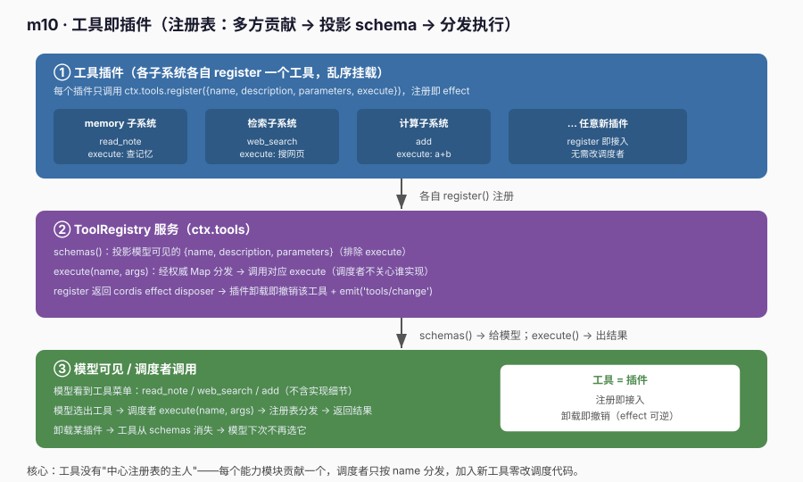
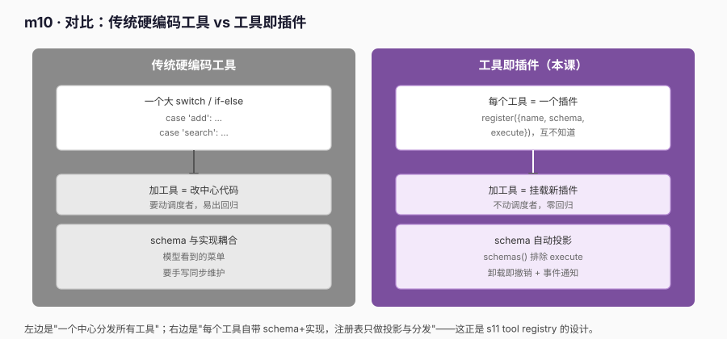

# m10 · 工具即插件

> 参考 deepseek-harness **s11**（`s11_tool_registry`）的思路，但**不照抄**：底层用真实 `@deepseek-ai/cordis` 的 `Service` + `ctx.effect` 实现"工具即插件"——注册表负责投影 schema 与分发执行，每个工具是一个独立插件，注册即 effect，卸载即撤销。工具用确定性实现（无网络/无密钥），跑通主干即可。

## 1. 目标

确立贯穿后续课程的原则：

> **工具（tool）不是硬编码在调度者里的 switch case，而是一个个独立插件；注册表只负责"投影模型可见的 schema"与"按 name 分发执行"。**

- 每个能力模块（记忆 / 检索 / 计算 …）各自贡献一个工具：`register({ name, description, parameters, execute })`；
- 工具之间**互不知道彼此**，挂载顺序无所谓（工具集是无序的）；
- 注册表只暴露 **schema**（name / description / parameters）给模型，**execute 实现细节不外泄**；
- 调度者只按 `name` 分发执行，**不关心是哪个插件实现的、怎么注册的**；
- 注册即 effect：卸载某工具插件 → 该工具自动从注册表消失，并 `emit('tools/change')` 通知下游。

这正是 s11 的核心论点：**工具是一个可插拔的注册表，调度者与具体工具实现解耦**。

## 2. 前置

- m03（Service 与 inject）：本课 `ctx.tools` 就是一个 `Service` 子类。
- m09（Prompt 是多方贡献）：同样是"注册表 + 多方贡献 + 卸载即撤销"的模式，本课把同一模式从"提示词分段"迁移到"工具"。
- m02（`ctx.effect`）：每个 `register()` 注册都是一个可逆 effect。
- 真实 Cordis API（本次关键）：
  - `class ToolRegistry extends Service`：`super(ctx, 'tools')` 把实例注册到 `ctx.tools`（Service 是 effect，卸载即移除）。
  - `ctx.effect(() => { register(); return () => unregister() })`：贡献工具是**可逆 effect**，卸载贡献插件的 fiber 只移除该工具。

## 3. 原理：注册表管线



```text
┌─────────────────────────────────────────────────────────────┐
│ ① 工具插件（各子系统各自 register 一个工具，乱序挂载）         │
│   memory: read_note  检索: web_search  计算: add   …新插件    │
└───────────────────────────┬─────────────────────────────────┘
                            │ 各自 register() 注册
┌───────────────────────────▼─────────────────────────────────┐
│ ② ToolRegistry 服务（ctx.tools）                             │
│   schemas()：投影 {name, description, parameters}（排除 exec）│
│   execute(name, args)：经权威 Map 分发 → 调对应 execute       │
│   注册返回 cordis effect disposer → 卸载即撤销 + emit 事件    │
└───────────────────────────┬─────────────────────────────────┘
                            │ schemas() → 给模型；execute() → 结果
┌───────────────────────────▼─────────────────────────────────┐
│ ③ 模型可见 / 调度者调用                                      │
│   模型看到菜单：read_note / web_search / add（不含实现）      │
│   选出工具 → execute(name, args) → 注册表分发 → 返回结果      │
│   卸载某插件 → 工具从 schemas 消失 → 模型下次不再选它         │
└─────────────────────────────────────────────────────────────┘
```

### 3.1 对比视角：硬编码工具 vs 工具即插件



```text
硬编码工具        ：一个大 switch，加工具要改调度者，schema 与实现耦合，易出回归
工具即插件（本课）：每个工具自带 schema+execute，加工具=挂载新插件，卸载即撤销，零回归
```

工具即插件的收益在本课得到印证：**新增一个能力只需挂载一个新插件，调度者（`execute`）一行都不用改**；卸载该插件，对应工具从下一次 `schemas()` 自动消失——这就是 s11「tool 是可插拔注册表」在设计层面的落点。

## 4. 代码文件

| 文件 | 角色 |
|---|---|
| `tool.ts` | `ToolRegistry extends Service`：登记 `Map`、注册即 effect（disposer + `emit('tools/change')`）、`schemas()`（投影模型字段）、`execute()`（权威表分发，未知工具返回结构化错误） |
| `plugins.ts` | 工具插件：`toolsPlugin.apply` 内乱序 `ctx.effect(() => ctx.tools.register(...))` 贡献三个工具；并暴露 `unregisterReadNote()` 供 runner 撤销 memory 贡献 |
| `runner.ts` | 消费者 + 五个实验（注册 / 投影 / 执行 / 卸载 / 未知工具） |
| `cordis.yml` | 列 `./tool.ts`（服务先于插件）与 `./plugins.ts`、`./runner.ts` |

## 5. 运行日志（节选 + 溯源）

```text
==== m10 工具即插件 ====

[注册] 三个子系统已各自贡献工具（乱序挂载，集合无序）：
  已注册工具: read_note, web_search, add

[投影] schemas() 给模型看的工具菜单（不含 execute）：
  • read_note: Read a note by its id from the user memory store.
  • web_search: Search the web and return the top result snippet.
  • add: Add two numbers and return the sum.

[执行] 调用 add(2,3)（调度者只传 name+args，不关心谁实现）：
   ✅ 2 + 3 = 5
[执行] 调用 read_note(home)：
   ✅ note[home]: "buy milk on the way home"

[卸载插件] unregisterReadNote() → read_note 应消失：
  卸载前含 read_note： ✅
  [event] tools/change → 当前可用: web_search, add
  卸载后含 read_note： ✅ (已自动消失)
  其余工具不受影响： ✅

[未知工具] 调用不存在的 tool：
   ✅ (返回结构化错误) Error: unknown tool "nonexistent"

==== 结束（工具 = 插件：注册即 effect，卸载即撤销） ====
```

**五个实验的归因（对齐 s11 的"注册表 / 投影 / 分发 / 可卸载"）**：
- 注册：三个子系统各自 `register()`，`已注册工具` 显示乱序集合，证明工具是"多方贡献"进同一注册表。
- 投影：`schemas()` 只列出 name/description/parameters，**不含 execute**——模型永远看不到实现函数。
- 执行：`execute('add', {a,b})` 调度者只传 name+args，结果由注册表分发到对应 execute，证明**调度者与实现解耦**。
- 卸载：`unregisterReadNote()` 触发 `tools/change` 事件、`read_note` 从集合消失、`add`/`web_search` 不受影响——这正是 `plugins.ts` 中 `ctx.effect(() => ctx.tools.register(...))` 被插件卸载时自动发生的事（effect 的 disposer 就是删掉该工具）。
- 未知工具：`execute('nonexistent')` 返回结构化错误（`isError: true`），而非抛异常崩溃——调度者对"选了不存在工具"是健壮的。

## 6. 心智模型

```text
ctx.tools 是"注册表 + 分发器"，不是"工具本体"：
  ctx.tools.register({name, description, parameters, execute})  ← 每个能力只贡献自己那个
  ctx.tools.schemas()                                          ← 给模型看（不含 execute）
  ctx.tools.execute(name, args)                                ← 按 name 分发（调度者不关心实现）

工具是"插件"，不是"被硬编码的分支"：
  plugins 激活  → 注册表里多一个工具
  plugins 卸载  → 仅该工具消失，其他工具与 tool 服务无感

挂载顺序无所谓，工具集是无序的：
  乱序 register()  → schemas() 顺序由注册表决定  → 模型选择与其无关
```

与前面课程的关系：
- m09（Prompt 是多方贡献）把"能力"具体到"系统提示词的每段"；**m10 把"能力"具体到"每一个工具"**——同一注册表 + effect 可逆模式。
- m03（Service）让"能力"可替换；**m10 让"新增工具"成为"挂载一个插件"，而非改调度者**。

## 7. 课程边界（本课新增的 vs 不涉及的）

```diff
  Context
+  ctx.tools (ToolRegistry Service：register/schemas/execute)
+  工具即插件（每个工具 = 独立插件，register 即接入）
+  投影 schema（模型只见 name/description/parameters，不见 execute）
+  按 name 分发执行（调度者与实现解耦）
+  注册即 effect（卸载插件 → 该工具自动撤销 + emit('tools/change')）
+  未知工具：结构化错误而非崩溃
```

它还没有加入（留给后续课程）：
- 工具参数 JSON Schema **校验/解析**（本课 `execute` 直接接收透传的 args，真实工程在调用前用 schema 校验模型给的 JSON）；
- 工具执行的**权限/沙箱**（如 bash 工具的文件系统边界）；
- 工具调用的**重试 / 超时 / 取消**；
- 工具结果回灌模型的**多轮循环**（agent loop 在 m12+ 展开）；
- 与真实 LLM 的对接（本课只产出 schema 列表与执行结果，不发请求）。

> 注意：本示例用确定性实现跑通"工具是多方贡献的注册表"，避免真实 LLM/网络/密钥依赖。换成真实工程时，**只需把各 `execute` 接上真实能力（如真实搜索、真实文件读），并把 `schemas()` 结果交给 `ctx.llm`**——调度者（agent loop）一行都不用改工具结构。

## 8. 真实工程对照（deepseek-harness）

本示例的 `ctx.tools` 注册表，对应真实工程的 `@deepseek-ai/dsh-tools` 的 **ToolRuntime**（s11_tool_registry）。真实工程里：

- 每个能力模块调用 `toolRuntime.register(definition)` 贡献一个工具（含 name/description/parameters/execute），与本合同一致；
- `schemas()` 投影模型可见字段（真实实现里是把内部 `ToolDefinition` 映射成 `ToolSchema`，排除 execute），与本合同一致；
- `execute(name, args)` 经权威表分发，未知工具返回结构化错误（真实实现里为 `UNKNOWN_TOOL`），与本合同一致；
- 注册即 effect：`register()` 在真实实现里返回 **cordis `layers.effect` 的 disposer**，插件卸载时自动撤销该工具——比本示例的"裸 disposer 删 Map"更严谨（走 cordis effect 生命周期）；
- 变更通知：真实实现在任意工具注册/撤销时 `emit('system-prompt/change')`（注意：真实工程把"工具变了"也归入 system-prompt 变更事件，因为工具菜单要写进提示词）；本示例独立用了 `emit('tools/change')`，语义等价但事件名不同；
- 作用域：真实实现用 `ScopedLayers` 支持**作用域（scope）**——agent 级工具可遮蔽（shadow）global 同名工具；本示例用单一 `Map`，无作用域。

一句话：**本示例把 s11 的主链路（工具即插件 + 投影 schema + 按名分发 + 可卸载）在真实 Cordis 上完整跑通了**；真实工程只是把这个骨架接上作用域遮蔽、参数校验、沙箱与 system-prompt 联动。

### 8.1 示例 vs deepseek-harness 真实工程实践

| 维度 | 本示例（m10） | deepseek-harness 真实工程（s11） |
|---|---|---|
| 工具单元 | `register({name, description, parameters, execute})` | 同，definition 字段一致 |
| 注册即 effect | `register` 返回删 Map 的 disposer | `register` 返回 **cordis `layers.effect` disposer**，走 effect 生命周期 |
| 投影 | `schemas()` 排除 execute | 同，内部 `ToolDefinition → ToolSchema` 映射 |
| 分发 | `execute(name, args)` 查 Map 调 execute | 同，经权威表分发 |
| 未知工具 | 返回 `{isError:true, content:...}` | 同，返回 `UNKNOWN_TOOL` 结构化错误 |
| 变更通知 | `emit('tools/change')` | `emit('system-prompt/change')`（工具变化也刷新提示词） |
| 作用域 | 无（单一 Map） | 有 `ScopedLayers`，agent 级工具可遮蔽 global |
| 参数校验 | 无（args 透传） | 调用前用 JSON Schema 校验模型给的 args |

**对齐点**：两者的"工具没有中心主人、每工具自带 schema+实现、注册表只做投影与按名分发、卸载即撤销"这一核心哲学完全一致。

**差异点（真实工程多做的）**：① 注册走 cordis 原生 `layers.effect` 而非裸 disposer；② 工具变更复用 `system-prompt/change` 事件（因为工具菜单要进提示词）；③ 支持作用域遮蔽；④ 调用前做参数 JSON Schema 校验。本示例刻意省略这四点，只为把"工具即插件 + 投影 + 分发 + 可卸载"这条主干讲清楚——它们正是 s11 想传递的设计意图。
