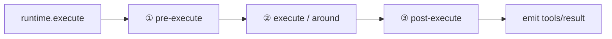

# m11 · 策略包裹执行（Strategy-Wrapped Execution）

> 一句话：**工具执行不是写死的函数，而是一段被多方"策略"包裹的可插拔管线。**
> 拦截、超时、重试、错误标准化……每一条都是插件，通过 cordis 的 `waterfall` 链挂载、卸载。

---

## 1. 为什么需要"策略包裹"

传统 SDK 的工具执行往往是一个大函数：

```ts
function execute(call) {
  if (call.name.startsWith('danger')) return  // 拦截逻辑
  const r = tool.run(call)                     // 无超时、无重试
  return r                                     // 错误直接抛出
}
```

拦截、超时、标准化全都**耦合**在一个函数里，要换策略只能改源码。

deepseek-harness 的做法：把执行拆成三层 `waterfall`（瀑布）钩子，每条策略是一个独立插件。
ToolRuntime 只搭骨架，具体策略由插件 `ctx.on('tools/...', ...)` 注册——**执行行为 = 当前挂载的策略集合**。



---

## 2. 课程代码地图

| 文件 | 角色 | 真实工程对照 |
|------|------|--------------|
| `runtime.ts` | `ToolRuntime extends Service`，三段 waterfall 执行管线 | `deepseek-harness/packages/core/tools` 的 `ToolRuntime` |
| `strategies.ts` | 策略插件：拦截 / 超时 / 错误标准化，导出 disposer 供热卸载 | `default strategies`（pre/execute/post） |
| `runner.ts` | 6 个实验：正常 / 拦截 / 超时 / 标准化 / 热卸载 | 无（演示用） |

---

## 3. 核心：三段 waterfall 怎么"包裹"

cordis 4.x 的 `waterfall` 语义（与 `ctx.on` 配合）：

- **注册策略**：`ctx.on('tools/execute', (payload, next) => ...)`
- **触发管线**：`ctx.waterfall('tools/execute', payload, () => defaultValue)`

`next` 是"调用链剩余部分"的钩子。**关键**：`next()` 会忽略你传给它的实参，直接用原始
`payload` 调用下游；因此"替换 / 包裹"必须通过**返回值**完成，而不是 `next(wrapped)`。

```ts
// ② execute 的 around 包裹（超时策略）
ctx.on('tools/execute', (payload, next) => {
  const wrapped = {
    ...payload,
    run: async () => {
      const timer = new Promise((_, reject) =>
        setTimeout(() => reject(new Error('timeout after 50ms')), 50))
      return Promise.race([payload.run(), timer])
    },
  }
  return wrapped   // 直接返回包裹后的 payload（不调 next）
})
```

三层职责：

1. **`tools/pre-execute`**：拦截 / 改写。返回 `null` ⇒ 短路，不真正执行。
2. **`tools/execute`**：around 钩子。`payload.run` 是"真正执行"，策略可包裹它做超时 / 重试 / 限流。
3. **`tools/post-execute`**：把 `result` 或 `error` 标准化为 `ToolResult`；末尾 `emit('tools/result')` 广播给记忆 / 日志 / UI。

---

## 3.5 调用过程逐行解读（一次 `execute` 到底发生了什么）

很多同学第一次看会觉得"和之前的模块不一样"。区别在于：**这里用的是 cordis 的 `waterfall`（瀑布）而不是普通 `ctx.on` 事件，而且策略的"包裹"靠返回值而不是副作用**。下面把一次正常调用（`add`）从头到尾拆开。

### 3.5.1 启动期：谁先就位

```ts
await ctx.plugin(ToolRuntime)   // 注册 executor 服务（三段瀑布骨架）
await ctx.plugin(strategies)    // 注册 3 条策略监听器到三条瀑布上
```

- `ToolRuntime` 构造里 `super(ctx, 'executor')` 把自己挂成 `ctx.executor` 服务。
- `strategies.apply` 跑起来，执行 3 个 `ctx.on('tools/...', fn)`，把三条策略**挂到对应的瀑布链上**。
  - 注意：此时没有"执行"发生，只是把"拦截 / 超时 / 标准化"三张"滤片"装到流水线上。

### 3.5.2 调用期：`execute({name:'add'})` 的瀑布流转

```
runner ──► ctx.executor.execute(call)
                │
                ├─① ctx.waterfall('tools/pre-execute', call, () => call)
                │      └─ 拦截策略检查 call.name → 不是 danger/* → return next()
                │         （next() 触发"默认值" () => call，链结束，返回 call 本身）
                │      ⇒ passed = call（放行）
                │
                ├─② ctx.waterfall('tools/execute', {call, run}, () => 默认payload)
                │      └─ 超时策略接收 payload，return wrapped
                │         （wrapped 的 run 被包成 Promise.race(原run, 50ms计时器)）
                │      ⇒ dispatched = wrapped（注意：此刻还没真正执行！）
                │
                ├─③ await dispatched.run()   ← 真正的工具执行在这里才发生！
                │      └─ wrapped.run() = Promise.race[ dispatchToolBody('add'), timer ]
                │         → dispatchToolBody 返回 {sum:5} → 胜出 → result = {sum:5}
                │
                ├─④ ctx.waterfall('tools/post-execute', payload, () => payload)
                │      └─ 标准化策略打印"结果已标准化"，return next()
                │      ⇒ finalized = payload（含 result={sum:5}）
                │
                └─⑤ emit('tools/result', {callId, name, content:{sum:5}})
```

**关键心智模型**：`execute` 方法本身不"做事"，它只是**搭了一条流水线**；真正干活的是第 ③ 步 `dispatched.run()`。三层瀑布决定的是"`run` 被包成什么样子、参数是否被改、结果是否被标准化"。

### 3.5.3 "洋葱模型"：为什么是包裹而不是替换

`waterfall` 的 `next` 机制是**洋葱式**的：

```
[pre 拦截] → [execute 超时包裹] → (真正执行) → [post 标准化] → 返回
```

- `pre-execute` 在最外层，最先看到 `call`，能拦截（返回 `null` 直接"破"掉整层洋葱）。
- `execute` 把"真正执行"这件事**包进 `run` 闭包里**（Promise.race），但不立刻调用——直到 `execute` 方法第 ③ 步才 `await dispatched.run()`，此时超时计时器才启动。
- `post-execute` 在最里层出来后触发，拿到 `result` 或 `error` 做标准化。

### 3.5.4 最容易踩的坑：`next()` 忽略实参

cordis 4.x 的 `waterfall` 有个反直觉点：**`next(wrapped)` 里你传给 `next` 的参数会被丢弃**，下游收到的是最初 `ctx.waterfall(name, payload, default)` 里的那个 `payload`。

```ts
// ❌ 以为这样能"传递包裹后的 payload"——其实 wrapped 被丢了
return next(wrapped)

// ✅ 正确：包裹通过"返回值"完成（返回值就是下游拿到的东西）
return wrapped
```

所以本课程的超时策略是 `return wrapped`（靠返回值把"带超时的 run"传递下去），而不是 `next(wrapped)`。这也是它看起来和 m09/m10 的"事件 + effect"写法不同的原因。

### 3.5.5 实验 ②⑤⑥：热卸载一条策略到底改了什么

`strategies.ts` 里把 `ctx.on(...)` 的返回值存成了 `guardDisposer` / `timeoutDisposer`：

```ts
guardDisposer  = ctx.on('tools/pre-execute', guardFn)   // 返回值 = 该监听的卸载器
timeoutDisposer = ctx.on('tools/execute',  timeoutFn)
```

`ctx.on` 返回的函数，调用它 = 把这条监听器从对应瀑布链上**摘掉**（cordis 自动处理）。runner 里：

```ts
timeoutDisposer?.()  // ⑤ 之后：tools/execute 瀑布上不再有"超时"这张滤片
guardDisposer?.()    // ⑥ 之后：tools/pre-execute 瀑布上不再有"拦截"这张滤片
```

- ⑤ 之后：再调用慢 `echo`，`execute` 瀑布里没有超时策略 → `dispatched.run()` 直接跑原始 `run`（睡 10ms）→ 正常返回 `survived`。
- ⑥ 之后：再调用 `danger/wipe`，`pre-execute` 瀑布里没有拦截策略 → 放行 → 进入执行层 → `dispatchToolBody` 抛 `unknown tool` → 被 post 标准化成错误结果。

**这正是 m09「Prompt 是多方贡献」、m10「工具即插件」同一套思想的执行侧体现**：能力（策略）由插件贡献，框架只负责把贡献串成管线；卸载插件 = 该能力从管线消失。

---

## 3.6 和之前模块的配置差异（为什么"看起来不一样"）

| 差异点 | m09 / m10 | m11 | 原因 |
|--------|-----------|-----|------|
| 服务名 | `prompt` / `tools` | `executor` | `runtime` 是 cordis 内置属性名（与 Service 的 accessor 冲突），故改用 `executor` |
| 触发方式 | `ctx.emit` / 直接调用方法 | `ctx.waterfall(name, payload, default)` | 执行需要"多方包裹"，普通事件是广播不回流，waterfall 能回流处理结果 |
| 策略注册 | `ctx.on('system-prompt/change')` 等普通事件 | `ctx.on('tools/...', fn)` 但语义是"瀑布监听器" | 同一个 `ctx.on` API，只是挂到 waterfall 事件上，返回值参与流水线 |
| 包裹方式 | effect disposer 自动管理 | 返回值传递（around） | waterfall 用返回值串链，next 忽略实参（见 3.5.4） |
| 卸载 | `memoryRecallFiber?.()` | `guardDisposer?.()` / `timeoutDisposer?.()` | 都是 `ctx.on/effect` 的返回值，调用即卸载该贡献 |

> 一句话：API 还是那几个（plugin / on / waterfall / emit），只是 m11 用 `waterfall` 表达"可回流的处理链"，而 m09/m10 用普通事件表达"广播通知"。

---

## 4. 运行演示

```bash
npm install        # 或复用同级 m10 的 node_modules（symlink）
npm start          # node --experimental-strip-types runner.ts
npm run typecheck  # tsc --noEmit
```

输出（节选）：

```
① 正常调用 add（被 pre/execute/post 三层策略包裹）
    ✅  后处理策略：结果已标准化
    📡 tools/result: {"callId":"c1","name":"add","content":{"sum":5}}

② 调用 danger/wipe（被拦截策略短路，不真正执行）
    🛡️  拦截策略：拒绝危险调用 danger/wipe
    📡 tools/result: {"callId":"c2","name":"danger/wipe","content":null,"interceptedBy":"guard"}

③ 调用 slow echo（会被超时策略在 50ms 后中断）
    ⚠️  后处理策略：标准化错误 → timeout after 50ms
    📡 tools/result: {"callId":"c3","name":"echo","content":null,"error":{"kind":"Error","message":"timeout after 50ms"}}

⑤ 热卸载"超时策略"后，再次调用 slow echo
    📡 tools/result: {"callId":"c5","name":"echo","content":{"text":"survived"}}
⑥ 热卸载"拦截策略"后，再次调用 danger/wipe
    📡 tools/result: {"callId":"c6","name":"danger/wipe","content":null,"error":{"kind":"Error","message":"unknown tool: danger/wipe"}}
```

---

## 5. 实验清单

| # | 实验 | 验证点 |
|---|------|--------|
| ① | 正常 `add` | 三层策略都包裹，结果标准化 |
| ② | `danger/wipe` | 拦截策略返回 `null` → 短路，不执行 |
| ③ | slow `echo` | 超时策略 50ms 中断 |
| ④ | `unknown` | 后处理策略把异常转成结构化 `ToolResult.error` |
| ⑤ | 热卸载"超时策略" | `timeoutDisposer()` 后慢调用正常返回 |
| ⑥ | 热卸载"拦截策略" | `guardDisposer()` 后危险调用进入执行层报错 |

**真卸载真实贡献**：`timeoutDisposer` / `guardDisposer` 就是 `ctx.on(...)` 返回的 disposer，
来自 `strategies.ts`（真实策略插件）。调用即 `disposer()`，该策略从 waterfall 链消失——
与 m09/m10 的"卸载 fiber → 贡献消失"同一机制。

---

## 6. 配图

- `images/strategy-wrapped-execution.svg`：三层瀑布包裹管线总览。
- `images/vs-traditional.svg`：传统写死 vs 真实工程策略包裹。

---

## 7. 示例 vs deepseek-harness 真实工程实践

| 维度 | 课程示例（m11） | deepseek-harness 真实实现 |
|------|----------------|---------------------------|
| 执行骨架 | `ToolRuntime.execute` 三段 `ctx.waterfall` | `ToolRuntime.execute` 同样三段 `tools/pre-execute` / `tools/execute` / `tools/post-execute` |
| 策略注册 | `ctx.on('tools/...', fn)` | 同，default strategies 通过 `ctx.on` 注册 |
| around 包裹 | 返回包裹后的 `payload` | 同样用 `next` + 返回值包裹 `run` |
| 拦截 | `pre-execute` 返回 `null` 短路 | `pre-execute` 返回 `{kind:'deny'}` 决策 |
| 结果广播 | `emit('tools/result')` | 同，末尾广播 `tools/result` 供记忆 / 日志 / UI |
| 真实工具 | 课程里用 `Math`/`JSON` 模拟 `add`/`echo` | 真实 `dispatchToolBody` 调用 `tool.execute(arguments)` |
| 热插拔 | 导出 `disposer`，`disposer()` 即卸载策略 | 卸载策略插件 ⇒ cordis 自动移除其 `ctx.on` 监听 |

> 课程把 deepseek-harness 的 `ToolRuntime` 三段瀑布**原样**搬到 TS 课程工程，仅把"真实工具执行"
> 换成 `add`/`echo` 模拟，策略（拦截 / 超时 / 标准化）与真实实现一一对应。

---

## 8. 小结

- 工具执行 = 被多方策略**包裹**的瀑布管线，而非一个写死的函数。
- 每条策略是插件（`ctx.on` 注册），**卸载插件 = 策略消失**，执行行为随之改变。
- 这与 m09（Prompt 是多方贡献）、m10（工具即插件）同一思想：**能力由插件贡献，框架只搭管线**。
