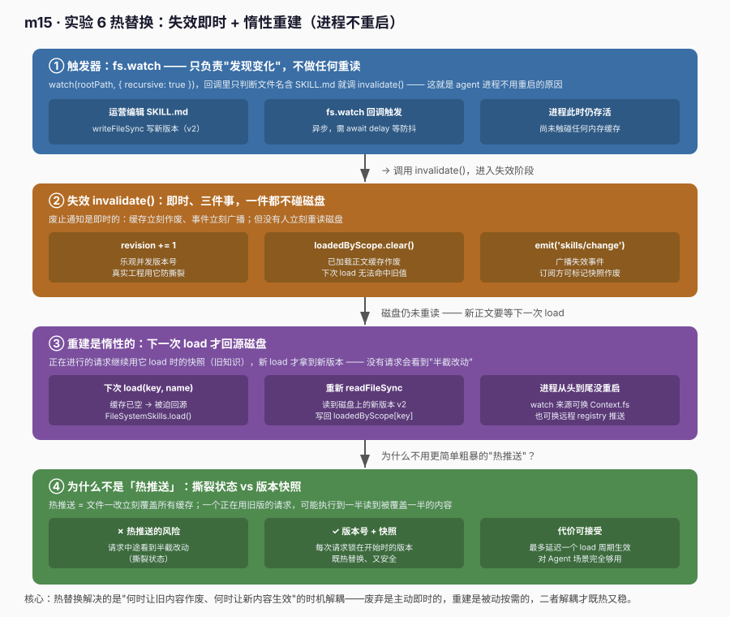
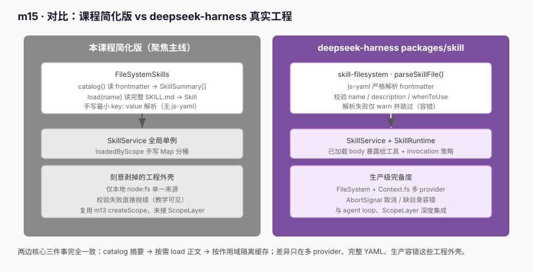

# m15 · 按需加载 Skill（Progressive Skill Loading）

本实验对应 Python 学习材料 [`s16_skills_runtime_context`](../learn-deepseek-harness/s16_skills_runtime_context)，
并将其落地到本地真实工程 [`deepseek-harness`](../../deepseek-harness) 的
`packages/skill` 体系（见后文「示例 vs deepseek-harness 真实工程实践」）。

> 运行方式：
> ```bash
> cd m15-skill-loading
> node --experimental-strip-types runner.ts   # 或 npm start
> npm run typecheck                           # tsc --noEmit 零错误
> ```
> 依赖通过 `node_modules` 软链复用 `m14` 的 `@deepseek-ai/cordis`（见 `node-shims.d.ts`）。

---

## 1. 为什么需要「按需加载」

给大模型塞技能（skill） instructions 时有个矛盾：

- 技能越多，全量塞进系统提示词越贵、越容易把真正相关的指令稀释掉；
- 但模型在真正动手前，得先「知道有哪些技能可选」。

**按需加载（progressive loading）** 把这件事拆成两段：

1. **catalog（目录）**：只把每个技能的 `name + description` 摘要给模型。很便宜，不占正文空间。
2. **load（加载）**：模型判断任务匹配后，才调用 `load_skill` 把该技能的**完整正文**拉进上下文。

未加载的技能正文始终留在磁盘上，**永远不会进上下文窗口**。这就是「按需」二字的含义。

本实验用 cordis 的「作用域」概念（m13）把「已加载的技能正文」做成**作用域局部状态**：
每个 agent 各自加载各自的，互不串门，agent 销毁时一并回收。

---

## 2. 核心概念与模块结构

```
m15-skill-loading/
├── skill.ts            # FileSystemSkills：catalog（摘要）/ load（正文）
├── runtime.ts          # SkillService：全局单例 + 按 scopeKey 分桶缓存已加载正文
├── scope.ts            # 作用域原语（从 m13 复用：createScope / ScopeRegistry）
├── runner.ts           # 6 个实验 + 临时技能目录构造
├── node-shims.d.ts     # 无 @types/node 时的最小 node 类型声明
├── skills/             # 自带的示例技能（SKILL.md）
│   ├── incident-triage/SKILL.md
│   └── release-notes/SKILL.md
└── images/
    ├── skill-progressive.svg
    ├── skill-vs-real.svg
    └── skill-hotswap.svg
```

### `skill.ts` — `FileSystemSkills`

对应 Python `s16` 的 `FileSystemSkills` 与 `Skill` / `SkillSummary`。

| 方法 | 做什么 | 是否读正文 |
|------|--------|-----------|
| `catalog()` | 扫描 `<root>/<name>/SKILL.md`，只解析 frontmatter | **否**（便宜） |
| `load(name)` | 解析某个 SKILL.md 完整正文并返回 `Skill` | **是**（按需、贵） |

`SkillSummary`（摘要）只有 `name` / `description`，**根本没有 `body` 字段**——这是隔离「目录开销」与「正文开销」的关键类型设计。

### `runtime.ts` — `SkillService`

对应 Python 的 `RuntimeContext` + `LOAD_SKILL_SCHEMA`，以及真实工程的 `SkillRegistry`。

- **主机平面**：`catalog()` 只对模型暴露摘要；`load(key, name)` 把正文按需拉进指定作用域。
- **作用域平面**：`loadedByScope: Map<scopeKey, Map<name, Skill>>`，按作用域分桶缓存。
- **热替换平面**：`invalidate()`（`revision++` + 清空缓存 + 广播 `skills/change`）、`watch()`（`fs.watch` 订阅技能目录）、`onChange()` 订阅失效事件——对应真实工程的 `invalidateCache` + `SkillWatchManager`。
- 监听 `'scope/disposed'` 自清理（与 m13 登记表同构）。

> 注意 `load(key, name)` **必须显式传入 scopeKey**。因为 `SkillService` 挂在全局 ctx，
> 它无法从 `this.ctx` 推断「当前是哪个 agent 在调用」——这正是作用域隔离的边界。

> **热替换的本质 = 失效 + 惰性重建**：`invalidate()` 只做「revision 自增、清空已加载缓存、广播事件」，
> 并不会立刻重读磁盘；真正的新正文在**下一次 `load`** 时才从磁盘重新读出。这保证了「正在进行的请求
> 不会突然看到半截改动」（快照稳定性），也是真实工程默认采用惰性而非推送的原因。

### `SKILL.md` 格式

与真实工程 `parseSkillFile` 一致，采用 YAML frontmatter：

```markdown
---
name: incident-triage
description: 生产事故的分级与初步处置流程
---
立即隔离故障爆炸半径，先止血再定位。
逐条核查：1) 影响面 2) 回滚可行性 3) 通知链路。
```

---

## 3. 六个实验

运行 `node --experimental-strip-types runner.ts`，六个实验全绿：

| # | 实验 | 验证点 |
|---|------|--------|
| 1 | **catalog 是 compact 的** | `catalog()` 只返回摘要，无 `body` 字段，正文留在磁盘 |
| 2 | **按需加载** | 未 `load` 时 `bodyOf` 为 `undefined`；调用后才拿到正文 |
| 3 | **未知技能被拒** | `load('teleport')` 抛 `SkillNotFoundError` |
| 4 | **作用域隔离** | A 加载的技能，B 取不到（分桶） |
| 5 | **dispose 回收** | 作用域销毁后，其已加载缓存随 `scope/disposed` 清空 |
| 6 | **热替换（不重启）** | 改 `SKILL.md` 后，watcher 触发 `invalidate()`，下次 `load` 自动拿到新版本，进程全程不重启 |

### 实验 2（按需加载）关键片段

```ts
// 未加载：正文不可见
root.skills.bodyOf(scope.key, 'incident-triage') // => undefined

// 模型（或调用方）决定加载后：正文才进入该作用域
const skill = root.skills.load(scope.key, 'incident-triage')
skill.body.includes('立即隔离')                    // => true
root.skills.bodyOf(scope.key, 'incident-triage')  // => 完整正文
```

### 实验 4（作用域隔离）关键片段

```ts
root.skills.load(a.key, 'incident-triage')
root.skills.loadedNames(a.key) // => ['incident-triage']
root.skills.loadedNames(b.key) // => []  （B 看不到 A 的）

// 即使直接去取 A 加载过的正文，也取不到（分桶隔离）
root.skills.bodyOf(b.key, 'incident-triage') // => undefined
```

### 实验 6（热替换，不重启 agent）关键片段

```ts
const v1 = root.skills.load(scope.key, 'incident-triage')
v1.body.includes('立即隔离')                 // => true   （旧版本）

let changeFired = false
root.skills.onChange(() => { changeFired = true }) // 订阅 skills/change
root.skills.watch()                          // fs.watch 订阅技能目录

// 运营人员编辑了磁盘上的 SKILL.md（新版本含「v2 新版本」）
writeFileSync(join(skillDir, 'incident-triage', 'SKILL.md'), newV2Body)
await delay(120)                             // 等 watcher 异步触发
//  ↑ 此刻进程从未重启

changeFired                                 // => true   （skills/change 已广播）
root.skills.getRevision()                   // => 1      （revision 自增）

const v2 = root.skills.load(scope.key, 'incident-triage')  // 重新 load 同一名字
v2.body.includes('v2 新版本')               // => true   （自动拿到新版本）
v2.body.includes('立即隔离')                // => false  （旧内容已被覆盖）
```

热替换的数据流（对应真实工程的 `SkillWatchManager → invalidateCache → skills/change`）：



要点：**废止通知是即时的（`invalidate` 立刻清空缓存 + 广播），但新正文是惰性的（下次 `load` 才重读磁盘）**。
正在进行的请求仍用旧知识，直到它自己决定再 `load` 一次——这就是真实工程用「失效 + 惰性重建」
而非「热推送」的原因：避免请求执行到一半突然看到撕裂状态。

### 热替换实现原理（为什么能不重启 agent）

热替换解决的不是「怎么读文件」，而是**「何时让旧内容作废、何时让新内容生效」**这两个时机的解耦。
把它拆成四个角色，就清楚了：

#### ① 触发器：文件监视（Watcher）

真实工程里由 `skill-filesystem` 包的 `SkillWatchManager` 负责——它用宿主提供的目录监视能力
（开发态是 `node:fs` 的 `fs.watch`，生产态可换成 `Context.fs` 受信任文件系统的 watch，或远程 registry 的推送事件）。
本实验用 `SkillService.watch()` 直接调 `node:fs` 的 `fs.watch` 订阅 `skills/` 目录：

```ts
this.watcher = watch(this.fs.rootPath, { recursive: true }, (_event, filename) => {
  if (!filename || String(filename).includes('SKILL.md')) this.invalidate()  // 只关心技能文件
})
```

关键点：**Watcher 不做任何「重读磁盘」的工作，它只负责「发现变化」然后调 `invalidate()`**。
这就是为什么 Agent 进程可以一直活着——文件变动从不需要重启进程去重新加载模块。

#### ② 失效：invalidateCache（即时、无副作用）

真实工程对应 `SkillRegistry.invalidateCache()`，本实验对应 `SkillService.invalidate()`：

```ts
invalidate(): void {
  this.revision += 1            // ① 乐观版本号自增（并发控制）
  this.loadedByScope.clear()    // ② 清空已加载正文缓存（内存作废）
  this.notifyChange()           // ③ 广播 skills/change（通知订阅方）
}
```

它做三件事，但**一件都不碰磁盘**：
- `revision++`：版本号是乐观并发控制的核心。真实工程在 `collect()` 里用它判断「我手上的缓存是不是过期了」，
  并在 `MAX_COLLECT_ATTEMPTS` 重试里防止「失效」和「重扫」打架时读到撕裂状态。
- 清空已加载缓存：让下一次 `load` 无法命中旧正文，被迫回源。
- 广播事件：让「当前对话已渲染给模型的 catalog 快照」等订阅方有机会刷新。

#### ③ 重建：惰性 load（下次访问才重读）

失效之后，**没有任何人立刻重读磁盘**。新正文要等到下一次 `load(scopeKey, name)` 被调用时，
才通过 `FileSystemSkills.load(name)` 重新 `readFileSync` 磁盘上的 `SKILL.md`：

```ts
load(scopeKey: string, name: string): Skill {
  const skill = this.fs.load(name)   // 每次都重新读盘 → 失效后自然拿新版本
  // ... 重新写入该作用域桶
  return skill
}
```

这就是「惰性重建」：失效是**主动立即**的，重建是**被动按需**的。二者解耦后：
- 正在跑的请求继续用旧正文（它已经 `load` 过了，拿的是当时的快照）；
- 新的 `load` 调用拿到的是失效后的新版本；
- 没有「半截改动」被某个请求中途看到。

#### ④ 通知：skills/change 订阅（可选刷新）

真实工程把失效事件暴露成 `ctx.on('skills/change', cb)`。本实验用 `onChange(cb)` 同构实现：

```ts
const off = root.skills.onChange(() => { changeFired = true })
// ... 文件改动后 changeFired === true，证明进程内事件已广播（未重启）
```

订阅方通常不立刻重扫，而是「标记自己的 catalog 快照作废，下次 LLM 请求时带新目录」——
这正是和 m13 作用域 `scope/disposed` 自清理同构的「事件驱动 + 惰性」模式。

#### 整体时序

```
文件改动
   │  (Watcher 侦测)
   ▼
invalidate()  →  revision++  →  loadedByScope.clear()  →  emit('skills/change')
   │
   │   （没人立刻重读磁盘，Agent 继续跑旧知识）
   ▼
下一次 load(name)
   │
   ▼
FileSystemSkills.load() 重新 readFileSync 磁盘
   │
   ▼
返回【最新的】SKILL.md 正文   ←  进程从头到尾没重启
```

#### 为什么不是「热推送」？

「热推送」= 文件一改，立刻把新正文写进所有已加载缓存。这看似更实时，但危险：
一个正在用 `incident-triage` 旧版本的请求，可能在第 3 步突然读到被覆盖了一半的新内容（撕裂状态）。
「失效 + 惰性重建」用**版本号 + 快照**把每次请求锁在它开始时的那个版本上，既热替换了、又安全。
代价仅是「最多延迟到一个 load 周期才生效」——对 Agent 场景完全可接受。

---

## 4. 调用过程解读（一次 `load` 发生了什么）

```
模型/调用方
   │  load(scopeKey='agent-A', 'incident-triage')
   ▼
SkillService.load(key, name)
   │  1. fs.load(name) —— 从磁盘读 SKILL.md 完整正文
   │  2. loadedByScope[key].set(name, skill) —— 写入该作用域桶
   ▼
返回 Skill{ name, description, body, baseDir }
   │
   ▼
该 agent 的系统提示词可渲染 <skill_content>…正文…</skill_content>
```

而 `catalog()` 走的是另一条更便宜的路径：`fs.catalog()` 只读每个文件的 frontmatter，
`body` 字段根本不会被解析、不会出现在任何返回里。

---

## 5. 关键坑位（与 m13/m14 一脉相承）

1. **Service 名全局唯一**：`SkillService` 挂在全局 ctx（`super(ctx,'skills')`），
   不能每作用域注册同名 service；已加载正文改用「全局单例 + 按 scopeKey 分桶」。
2. **`load` 必须显式传 scopeKey**：全局 Service 无法从 `this.ctx` 推断当前作用域，
   否则所有 agent 会共享同一份加载缓存，破坏隔离。
3. **`this.ctx` 上的自定义事件需声明**：`'scope/disposed'` 与 `'skills/change'` 在 `declare module '@deepseek-ai/cordis'`
   的 `Events` 里声明后，`ctx.emit` / `ctx.on` 才通过类型检查。
4. **`fs.watch` 是异步的**：实验 6 改写文件后要 `await delay(...)` 等 watcher 回调触发 `invalidate`，
   再断言 `revision` 与 `skills/change`——不可以同步立刻断言（真实工程的 `watchStabilityThresholdMs` 也是同理的防抖）。
5. **strip-types 下 type-only 要 `import type`**：`Skill` / `SkillSummary` 用 `import type` 引入，
   否则 `--experimental-strip-types` 会把类型当值导入而报错。
6. **import 要带 `.ts` 扩展名**：`node --experimental-strip-types` 要求显式扩展名（同 m14）。
7. **frontmatter 解析要容错**：真实工程对缺字段 / 非法 name / 重复 name 都会 warn 并跳过；
   本实验在 `catalog()` 阶段直接抛错以暴露问题（教学用）。

---

## 6. 示例 vs deepseek-harness 真实工程实践

下面这张图对比了本课程的简化实现与 `deepseek-harness` 的真实 `packages/skill` 体系。
二者在「progressive loading 的核心三件事」上完全一致，差异只在工程完备度。



### 6.1 真实工程里长什么样

- **`packages/skill/skill`** —— `SkillService` / `SkillRuntime`：运行时把「已加载的技能正文」
  暴露给 `load_skill` 工具，并支持 `invocation` 策略、`trustedHost` 标记等。
- **`packages/skill/skill-filesystem`** —— `parseSkillFile()`：用 `js-yaml` 严格解析 frontmatter，
  校验 `name`（`isSkillName`）、`description`、`whenToUse`，解析失败仅 `warn` 并跳过（不致命）。
- **多 provider 抽象** —— 技能可来自本地文件系统 `FileSystem`，也可来自 `Context.fs`（受信任的文件系统服务），
  二者通过统一接口接入，并支持 `AbortSignal` 取消与缺目录容错。
- **与 agent loop / scope 集成** —— 技能的可见性、加载、回收与 m13 的作用域、m12 的 agent loop
  在真实的 harness 里是打通的：一个 session 就是一个 scope，技能加载状态是 scope 局部状态。

### 6.2 本课程的取舍

| 维度 | 真实工程 | 本课程 |
|------|----------|--------|
| frontmatter 解析 | `js-yaml`（完整 YAML） | 手写最小 `key: value` 解析器 |
| 来源 | FileSystem + `Context.fs` 多 provider | 仅本地 `node:fs` |
| 校验失败 | `warn` 跳过（容错） | 抛错（教学可见） |
| 作用域 | 与 `ScopeLayer` 深度集成 | 复用 m13 的 `createScope` + 分桶 Map |
| 运行时暴露 | 注入工具、`SkillRuntime` | `load(key, name)` 直接返回 `Skill` |

> 结论：本课程把真实工程的「**catalog 摘要 → 按需 load 正文 → 按作用域隔离缓存**」这条主线
> 完整复现了，只是把多 provider / 完整 YAML / 生产容错这些「工程外壳」剥掉，便于聚焦学习。

### 6.3 真实内核清单（与示例一一对应）

- ✅ **两阶段开销隔离**：`catalog()` 不读正文 ↔ 真实 `parseSkillFile` 只在 `load` 时读 body。
- ✅ **按作用域缓存已加载正文**：`loadedByScope` ↔ 真实工程里加载状态挂在 scope 局部。
- ✅ **未知技能拒绝**：`SkillNotFoundError` ↔ 真实 `unknown skill` 错误。
- ✅ **作用域销毁回收**：监听 `'scope/disposed'` ↔ 真实工程随 scope 生命周期清理。
- ✅ **热替换（不重启）**：`invalidate()`（`revision++` + 清缓存 + `skills/change`）↔ 真实工程 `invalidateCache` + `SkillWatchManager`，文件改动后下次 `load` 自动拿新版本，进程从不重启。

---

## 7. 与系列课程的关系

- **m12** agent loop：决定「何时该调用 `load_skill`」。
- **m13** 作用域注册：本实验缓存分桶的基础。
- **m14** Preset 组合 Agent：组合的是「工具」，本实验加载的是「技能正文」。
- **m15（本篇）** 按需加载 Skill：把技能正文做成按需、作用域局部、可回收的资源。
