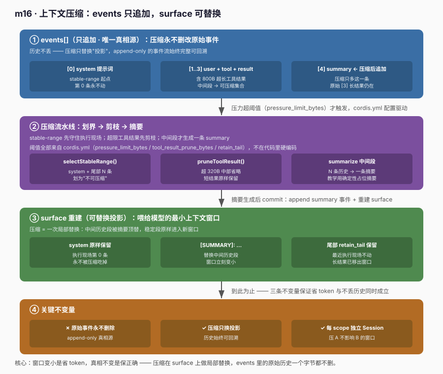
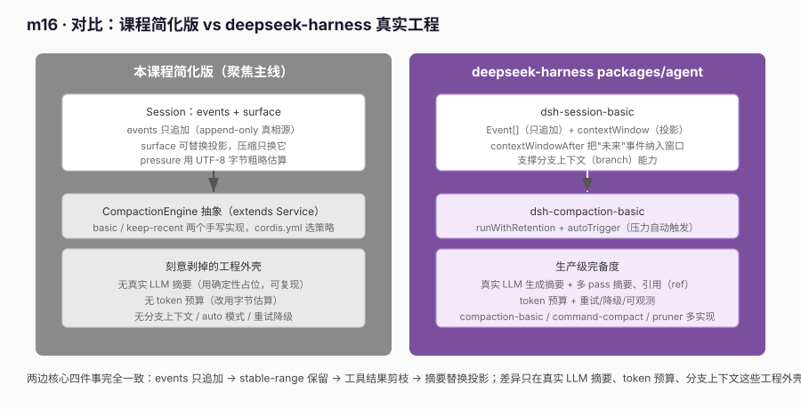

# m16 · 上下文压缩（Context Compaction）

> 对应 Python 学习材料 [`learn-deepseek-harness/s17_context_compaction`](../../learn-deepseek-harness/s17_context_compaction/) ，
> 以及真实工程 [`deepseek-harness/docs/subsystems/compaction.zh.md`](../../deepseek-harness/docs/subsystems/compaction.zh.md) 与
> `packages/agent/dsh-session-basic`、`packages/agent/dsh-compaction-basic`。

## 0. 这个模块解决什么问题

长对话里，模型上下文窗口会被历史消息、工具调用、超长工具结果不断填满。
**上下文压缩**就是：在窗口"快满"时，把**中间可被压缩的历史段**换成一段摘要，
保留**不可压缩的稳定段**（system 提示词 + 最近尾部执行现场），从而：

1. 同样一轮对话，喂给模型的 token 更少、更便宜、更不容易丢重点；
2. **历史不丢** —— 压缩只替换"投影"，原始事件流仍完整可回溯；
3. **稳定段不被动** —— system 提示词和最近几轮对话是执行现场，压缩不能把它们吃掉。

核心心智：**压缩 = 事件溯源（events 只追加）+ 可替换投影（surface）+ stable-range 保留**。

---

## 1. 模块结构

```text
m16-context-compaction/
├── cordis.yml          # 课程配置（m13 起未再出现，m16 恢复）：声明压缩策略与阈值
├── scope.ts            # 作用域原语（复用 m13/m15）
├── session.ts          # 事件溯源 Session：events[]（只追加）+ surface（可替换投影）
├── compaction.ts       # CompactionEngine（抽象）+ CompactionBasic / CompactionKeepRecent 两个可替换实现
├── runner.ts           # 5 个实验 + 读取 cordis.yml
├── node-shims.d.ts     # 无 @types/node 时的最小 node 类型声明
└── images/
    ├── compaction-flow.svg
    └── compaction-vs-real.svg
```

### `cordis.yml`（配置驱动，对应 m09~m12 的装配方式）

```yaml
plugins:
  compaction-basic:
    enabled: true
    options:
      pressure_limit_bytes: 600     # 触发压力阈值（UTF-8 字节，教学估算；生产用 tokenizer）
      tool_result_prune_bytes: 320  # 工具结果剪枝阈值（超过则裁掉中部）
      retain_tail: 1                # 保留尾部事件条数（stable-range 的"尾部"长度）
```

runner 启动时读取该配置，传入 `CompactionService` —— 阈值不在代码里硬编码，
与 m09~m12 系列"cordis.yml 驱动插件装配"一脉相承（m13 起为聚焦作用域概念而省略，m16 恢复）。

### `session.ts` — 事件溯源 Session

对应真实工程 `dsh-session-basic` 的 Session，以及 Python s17 的 `Session`：

- `events: Event[]` —— **只追加**（append-only）的对话事件流，是唯一的"真相源"，压缩永远不动它；
- `surface: string` —— 当前要喂给模型的"最小上下文窗口"，是 `events` 的一个**可替换投影**；
  压缩 = 用一条 summary 事件替换 `surface` 里"过期但被保留"的那一段。

> 关键：两种角色分离，使"压缩"成为一次**局部替换**而非"丢失历史"。

### `compaction.ts` — `CompactionEngine`（抽象）+ 两个可替换实现

对应真实工程 `packages/compaction/compaction` 的抽象 `CompactionEngine`（它 `extends Service`，
文档明确写 *"Load one implementation per context as `ctx.compaction`"*），以及并排的多种实现
`compaction-basic` / `command-compact` / `compaction-tool-result-pruner`。

- **抽象基类 `CompactionEngine extends Service`**：声明契约（`compact` / `strategyName`），
  提供公共能力（压力测量 `pressure()`、工具结果剪枝 `pruneToolResult()`、`commit()` 骨架）。
  它本身就是 cordis 的一个**服务**，以 `ctx.compaction` 注入；每个 context 只加载「一个」实现（依赖倒置）。
- **实现一 `CompactionBasic`**：经典策略，保留 system + 尾部 N 条，中间段送摘要。
- **实现二 `CompactionKeepRecent`**：激进策略，只保留最近 N 条事件，更旧的整段丢弃进摘要。

上层 agent loop 只依赖抽象 `CompactionEngine`；具体用哪个策略，由装配时决定（本实验由 `cordis.yml`
的 `strategy` 字段选择，对应真实工程里"每个 context 加载一个实现"）。

与 m13/m15 一致：引擎挂在全局 ctx（常驻），每个 agent scope 持有自己的 `Session`。

---

## 2. 五个实验

运行 `node --experimental-strip-types runner.ts`，五个实验全绿：

| # | 实验 | 验证点 |
|---|------|--------|
| 1 | **events 只追加** | 压缩后 `events` 只多一条 summary，原始历史（含长 result）仍在，永不丢失 |
| 2 | **工具结果剪枝** | 超 `toolResultPruneBytes` 的 result 中部被省略；短结果原样保留 |
| 3 | **stable-range 选择** | system（第 0 条）与尾部 N 条被识别为"不可压缩"，中间段进可压缩集合 |
| 4 | **压缩重建 surface** | 一次 `compact` 后 surface = system + `[SUMMARY]` + 尾部；长结果移出窗口、原始仍在 events |
| 5 | **作用域隔离** | A、B 两个 scope 各持独立 Session，压缩 A 不影响 B 的窗口 |
| 6 | **可替换策略** | 同一会话、同一调用方 `engine.compact(...)`，换 `CompactionBasic` / `CompactionKeepRecent` 两实现得到不同保留结果（依赖倒置） |

数据流图（events 真相源 vs surface 最小窗口）：



### 实验 1（events 只追加）关键片段

```ts
session.message('user', '查下日志')
session.tool('search', 'grep ERROR')
session.result('search', 'ERROR: timeout\nERROR: oom')
const before = session.events.length

root.compaction.compact(session, () => '摘要: 用户查了日志')

// 压缩后 events 只增不减（多了一条 summary 事件）
session.events.length === before + 1          // => true
// 原始 result 仍在 events 里（历史不丢）
session.events.some(e => e.type === 'result' && e.payload.includes('ERROR: oom')) // => true
```

### 实验 2（工具结果剪枝）关键片段

```ts
const huge = 'X'.repeat(800)                  // 远超 toolResultPruneBytes(320)
const pruned = root.compaction.pruneToolResult(huge)
pruned.includes('已省略')                     // => true（中部被裁，留首尾）
pruned.length < huge.length                   // => true

root.compaction.pruneToolResult('Y'.repeat(50)) // 短结果原样保留
```

### 实验 3（stable-range 选择）关键片段

```ts
session.message('system', 'sys-prompt')
session.message('user', 'step1')
session.tool('a', 'call-a')
session.result('a', 'r-a')
session.message('user', 'step2')              // 尾部（retainTail=1）

const { systemIndex, tailFrom, compressible } = root.compaction.selectStableRange(session)
systemIndex === 0                             // => true（system 是第 0 条）
session.events.slice(tailFrom).some(e => e.content === 'step2')  // => true（尾部保留）
!compressible.some(e => e.content === 'step2') // => true（尾部不进可压缩段）
```

### 实验 4（压缩重建 surface）关键片段

```ts
const { summary, surface } = root.compaction.compact(session, (comp, pruned) => {
  return `压缩了 ${comp.length} 条（含 ${pruned.filter(e => e.type === 'result').length} 条已剪枝结果）`
})
surface.includes('[SUMMARY]:')                // => true
surface.includes('sys-prompt')                // => true（system 保留）
surface.includes('再查一次')                  // => true（尾部保留）
!surface.includes('A'.repeat(40))             // => true（长结果移出窗口）
// 原始长结果仍在 events（真相源不丢）
session.events.some(e => e.type === 'result' && e.payload.includes('AAAA')) // => true
```

### 实验 5（作用域隔离）关键片段

```ts
const sa = new Session(); sa.message('user', 'A 的会话')
const sb = new Session(); sb.message('user', 'B 的会话')

root.compaction.compact(sa, () => 'A 摘要')
sa.surface.includes('A 摘要')                 // => true
sb.surface.includes('[SUMMARY]')             // => false（B 的窗口没被 A 串门）
```

### 实验 6（可替换策略）关键片段

```ts
// 同一份「超长对话」会话（system + step1..step5 + 长结果）
function buildSession(): Session {
  const s = new Session()
  s.message('system', 'sys-prompt')
  for (let i = 1; i <= 5; i++) s.message('user', `step${i}`)
  s.result('search', 'Z'.repeat(400))
  return s
}

// 策略 A：basic（保留 system + 尾部 1 条 = result），中间 step1..step5 被摘要
const engineA = new CompactionBasic(ctxA, { retainTail: 1 })
const rA = engineA.compact(buildSession(), (c) => `摘要了 ${c.length} 条`)
rA.surface.includes('sys-prompt')              // => true（system 保留）
rA.surface.includes('ZZZZ')                    // => true（尾部 result 保留）
rA.surface.includes('step1')                   // => false（step1 已摘要丢弃）

// 策略 B：keep-recent（仅保留最近 3 条 = step4/step5/result），更旧整段丢弃
const engineB = new CompactionKeepRecent(ctxB, { keepRecent: 3 })
const rB = engineB.compact(buildSession(), (c) => `摘要了 ${c.length} 条`)
rB.surface.includes('sys-prompt')              // => true
rB.surface.includes('step4') && rB.surface.includes('step5')  // => true（最近保留）
rB.surface.includes('step1')                   // => false（step1 已丢弃）

// 关键：两次调用方代码完全相同（都是 engine.compact(session, fn)），
// 差异完全来自「装配时选了哪个实现」——这正是依赖倒置 / 策略可替换。
console.log((root.compaction as any).strategyName())  // => 当前 cordis.yml 选的策略
```

本实验通过 `cordis.yml` 的 `strategy: basic | keep-recent` 字段选择默认实现，对应真实工程中
「每个 context 加载一个 `CompactionEngine` 实现作为 `ctx.compaction`」的装配方式。换策略 = 换一个
插件包（本实验是换一个类），**调用方 `engine.compact(...)` 一行都不用改**。

---

## 3. 坑位（与 m13~m15 一致的部分）

1. **自定义事件需声明**：`'scope/disposed'` 在 `declare module '@deepseek-ai/cordis'` 的 `Events` 里声明后，`ctx.emit` / `ctx.on` 才通过类型检查。
2. **strip-types 下 type-only 要 `import type`**：`Event` 等类型用 `import type` 引入，否则 `--experimental-strip-types` 会把类型当值导入而报错。
3. **import 要带 `.ts` 扩展名**：`node --experimental-strip-types` 要求显式扩展名（同 m14/m15）。
4. **union 类型访问字段要先收窄**：`Event` 是 discriminated union，访问 `content`/`payload` 前需类型守卫或 `as any`（教学简便写法）。
5. **cordis 的 Service 同名只能注册一次**：`scopes` 在插件内部 `new ScopeRegistry(ctx)` 注入即可，不要再额外 `plugin(ScopeRegistry)`，否则报 "service already registered"。

---

## 4. 示例 vs deepseek-harness 真实工程实践

下面这张图对比了本课程的简化实现与 `deepseek-harness` 的真实 compaction 体系。
二者在「事件溯源 + 稳定段保留 + 工具结果剪枝」的核心思想上完全一致，差异只在工程完备度。



### 4.1 真实工程里长什么样

- **`packages/agent/dsh-session-basic`** —— `Session`：`Event[]`（只追加）+ `contextWindow`（可替换投影），
  提供 `contextWindowAfter` 把"未来"事件也纳入窗口（分支上下文基础）。
- **`packages/agent/dsh-compaction-basic`** —— `runWithRetention()`：保留/触发逻辑；
  `toolResultPruneBytes` 决定工具结果剪枝阈值；`autoTrigger` 在压力超限时自动触发压缩。
- **多实现并存**：`compaction/compaction`（抽象 `CompactionEngine`）+ `compaction-basic` /
  `command-compact` / `compaction-tool-result-pruner`。策略**可替换**，每个 context 加载一个。
- **真实 LLM 摘要**：压缩调用模型生成摘要（本实验用确定性占位摘要，便于单测与可复现）。
- **生产级增强**：多 pass 摘要、引用（ref）、分支上下文（branch）、`auto` 模式（子代理并行压缩）、
  重试/降级/可观测、token 预算（而非字节估算）。

### 4.2 本课程的取舍

| 维度 | 真实工程 | 本课程 |
|------|----------|--------|
| 压力估算 | tokenizer 算 token 预算 | UTF-8 字节粗略估算 |
| 摘要生成 | 真实 LLM 调用 | 确定性占位摘要（可复现） |
| 剪枝 | `toolResultPruneBytes` | 同参数，中部省略 |
| stable-range | system + 尾部（可配） | system + 尾部（retainTail） |
| 触发 | `autoTrigger` 压力自触发 | `shouldCompact()` 显式判断 |
| 分支上下文 | `contextWindowAfter` + branch | 未实现（聚焦主线） |
| 策略可替换 | 抽象 `CompactionEngine` + 多实现，每 context 一个 | 抽象 `CompactionEngine` + `CompactionBasic`/`CompactionKeepRecent` 两实现，`cordis.yml` 选策略 |
| 装配 | harness 运行时整合 | cordis.yml 配置驱动 + 显式 `compact()` |

> 结论：本课程把真实工程的「**events 只追加 + surface 可替换 + stable-range 保留 + 工具结果剪枝**」这条主线
> 完整复现了，只是把 LLM 摘要、token 预算、分支上下文这些「工程外壳」剥掉，便于聚焦学习。

### 4.3 真实内核清单（与示例一一对应）

- ✅ **events 只追加（真相源不丢）**：`Session.events` 永不删改 ↔ 真实 `Event[]` append-only。
- ✅ **surface 可替换投影**：压缩只换 `surface` ↔ 真实 `contextWindow` 重建。
- ✅ **工具结果剪枝**：`pruneToolResult()` ↔ 真实 `toolResultPruneBytes`。
- ✅ **stable-range 保留**：`selectStableRange()`（system + 尾部）↔ 真实工程保留不可压缩段。
- ✅ **作用域隔离**：每 scope 独立 `Session` ↔ 真实 engineering 里一个 session = 一个 scope。
- ✅ **策略可替换（依赖倒置）**：抽象 `CompactionEngine` + `CompactionBasic`/`CompactionKeepRecent` 两实现，调用方只依赖抽象 ↔ 真实工程 `CompactionEngine`（`extends Service`）+ `compaction-basic`/`command-compact`/`compaction-tool-result-pruner` 多实现，每个 context 加载一个作为 `ctx.compaction`。

---

## 5. 与系列课程的关系

- **m12** agent loop：决定「何时该触发压缩」（压力超限时）。
- **m13** 作用域注册：每个 agent scope 持有独立 Session 的基础。
- **m14** Preset 组合 Agent：组合的是「工具与初始提示词」，本实验压缩的是「运行期累积的上下文」。
- **m15** 按需加载 Skill：把技能正文做成按需、作用域局部资源；本实验把"长对话"做成可压缩、可回溯的资源。
- **m16（本篇）** 上下文压缩：让长会话可持续运行而不撑爆窗口，历史始终可回溯。
