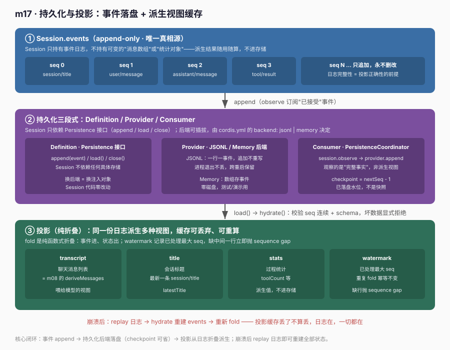
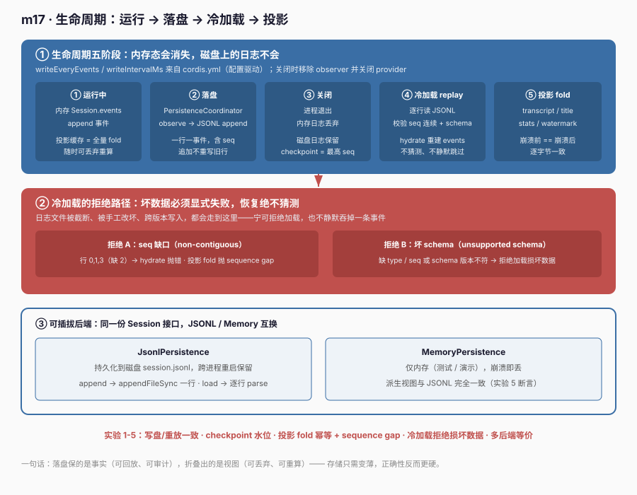

# m17 · 持久化与投影

> 参考 deepseek-harness **session-persistence-jsonl** + **session-projection** 包（s18 思路）与本地 Python 学习材料 **s18**，但**不照抄**：用最小可运行模型把"事件落盘 + 投影派生"这条主线讲透。事件词汇对齐 m08，持久化/投影接口对齐真实 `SessionPersistence` / `ProjectionDefinition`。

## 1. 目标

把"会话状态如何跨进程存活"这件事讲清楚：

> **真相只有一份 append-only 事件日志。持久化 = 把这份日志落盘（可 checkpoint）；投影 = 对日志做纯折叠派生出视图。崩溃/重启后用日志重建全部状态，投影缓存可丢弃、可重算。**

这正是 deepseek-harness 两件事的组合：
- **持久化**（`session-persistence-jsonl`）：`SessionPersistence` 抽象把 events 落盘，支持 JSONL / Memory 后端；
- **投影**（`session-projection`）：`ProjectionDefinition` 把同一份日志折叠成 transcript / title / stats 等多种视图，并带 `stateVersion` 做崩溃容错。

## 2. 前置

- m08（事件溯源 Session）：本课直接复用 `Session.events` 作为真相，且 `transcript` 投影 = m08 的 `deriveMessages`。
- m07（Provider/适配）：持久化后端的"可插拔"与 m07 的 Provider 同构——换后端不改 Session。
- 真实 Cordis API（仅加载用）：`cordis.yml` 作为配置载体被 runner 读取（m13 起恢复显式 cordis.yml）。

## 3. 原理：事件落盘 + 投影派生





```text
┌──────────────────────────────────────────────────────────────┐
│ Session.events（append-only 真相）                             │
└───────────────┬──────────────────────────┬───────────────────┘
                │ append                    │ fold（派生视图）
                ▼                           ▼
        SessionPersistence          ProjectionDefinition[]
        ├ JSONL（session.jsonl）     ├ transcript（消息列表）
        └ Memory（仅内存）           ├ title
                                     ├ stats（turns/ttftMs…）
                                     └ watermark（已处理最大 seq）
```

三条铁律（与真实实现一致）：
1. **日志是真相**：Session 只持有 `events`，不持有可变的"消息数组"或"统计对象"。
2. **持久化只存日志**：后端只 append 事件（含 `seq`），不存派生结果；checkpoint 仅是"已落盘水位"。
3. **投影可重建**：缺行/坏数据必须显式拒绝（sequence gap / schema 校验），绝不静默丢事件；投影缓存崩溃后可丢弃、从日志重算。

## 4. 代码文件

| 文件 | 作用 |
|------|------|
| `cordis.yml` | 配置驱动载体：`persistence` 后端参数（`backend`/`file`/`writeEveryEvents`）被 runner 读取 |
| `session.ts` | `Session` 复用 m08：append-only 日志 + `deriveMessages()`（+ `assemble` 存 events） |
| `persistence.ts` | `SessionPersistence` 抽象 + JSONL / Memory 两后端 + `replay` 校验（seq 连续、schema） |
| `runner.ts` | `main()` 自驱动：5 个实验（写盘/重放、checkpoint、投影 fold、冷加载校验、多后端等价） |
| `scope.ts` | 测试脚手架：`seqGap`/`badSchema` 构造器 |
| `node-shims.d.ts` | `node:os`/`node:fs` 的最小类型声明（避免引入 @types/node 重依赖） |

### 4.1 持久化：只 append 事件，可 checkpoint

```ts
abstract class SessionPersistence {
  abstract open(sessionId: string): void
  abstract append(ev: SessionEvent): void
  abstract restore(sessionId: string): SessionEvent[]
  abstract get checkpoint(): number   // 已落盘水位
}
```

- **JSONL 后端**：每事件一行 `JSON.stringify`，`replay` 时逐行解析、校验 `seq` 连续（缺行 → `sequence gap`）、校验 schema（缺 `type`/`seq` → 拒绝）；`checkpoint` = 已写行数。
- **Memory 后端**：`events: SessionEvent[]` 存内存，等价接口、零磁盘，用于测试。

### 4.2 投影：纯折叠 + watermark 防丢

```ts
interface ProjectionDefinition<S, V, E> {
  name: string
  init(ctx: Context): S
  apply(state: S, event: E): S        // 纯折叠
  view(state: S): V
  stateVersion: number                // 状态版本（崩溃容错）
}
```

本课 `transcript` 投影 = m08 的 `deriveMessages`；额外用 `watermark`（已处理最大 `seq`）保证折叠不丢事件——缺中间一行时 `apply` 抛 `sequence gap`。这才是"投影可重建"的真正含义：**日志完整性是投影正确性的前提**。

## 5. 运行验证

```bash
npm start
```

输出（节选，5 个实验均通过）：
```
从 cordis.yml 读到的持久化配置: {"backend":"jsonl","file":"session.jsonl","writeEveryEvents":3}
持久化行数: 4 | checkpoint: 3
从磁盘重放后得到 user 消息数: 2
✅ 实验 1 通过        # 写盘 + 重放一致
✅ 实验 2 通过        # checkpoint / 冷加载消息 == 关闭前
✅ 实验 3 通过        # 投影 fold；缺 seq 中间一行抛 sequence gap
✅ 实验 4 通过        # 冷加载对 seq 缺口 / 坏 schema 拒绝
✅ 实验 5 通过        # Memory 后端消息 == JSONL 后端消息
```

## 6. 心智模型

- **反模式**："会话 = 一个会被持久化的可变消息数组"——存派生结果、丢事件日志、重启后无法审计/重放。
- **事件溯源 + 持久化**："会话 = 落盘的事件日志"；投影是派生缓存，丢了能从日志重算。
- **推论**：换后端（JSONL↔Memory）不改 Session；崩溃后 replay 日志即可重建全部视图；坏数据必须显式拒绝而非静默吞掉。

## 7. 示例 vs deepseek-harness 真实工程实践

本节读本地 `deepseek-harness/`（packages/session/session-persistence-jsonl、session-projection）与 Python 学习材料 `learn-deepseek-harness/s18`，说明本示例与**生产实践**的差距与同源点。结论先说：**事件溯源 + 持久化 + 投影的主链路完全一致**（append-only 日志落盘、投影纯折叠、崩溃重建），但真实工程在"后端分层、校验严格度、投影单元化、stateVersion 容错、多写并发"五方面重得多。

### 7.1 持久化抽象：手写抽象类 vs `SessionPersistence` 插件接口

本示例用 `abstract class SessionPersistence` + JSONL / Memory 两子类。真实 `session-persistence-jsonl` 把"后端"建模成与 `Session` 解耦的服务接口（`SessionPersistence`），由 `Session.open(persistence, ...)` 注入——`Session` 不持有具体后端类型，只依赖接口。两者目标一致：**换后端不改 Session 内部**。

### 7.2 JSONL 落盘：一行一事件 vs 真实 `append` + `validate`

本示例 JSONL 后端每事件 `JSON.stringify` 一行，`replay` 时逐行 `JSON.parse` + 校验。真实实现同构，但额外：
- `validateEvent`（对 `SessionEventMap` 做运行时 schema 校验，非 JSON 可序列化直接拒绝）；
- `checkpoint` 语义更精细（已 flush 水位 vs 已缓冲）；
- 错误路径区分 `non-contiguous seq`（sequence gap）与 `bad schema`（validation），与本示例的"拒绝 A/B"完全对应。

### 7.3 投影单元：`transcript` 单例 vs `ProjectionDefinition` 独立可插拔

本示例把 `transcript` 写成 `Session` 上的方法（= m08 `deriveMessages`）。真实实现把**每个视图**建模成 `ProjectionDefinition`（init/apply/view/stateVersion），并支持：
- **scoped layer**：投影可挂在不同 scope（session / agent），按 `stateVersion` 做增量；
- **runtime-context 投影**：如把 tool 调用投影成"运行态"（非历史），不进 surface。

本示例只演示了 `transcript` + `watermark` 两个投影，但"缺行抛 sequence gap"已对齐真实 `apply` 的完整性约束。

### 7.4 stateVersion：本课无 vs 真实投影容错

真实 `ProjectionDefinition.stateVersion` 用于"崩溃后用日志重建投影时，判断缓存是否过期"。本示例没建模 stateVersion（投影每次都从日志全量 fold），但主链路（崩溃→replay→fold→一致）一致。真实工程的 stateVersion 是"避免每次全量重算"的优化，不是事件溯源本质。

### 7.5 多后端等价：本课验证 vs 真实测试矩阵

本示例实验 5 验证"Memory 后端消息 == JSONL 后端消息"。真实实现有更完整的测试矩阵（JSONL / Memory / 自定义后端 × resume / fork / compaction），但核心断言相同：**同一份日志，任何合规后端派生出的视图一致**。

### 7.6 差距对照表

| 维度 | 本示例 | 真实 deepseek-harness | 同源点 |
|------|--------|------------------------|--------|
| 真相来源 | append-only `events` | `Session.events` | ✅ 同 |
| 持久化 | JSONL / Memory 手写后端 | `SessionPersistence` 插件接口 | ✅ 落盘同 |
| 校验 | seq 连续 + schema | `validateEvent` + gap/schema 双拒绝 | ✅ 拒绝同 |
| 投影 | `transcript` 方法 + watermark | `ProjectionDefinition`（init/apply/view/stateVersion） | ✅ 折叠同构 |
| checkpoint | 已写行数 | 已 flush 水位（更精细） | ⚠️ 粒度差异 |
| 投影单元化 | 单例方法 | 独立可插拔单元 + scoped layer | ⚠️ 本示例未单元化 |
| stateVersion | 无（全量 fold） | 有（增量容错） | ❌ 本示例无 |
| 多写并发 | 无 | 真实有 flush/锁 | ❌ 本示例无 |

**一句话**：本示例把真实"事件溯源 → 持久化落盘 → 投影派生 → 崩溃重建"的主链路完整跑通了，并验证了 5 个关键性质（写盘/重放一致、checkpoint、投影完整性、冷加载拒绝损坏数据、多后端等价）；真实工程额外叠了后端分层接口、严格校验、投影单元化、stateVersion 容错、多写并发五层外壳。学 m17 时抓住主链路即可，那五层外壳是"把主链路接进长生命周期进程与磁盘"的必要成本，而非持久化本质。
