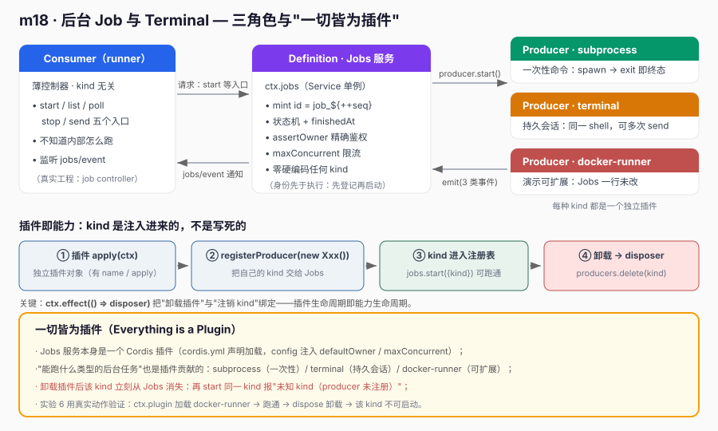
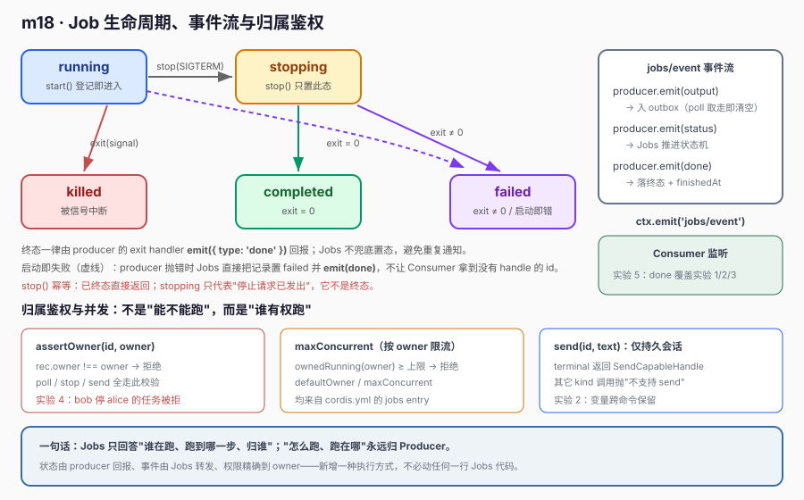

# m18 · 后台 Job 与 Terminal

> 用 Cordis 实现"后台 Job 运行时 + Terminal 持久会话"，并贯穿一个核心理念：**一切皆为插件**。
> 本课对齐 `deepseek-harness` 的 `packages/jobs`、`packages/subprocess`、`packages/terminal`。

---

## 1. 课程目标

- 理解后台任务的 **Definition / Provider / Consumer 三角色** 职责划分。
- 用 Cordis `Service` 实现 `Jobs` 运行时：`start / list / poll / stop / send` + 生命周期状态机 + `owner` 归属鉴权 + 完成通知。
- 理解 **Terminal 是"持久会话"**：状态（变量 / cwd）跨命令保留，区别于一次性 `subprocess`。
- 体会 **一切皆为插件**：连"能跑什么类型的后台任务"也是插件贡献的。

## 2. 前置知识

- m05 事件与 `ctx.emit` / `ctx.on`
- m06 `Service` 子类 + `super(ctx, name)` 注册 `ctx.<name>`
- m07 Provider 模式（本课 Producer = 一种 Provider）
- 进程管理：`node:child_process` 的 `spawn`、信号（SIGTERM / SIGKILL）

## 3. 核心原理

### 3.1 三角色与"一切皆为插件"



| 角色 | 职责 | 本课落点 |
|------|------|----------|
| **Definition** | 身份 + 生命周期拥有者 | `Jobs` 服务（`ctx.jobs`），负责 mint id、归属鉴权、状态机 |
| **Provider** | 拥有"执行资源" | `subprocess` / `terminal` 两个 Producer 插件，真正去 spawn / 读终端 |
| **Consumer** | kind 无关的薄控制器 | `runner.ts`，只调 `start/list/poll/stop/send`，不知内部 |

**一切皆为插件的落点**：
- `Jobs` 服务本身是一个 Cordis 插件（`cordis.yml` 声明加载）；
- `subprocess` / `terminal` 两个 Producer 也是插件，通过 `ctx.effect(() => ctx.jobs.registerProducer(...))` 注入，
  卸载该插件 → 该 `kind` 从 `Jobs` 消失；
- 新增一种后台任务（如 `docker-runner`），只需再写一个插件，**无需改 `Jobs` 一行代码**。

> 这不是停留在文字上的主张——**实验 6** 用真实动作验证：加载 `docker-runner` 插件后 `jobs.start({kind:'docker-runner'})` 能跑通（`Jobs` 源码未改），
> 随后 `dockerFiber.dispose()` 卸载该插件，再 `start` 同一 `kind` 即报"未知 kind（producer 未注册）"，证明 kind 随插件卸载消失。

### 3.2 生命周期与事件流



状态机：`running → stopping → killed | completed | failed`。
Producer 通过 `emit` 向 `Jobs` 回报 `output / status / done` 三类事件，`Jobs` 转发为
`ctx.emit('jobs/event', ...)`，Consumer 监听即得到完成通知。

## 4. 代码文件

| 文件 | 角色 |
|------|------|
| `jobs.ts` | `Jobs extends Service`：Definition 层（身份 / 生命周期 / 鉴权 / 通知） |
| `producers.ts` | 两个 Producer 插件：subprocess（一次性命令）、terminal（持久会话） |
| `runner.ts` | Consumer：装配插件 + 5 个实验 |
| `cordis.yml` | 配置驱动载体（`jobs` 服务 + `runner` 主插件，含 `defaultOwner` / `maxConcurrent` 配置） |

## 5. 关键代码解读

### 5.1 Jobs 服务：身份与生命周期拥有者

`Jobs` 持有 `producers` 注册表，但**零硬编码 kind**——kind 由插件注入（见 m18 `jobs.ts:108` `registerProducer`）。

```ts
// jobs.ts:128  Consumer 入口：启动一个后台任务
async start(spec: JobSpec, owner: string = this.defaultOwner): Promise<string> {
  const producer = this.producers.get(spec.kind)
  if (!producer) throw new Error(`[jobs] 未知 kind="${spec.kind}"（producer 未注册）`)
  if (this.ownedRunning(owner) >= this.maxConcurrent) throw new Error('并发超限')
  const id = `job_${++this.seq}`
  const record: JobRecord = { id, kind: spec.kind, label: spec.label, owner,
    status: 'running', createdAt: Date.now(), handle: undefined as any, outbox: [] }
  this.jobs.set(id, record)
  const emit = (ev) => this.onProducerEvent(id, ev)
  const handle = await producer.start(spec, emit)   // 身份先于执行
  record.handle = handle
  this.ctx.emit('jobs/event', { id, event: { type: 'status', status: 'running' } })
  return id
}
```

### 5.2 精确归属鉴权

只有 `owner` 能 `poll / stop` 自己的任务（真实工程里 `teardown_owner` 也依赖此约束）：

```ts
// jobs.ts:221
private assertOwner(id: string, owner?: string): void {
  const rec = this.jobs.get(id)!
  if (!rec) throw new Error(`[jobs] 未知 job id="${id}"`)
  if (owner !== undefined && rec.owner !== owner)
    throw new Error(`[jobs] 归属鉴权失败：job "${id}" 属于 "${rec.owner}"，调用方是 "${owner}"`)
}
```

### 5.3 Producer 作为插件注入（一切皆为插件）

```ts
// producers.ts  subprocessProducerPlugin / terminalProducerPlugin
apply(ctx: Context): void {
  const disposer = (ctx.jobs as Jobs).registerProducer(new SubprocessProducer())
  ctx.effect(() => disposer)   // 卸载插件 → 该 kind 从 Jobs 消失
}
```

### 5.4 Terminal 持久会话

与非交互 `subprocess` 不同，terminal 用**同一个 shell 进程**逐行读命令执行，变量 / cwd 状态跨命令保留，并提供 `send` 能力：

```ts
// producers.ts  TerminalProducer.start
const send = (text: string) => shell.stdin.write(text.endsWith('\n') ? text : text + '\n')
return { send, async stop(sig) { shell.kill(sig); await once(shell, 'exit') },
         async next() { return { chunk: '', done: settled } } }
```

## 6. 运行验证

```bash
cd learn-dsh-ts/m18-background-job-terminal
node --import tsx ./node_modules/@deepseek-ai/cordis/bin.js
```

输出要点（6 个实验全部 OK）：

```
[实验 1] subprocess 增量输出：hello-from-subprocess ........ OK
[实验 2] terminal 持久会话状态跨命令保留（读到 hi-terminal）： OK
[实验 3] SIGTERM 停止 → killed： OK
[实验 4] owner 隔离：用错误 owner 去 stop 被拒绝： OK
[实验 5] 完成通知覆盖实验1/2/3： OK
[实验 6] 可扩展性：新增 docker-runner 无需改 Jobs + 卸载即消失： OK
          6.1 新 kind 跑通（输出含 docker-runner）： OK
          6.2 已卸载 docker-runner 插件
          6.3 卸载后该 kind 不可启动： OK（报"未知 kind=...（producer 未注册）"）
```

## 7. 心智模型

- **Jobs 管"谁、什么状态、归谁"；Producer 管"怎么跑"；Consumer 管"要什么"。** 三者通过 `jobs/event` 解耦。
- **Terminal ≠ 一次性命令**：terminal 是持久会话，`send` 多轮、状态保留；subprocess 一跑即焚。
- **一切皆为插件**：`Jobs` 是插件，每种 `kind` 也是插件。运行时能力是可插拔的，不是写死的。

## 8. 示例 vs deepseek-harness 真实工程实践

### 8.1 三角色映射

| 本课示例 | deepseek-harness 真实实现 | 说明 |
|----------|---------------------------|------|
| `Jobs` 服务 | `packages/jobs/src/index.ts`（`Jobs` Service） | 身份 / 生命周期 / 通知 |
| `SubprocessProducer` | `packages/subprocess/subprocess-local/src/spawn.ts` | `Popen(start_new_session=True)` + `killpg` |
| `TerminalProducer` | `packages/terminal/terminal-bash/src/session.ts` | 持久 PTY（`bash`）会话 |
| `runner.ts` | harness 的 job controller 函数 | kind 无关薄控制器 |

### 8.2 启动 API 对齐

真实 `Jobs.start` 签名（简化）：

```python
# deepseek-harness packages/jobs/src/index.ts（Python 伪签名）
def start(self, kind: str, label: str, owner: str, producer: Callable) -> str:
    job_id = self._mint_id(owner)        # ID 铸造 + 归属绑定
    record = JobRecord(id=job_id, owner=owner, status='running', ...)
    self._jobs[job_id] = record
    handle = producer(job_id, ...)        # producer 拥有执行资源
    return job_id
```

本课 `jobs.ts:128` 的 `start` 与其一一对应：`mint id` → `job_${++seq}`、`owner` 绑定、`producer.start(spec, emit)` 托管执行。

### 8.3 生命周期状态机

真实实现同样是 `running → stopping → killed | completed | failed`，且
- **producer 拥有执行资源**：`subprocess` 用进程组 `killpg` 升级 SIGTERM→SIGKILL；本课 `producers.ts` 用 `shell.kill` + `once(shell,'exit')` 等进程退出后回报 `killed`。
- **Jobs 不碰执行细节**：`stop()` 把信号交给 `handle.stop()`，再由 producer 的 exit handler 回报终态——本课 `jobs.ts:208` `stop` 仅置 `stopping` 并 `await handle.stop`，终态由 producer 的 exit 事件回报，避免重复通知。

### 8.4 归属鉴权

真实工程用 `teardown_owner` 等待某 owner 的所有任务"结清"再回收；鉴权粒度精确到 **owner == job.owner**。
本课 `jobs.ts:221` `assertOwner` 复刻了这一约束：非 owner 调用 `poll / stop` 直接拒绝。

### 8.5 "一切皆为插件"在真实工程中的体现

`deepseek-harness` 的 `subprocess` 与 `bash` 是**两个独立包**
（`@deepseek-ai/dsh-subprocess-local` / `@deepseek-ai/dsh-bash-local`），各自通过注册把自己贡献给统一的 Job 运行时。
本课把两者放进 `producers.ts` 的两个独立插件对象，并用 `ctx.effect(() => registerProducer(...))` 体现"可插拔、可卸载"——与真实工程的拆分思路一致，只是为聚焦主线合并在同一文件。

### 8.6 配置驱动

真实 harness 的 `cordis.yml` 里，`subprocess` / `bash` 各自是带 `config` 的 entry，由 loader 注入 Provider。
本课 `cordis.yml` 用 `jobs` entry 的 `config`（含 `defaultOwner` / `maxConcurrent`）驱动 `Jobs` 构造，并保留 `runner` 主插件入口——配置即装配蓝本。

### 8.7 新增一种 backend 的真实路径（本课实验 6 已实证）

真实 harness 若要支持"在 docker 容器里跑命令"，做法是新建一个 `@deepseek-ai/dsh-docker-runner` 包，
实现 `JobProducer` 接口、在 `apply` 里 `registerProducer`，再在 `cordis.yml` 加一行 entry——**`packages/jobs` 一行都不用改**。
本课用 `producers.ts` 的 `DockerRunnerProducer` + `dockerRunnerProducerPlugin` 复刻同一条路径，并在**实验 6** 中真实 `ctx.plugin` 加载、跑通、再 `dispose` 卸载，
验证"插件即能力、卸载即消失"，而非仅文档文字声明。

---

> 不照抄真实实现：本课用 `node:child_process` 的 `spawn` + `once` 简化 producer，用 `Jobs extends Service` + `ctx.jobs` 体现 Cordis 风格，
> 用 `ctx.effect` 体现"卸载即注销 kind"的插件语义；真实工程用进程组 / PTY 等更健壮的机制，但三角色职责、状态机、归属鉴权、事件通知的思想完全一致。
