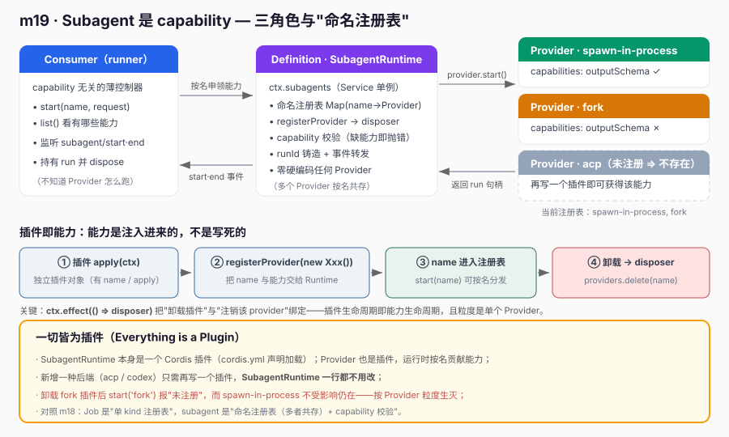
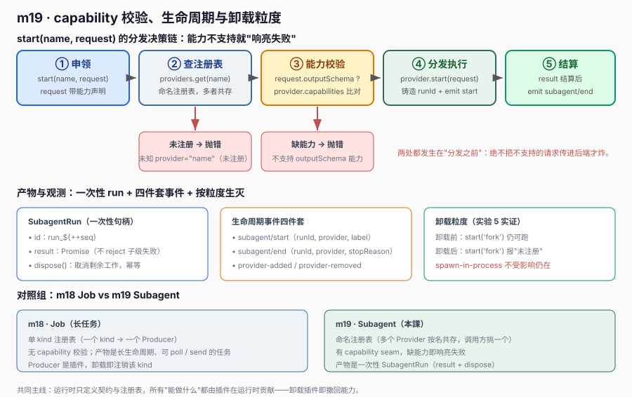

# m19 · Subagent 是 capability

> 把 "subagent" 建模为 **capability（能力）** 而非 "对象"：通过 `Provider` 插件在运行时把"子代理执行后端"注入 `SubagentRuntime`，
> 调用方按名选择、运行时校验能力。**一切皆为插件**——连 "子代理能用哪种后端跑" 都是插件贡献的，而非写死在运行时里。
> 本课对齐 `deepseek-harness` 的 `packages/subagent/subagent`（SubagentRuntime）、`packages/subagent-dsh-sdk`（spawn-in-process）、`packages/subagent-process`（fork）。

---

## 1. 课程目标

- 理解 subagent 的 **Definition / Provider / Consumer 三角色** 职责划分。
- 用 Cordis `Service` 实现 `SubagentRuntime`：`start(name, request)` / `list()` / `registerProvider()` + **capability 校验** + 生命周期事件 `subagent/start`·`subagent/end`。
- 区分"**subagent 是 capability**"与"subagent 是个对象实例"：能力用名字注册、按需选择、可插拔生灭。
- 体会 **一切皆为插件**：`spawn-in-process` / `fork` 都是对等插件，卸载即注销；新增一种后端（如 `acp`）无需改 Runtime 一行代码。

## 2. 前置知识

- m05 事件与 `ctx.emit` / `ctx.on`
- m06 `Service` 子类 + `super(ctx, name)` 注册 `ctx.<name>`
- m07 Provider 模式（本课 `SubagentProvider` 是标准 Provider）
- m18 后台 Job：同样的"三角色 + 插件注入"思路（Job 是单 kind 注册表，subagent 是**按名**的命名注册表）

## 3. 核心原理

### 3.1 三角色与"一切皆为插件"



| 角色 | 职责 | 本课落点 |
|------|------|----------|
| **Definition** | 能力契约 + 注册表 + 校验 | `SubagentRuntime` 服务（`ctx.subagents`），持有命名 Provider 注册表，做 capability 校验 |
| **Provider** | 拥有"执行资源" | `spawn-in-process` / `fork` 两个 Provider 插件，真正去执行子代理 |
| **Consumer** | capability 无关的薄控制器 | `runner.ts`，只调 `start(name, request)`，按名选能力、监听事件 |

**一切皆为插件的落点**：
- `SubagentRuntime` 服务本身是一个 Cordis 插件（`cordis.yml` 声明加载）；
- `spawn-in-process` / `fork` 两个 Provider 也是插件，通过 `ctx.effect(() => ctx.subagents.registerProvider(...))` 注入，
  卸载该插件 → 该 `name` 从注册表消失；
- 新增一种子代理后端（如 `acp` / `codex`），只需再写一个插件，**无需改 `SubagentRuntime` 一行代码**。

> 这不是停留在文字上的主张——**实验 5** 用真实动作验证：加载 `fork` 插件后 `subagents.start('fork', ...)` 能跑通（Runtime 源码未改），
> 随后 `forkFiber.dispose()` 卸载该插件，再 `start('fork')` 即报"未注册"，且 `spawn-in-process` 不受影响仍在——证明能力随插件**按粒度生灭**。

### 3.2 capability seam（能力接缝）



`start(name, request)` 在分发前先做 **capability 校验**：请求里声明的可选能力（如 `outputSchema`）若目标 Provider 不支持，则**响亮失败**（抛错），而不是默默接受、运行时才发现缺能力。
Provider 通过 `capabilities` 字段声明自己能做什么；Runtime 只认契约，不认具体实现。

## 4. 文件结构

| 文件 | 角色 | 说明 |
|------|------|------|
| `subagents.ts` | Definition（Service） | `SubagentRuntime`：命名 Provider 注册表 + `start`/`list`/`registerProvider` + capability 校验 + 事件 |
| `providers.ts` | Provider（插件 ×2） | `spawn-in-process`（支持 outputSchema）、`fork`（演示可扩展）两个对等插件 |
| `runner.ts` | Consumer + 装配 | 主插件，`await ctx.plugin` 加载两个 provider 插件，跑 5 个实验 |
| `cordis.yml` | 配置驱动 | 仅声明 `subagents` 服务 + `runner`；provider 由插件在运行时贡献 |
| `images/*.svg` | 配图 | 架构图 + 能力校验/生命周期时序图（`#fafafa` 扁平风格） |

## 5. 关键代码

### 5.1 Definition 层：命名注册表 + capability 校验

```ts
// subagents.ts
export class SubagentRuntime extends Service {
  private readonly providers = new Map<string, SubagentProvider>()

  /** 注册一个 Provider（effect 作用域：插件卸载 → 自动注销）。返回 disposer。 */
  registerProvider(provider: SubagentProvider): () => void {
    if (this.providers.has(provider.name)) throw new Error(`已存在 "${provider.name}"`)
    this.providers.set(provider.name, provider)
    this.ctx.emit('subagent/provider-added', provider)
    return () => {
      this.providers.delete(provider.name)        // 卸载 → 能力消失
      this.ctx.emit('subagent/provider-removed', provider.name)
    }
  }

  async start(name: string, request: SubagentStartRequest): Promise<SubagentRun> {
    const provider = this.providers.get(name)
    if (!provider) throw new Error(`未知 provider="${name}"（未注册）`)
    // capability 校验：缺能力即"响亮失败"
    if (request.outputSchema && !provider.capabilities.outputSchema) {
      throw new Error(`provider "${name}" 不支持 outputSchema 能力`)
    }
    const runId = `run_${++this.seq}`
    this.ctx.emit('subagent/start', { runId, provider: name, label: request.label })
    const run = await provider.start(request)
    const result = run.result.then((r) => {
      this.ctx.emit('subagent/end', { runId, provider: name, stopReason: r.stopReason })
      return r
    })
    return { ...run, result }
  }
}
```

### 5.2 一切皆为插件：两个对等 Provider 插件

```ts
// providers.ts
export const forkProviderPlugin = {
  name: 'subagent-provider-fork',
  inject: ['subagents'],
  apply(ctx: Context): void {
    const disposer = (ctx.subagents as SubagentRuntime).registerProvider(new ForkProvider())
    console.log('  [插件] 注册 provider="fork"')
    ctx.effect(() => disposer)   // 卸载插件 → disposer 触发 → providers.delete('fork')
  },
}
// spawn-in-process 插件写法完全相同，仅换一个 Provider 类。
```

> `SubagentRuntime` 对具体 Provider 一无所知：新增第三种后端（如 `acp`）只需复制上面这段代码、换 class，`Runtime` 零改动。

## 6. 运行验证

```bash
node --import tsx ./node_modules/@deepseek-ai/cordis/bin.js
```

输出要点（5 个实验全部 OK）：

```
[注册表] spawn-in-process, fork

[实验 1] 按名启动 spawn-in-process： OK
[实验 2] 多 provider 共存，fork 也能启动： OK
[实验 3] capability 校验：
   OK 拒绝（响亮失败）： [subagents] provider "fork" 不支持 outputSchema 能力
[实验 4] 生命周期事件：
   subagent/start 触发： spawn-in-process, fork
   subagent/end   触发： spawn-in-process:completed, fork:completed
   两个 run 均被观测： OK
[实验 5] 一切皆为插件：fork 是后加 provider，卸载即消失：
   5.1 卸载 fork 插件前，start("fork") 仍可跑： OK
   5.2 已卸载 fork 插件
   5.3 注册表剩余： spawn-in-process
   OK fork 已消失： [subagents] 未知 provider="fork"（未注册）
   5.4 spawn 不受影响仍在： OK
```

## 7. 心智模型

- **subagent 是 capability，不是对象**：你不会"new 一个 Subagent 实例"并长期持有；而是"向 Runtime 请求一个能力（按名字），它返回一个一次性的 `SubagentRun`"。
- **命名注册表 vs 单注册表**：Job（m18）是"一个 kind → 一个 Producer"；subagent 是"多个 Provider 按名共存"，调用方按业务语义挑一个。
- **capability seam**：把"能不能做某件事"前置成可校验的契约，避免把不支持的请求传进后端才炸。
- **插件即能力**：注册表初始为空，所有能力都来自插件；卸载插件 = 撤回能力，且粒度是单个 Provider。

## 8. 示例 vs deepseek-harness 真实工程实践

| 维度 | 本课示例（简化） | deepseek-harness 真实工程 |
|------|----------------|---------------------------|
| 运行时 | `SubagentRuntime`（`ctx.subagents`），命名注册表 | `packages/subagent/subagent/src/index.ts` 同名的 `SubagentRuntime`（`ctx.subagents`） |
| 契约类型 | `SubagentStartRequest` / `SubagentResult` / `SubagentRun` | `types.ts` 中 `SubagentStartRequest`（含 `ContentBlock[]` 多模态、`outputSchema`、`persona`）、`SubagentResult`、带 `id/result/dispose` 的 `SubagentRun` |
| Provider 数量 | 2 个示例（`spawn-in-process`、`fork`） | 多 Provider：`packages/subagent-dsh-sdk`（spawn-in-process）、`packages/subagent-process`（fork）、`packages/acp-core`/`acp-sdk`（acp）等，各自独立 npm 包 |
| 能力声明 | `capabilities: { outputSchema, persona }` | 同名字段，真实 Provider 在 `capabilities` 里声明支持的能力集合 |
| 注册方式 | `registerProvider` + `ctx.effect(() => disposer)` | 真实 Provider 在插件 `apply` 里 `registerProvider`，并以 `ctx.effect` 返回 disposer 实现可卸载 |
| 生命周期事件 | `subagent/start`、`subagent/end`、`subagent/provider-added/removed` | `index.ts` 的 Runtime 也通过 `ctx.emit('subagent/start'|'subagent/end'|...)` 发事件，供 observer 观测 |
| capability 校验 | `start` 里检查 `outputSchema` 支持与否再分发 | 真实 Runtime 在 `start` 分发前做 capability 校验，缺能力即失败 |
| 配置驱动 | `cordis.yml` 仅声明 `subagents` + `runner` | 真实 `cordis.yml` 把每个 Provider 作为带 `config` 的 entry 注入，Runtime 不感知具体 Provider |

### 8.1 一个真实工程的"新增 capability"路径（本课实验 5 已实证）

真实 harness 若要支持"通过 ACP 协议跑子代理"，做法是新建一个 `@deepseek-ai/dsh-acp` 包，实现 `SubagentProvider` 接口、在 `apply` 里 `registerProvider`，再在 `cordis.yml` 加一行 entry——**`packages/subagent/subagent` 一行都不用改**。
本课用 `providers.ts` 的 `ForkProvider` + `forkProviderPlugin` 复刻同一条路径，并在**实验 5** 中真实 `ctx.plugin` 加载、`dispose` 卸载，验证"插件即能力、卸载即消失"，而非仅文档文字声明。

### 8.2 与 m18 Job 的对照

| | m18 Job | m19 Subagent |
|---|---------|--------------|
| 注册表形态 | 单 kind 注册表（kind → Producer） | 命名注册表（name → Provider，多者共存） |
| 能力校验 | 无（统一 `start(spec)`） | 有（capability seam，缺能力响亮失败） |
| 产物 | 长生命周期、可 `poll`/`send` 的后台任务 | 一次性 `SubagentRun`（result + dispose） |
| 一切皆为插件 | ✓（producer 是插件） | ✓（provider 是插件） |

两者共同印证本系列主线：**运行时只定义契约与注册表，所有"能做什么"都由插件在运行时贡献。**
