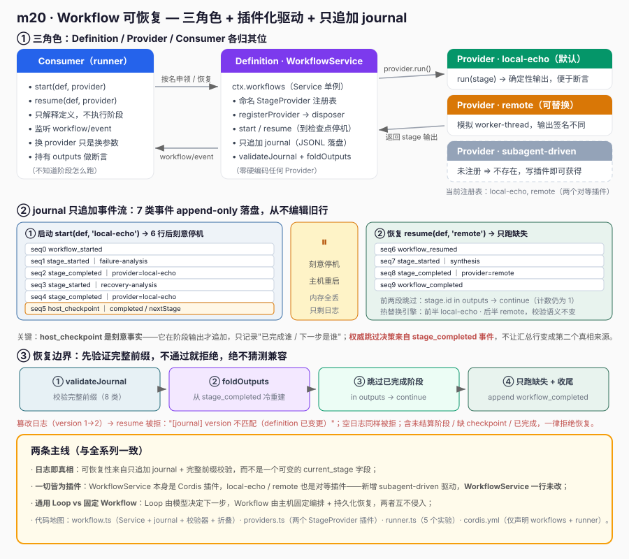
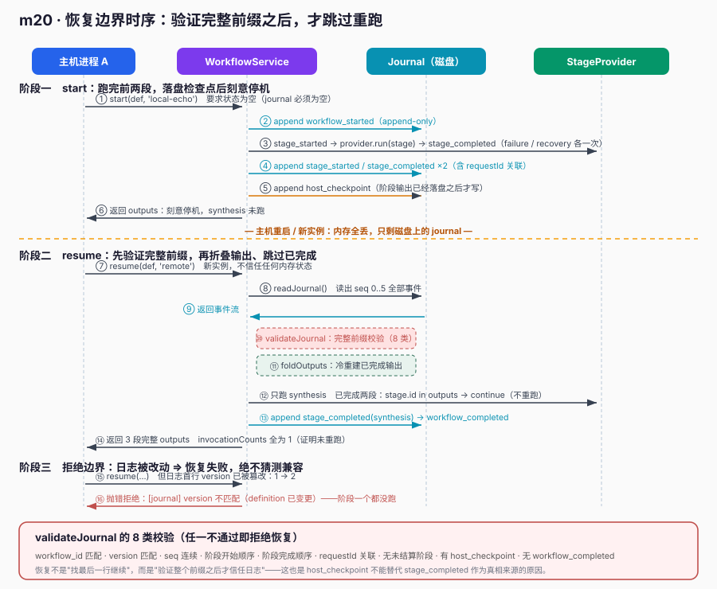

# m20 · Workflow 可恢复

> 把 "workflow" 建模为 **固定编排 + 可替换驱动 + 只追加日志**：阶段顺序在执行前就固定，
> 阶段由可替换的 `StageProvider` 执行，持久化的只追加 journal 让主机重启后能**验证日志、跳过已完成阶段、不重跑**。
> 本课对齐 `deepseek-harness` 的 `packages/workflow/workflow`（服务）、`workflow-worker-thread`（provider）、`tool-workflow`（consumer）。

---

## 1. 课程目标

- 理解 workflow 的 **Definition / Provider / Consumer 三角色** 职责划分。
- 用 Cordis `Service` 实现 `WorkflowService`：`start` / `resume` / `registerProvider` + **只追加 journal** + **恢复前完整前缀校验**。
- 区分"通用 Agent Loop"与"固定 Workflow 驱动"：前者模型动态决定下一步，后者主机决定检查点与恢复。
- 体会 **一切皆为插件**：`local-echo` / `remote` 两个 StageProvider 都是对等插件，换 provider 不改 Runtime 与日志校验语义。

## 2. 前置知识

- m05 事件与 `ctx.emit` / `ctx.on`
- m06 `Service` 子类 + `super(ctx, name)` 注册 `ctx.<name>`
- m07 Provider 模式（本课 `StageProvider` 是标准 Provider）
- m18 后台 Job / m19 Subagent：同样的"三角色 + 插件注入"思路（Job 单 kind 注册表、subagent 命名注册表、workflow 是带日志的可恢复注册表）

## 3. 核心原理

### 3.1 三角色与"一切皆为插件"



| 角色 | 职责 | 本课落点 |
|------|------|----------|
| **Definition** | 固定的阶段顺序 + 检查点边界 | `WorkflowDefinition` 数据对象（stages 顺序即权威） |
| **Provider** | 拥有"执行资源"的驱动 | `local-echo` / `remote` 两个 `StageProvider` 插件，只执行单个阶段 |
| **Consumer** | 解释 definition、写日志、决定恢复 | `WorkflowService`（`ctx.workflows`），按 definition 跑阶段、写 journal、恢复时校验+跳过 |

**一切皆为插件的落点**：
- `WorkflowService` 服务本身是一个 Cordis 插件（`cordis.yml` 声明加载）；
- `local-echo` / `remote` 两个 StageProvider 也是插件，通过 `ctx.effect(() => ctx.workflows.registerProvider(...))` 注入；
- 新增一种执行后端（如 `subagent-driven` 复用 m19 Subagent Definition），只需再写一个插件，**无需改 `WorkflowService` 一行代码**；换 provider 时 Runtime 与 journal 校验语义不变。

> 实验 4 用真实动作验证：用 `remote` provider 跑一遍 start/resume，调用计数与 `local-echo` 完全一致（前两段不重跑），证明"替换驱动边界"成立。

### 3.2 可恢复核心：只追加 journal + 完整前缀校验



- **只追加**：`stage_started` / `stage_completed` / `host_checkpoint` / `workflow_resumed` / `workflow_completed` 全部 append-only，从不编辑旧行。
- **主机检查点是刻意事实**：在阶段输出已落盘之后才追加 `host_checkpoint`，记录已完成 ID 与下一阶段，但**权威跳过决策来自 `stage_completed` 事件**，不让汇总行成为第二个真相来源。
- **恢复 = 验证 + 跳过**：`resume` 先 `validateJournal`（校验 workflow_id/version 匹配、序列连续、阶段顺序、request_id 关联、无未结算阶段、有 checkpoint、无 completed），通过后才 `foldOutputs` 重建已完成输出、只跑缺失阶段。
- 篡改日志（如 version 不匹配）→ 恢复被拒，而不是猜测兼容。

## 4. 文件结构

| 文件 | 角色 | 说明 |
|------|------|------|
| `workflow.ts` | Definition + Consumer（Service） | `WorkflowService`：命名 StageProvider 注册表 + `start`/`resume` + 只追加 journal + `validateJournal`/`foldOutputs`/`invocationCounts` |
| `providers.ts` | Provider（插件 ×2） | `local-echo`（默认）、`remote`（可替换驱动）两个对等插件 |
| `runner.ts` | Consumer + 装配 | 主插件，`await ctx.plugin` 加载两个 provider 插件，跑 5 个实验 |
| `cordis.yml` | 配置驱动 | 仅声明 `workflows` 服务 + `runner`；provider 由插件在运行时贡献 |
| `images/*.svg` | 配图 | 架构图 + 恢复时序图（`#fafafa` 扁平风格） |

## 5. 关键代码

### 5.1 Definition + Consumer：start / resume

```ts
// workflow.ts（节选）
async start(def: WorkflowDefinition, providerName: string): Promise<Record<string, string>> {
  if (this.readJournal(def.workflowId).length > 0) throw new Error('--start 要求状态为空')
  this.append(def, 'workflow_started', { description: def.description })
  const outputs: Record<string, string> = {}
  for (const stage of def.stages) {
    outputs[stage.id] = await this.runStage(def, stage, providerName, outputs)
    if (stage.id === def.hostCheckpointAfter) {
      this.append(def, 'host_checkpoint', { completed: Object.keys(outputs), nextStage: def.stages[Object.keys(outputs).length].id })
      return outputs // 刻意停机
    }
  }
  throw new Error('未到达配置的主机检查点')
}

async resume(def: WorkflowDefinition, providerName: string): Promise<Record<string, string>> {
  const events = this.readJournal(def.workflowId)
  validateJournal(events, def)              // 不信任日志，先验证完整前缀
  const outputs = foldOutputs(events)       // 冷重建已完成输出
  this.append(def, 'workflow_resumed', { completed: Object.keys(outputs) })
  for (const stage of def.stages) {
    if (stage.id in outputs) continue       // 跳过已完成阶段（关键：不重跑）
    outputs[stage.id] = await this.runStage(def, stage, providerName, outputs)
  }
  this.append(def, 'workflow_completed', { completed: Object.keys(outputs) })
  return outputs
}
```

### 5.2 一切皆为插件：两个对等 StageProvider 插件

```ts
// providers.ts（节选）
export const remoteProviderPlugin = {
  name: 'workflow-provider-remote',
  inject: ['workflows'],
  apply(ctx: Context): void {
    const disposer = (ctx.workflows as WorkflowService).registerProvider(new RemoteProvider())
    console.log('  [插件] 注册 stage provider="remote"')
    ctx.effect(() => disposer)   // 卸载插件 → disposer → providers.delete('remote')
  },
}
// local-echo 插件写法完全相同，仅换一个 Provider 类。
```

> `WorkflowService` 对具体 Provider 一无所知：新增第三种驱动（如 subagent-driven）只需复制上面这段代码、换 class，`WorkflowService` 零改动。

## 6. 运行验证

```bash
node --import tsx ./node_modules/@deepseek-ai/cordis/bin.js
```

输出要点（5 个实验全部 OK）：

```
[注册 provider] local-echo, remote

[实验 1] 启动：跑完 failure/recovery 后刻意检查点停机：
  启动后已完成阶段： failure-analysis, recovery-analysis
  synthesis 未跑（停机前）： OK

[实验 2] journal 落盘为只追加 JSONL：
  行数： 6 含 host_checkpoint： OK

[实验 3] 恢复：仅跑 synthesis，前两段调用计数仍为 1：
  恢复后所有阶段： failure-analysis, recovery-analysis, synthesis
  调用计数： {"failure-analysis":1,"recovery-analysis":1,"synthesis":1}
  前两段未重跑（计数=1）： OK
  已完成输出逐字节复用： OK

[实验 4] 一切皆为插件：同一 workflow 热替换引擎 local-echo → remote：
  4.1 start 用 local-echo 跑到检查点停机：OK
  各阶段执行引擎： {"failure-analysis":"local-echo","recovery-analysis":"local-echo","synthesis":"remote"}
  调用计数： {"failure-analysis":1,"recovery-analysis":1,"synthesis":1}
  前半段由 local-echo 执行： OK
  后半段由 remote 执行（热替换）： OK
  换引擎后仍不重跑已完成阶段： OK

[实验 5] 日志校验边界：篡改 version 后恢复被拒：
  OK 拒绝（不猜测兼容）： [journal] version 不匹配（definition 已变更）
  校验器拒绝空日志： OK
```

## 7. 心智模型

- **workflow 是固定编排，不是对象**：定义先定好阶段顺序，运行时只解释它、记录事实、按需跳过。
- **通用 Loop 与 Workflow 驱动分工**：Loop 负责"模型动态下一步"，Workflow 负责"主机固定编排 + 持久化恢复"；两者互不侵入。
- **日志即真相**：可恢复性来自只追加 journal + 完整前缀校验，而非一个可变 `current_stage=2` 字段。
- **插件即驱动**：执行某个阶段的"引擎"是插件贡献的；换引擎不改编排、不改日志语义。

## 8. 示例 vs deepseek-harness 真实工程实践

| 维度 | 本课示例（简化） | deepseek-harness 真实工程 |
|------|----------------|---------------------------|
| 服务 | `WorkflowService`（`ctx.workflows`） | `packages/workflow/workflow` 同名的服务类型 |
| 定义 | `WorkflowDefinition`（stages + checkpoint） | `client/ui-workflow-run` 的 `workflow-definition.ts` + 脚本元数据 |
| 执行驱动 | `StageProvider` 插件（local-echo / remote） | `packages/workflow/workflow-worker-thread`（worker-thread provider）、可扩 subagent provider |
| 消费者 | `runner.ts` 直接调 `start/resume` | `packages/workflow/tool-workflow`（把 workflow 暴露为工具） |
| 持久化 | 进程临时目录上的 JSONL journal | `session/session-persistence`（sqlite/jsonl/zstd）、`session-checkpoint-policy` 检查点策略 |
| 恢复校验 | `validateJournal`（id/version/序列/顺序/关联/未结算/checkpoint/completed） | `session-checkpoint-policy` 的 crash-recovery 契约 + `session-persistence` 的 coordinator |
| 事件 | `workflow/event` + 7 类 journal 事件 | 上游把脚本元数据、引擎执行、子 agent 事件、运行结果、取消、工具展示分离 |
| 可替换性 | 换 StageProvider 不改 Runtime/journal | 引擎、provider、存储、模型配置均可独立替换而不改编排 |

### 8.1 一个真实工程的"替换驱动"路径（本课实验 4 已实证）

真实 harness 若要改用"子 agent 驱动"跑阶段，做法是新增一个实现了 `StageProvider` 接口的 provider 包（复用 m19 `Subagent Definition`），注册进 `WorkflowService`，**`workflow/workflow` 服务与 journal 验证一行都不用改**。
本课用 `providers.ts` 的 `RemoteProvider` + `remoteProviderPlugin` 复刻同一条"替换驱动边界"路径，并在**实验 4** 中真实用 `remote` 跑 start/resume，证明其调用计数与默认 `local-echo` 完全一致——驱动可换、编排与日志语义不变。

### 8.2 与 m18/m19 的对照

| | m18 Job | m19 Subagent | m20 Workflow |
|---|---------|--------------|--------------|
| 注册表 | 单 kind（kind→Producer） | 命名（name→Provider，多者共存） | 命名（name→StageProvider）+ 落盘 journal |
| 产物生命周期 | 长生命周期、可 poll/send | 一次性 `SubagentRun` | 多阶段、可中断、可恢复 |
| 可恢复性 | 无 | 无 | **有**：只追加 journal + 完整前缀校验 |
| 一切皆为插件 | ✓ | ✓ | ✓ |

三者共同印证本系列主线：**运行时只定义契约与注册表，所有"能做什么"都由插件在运行时贡献。**
