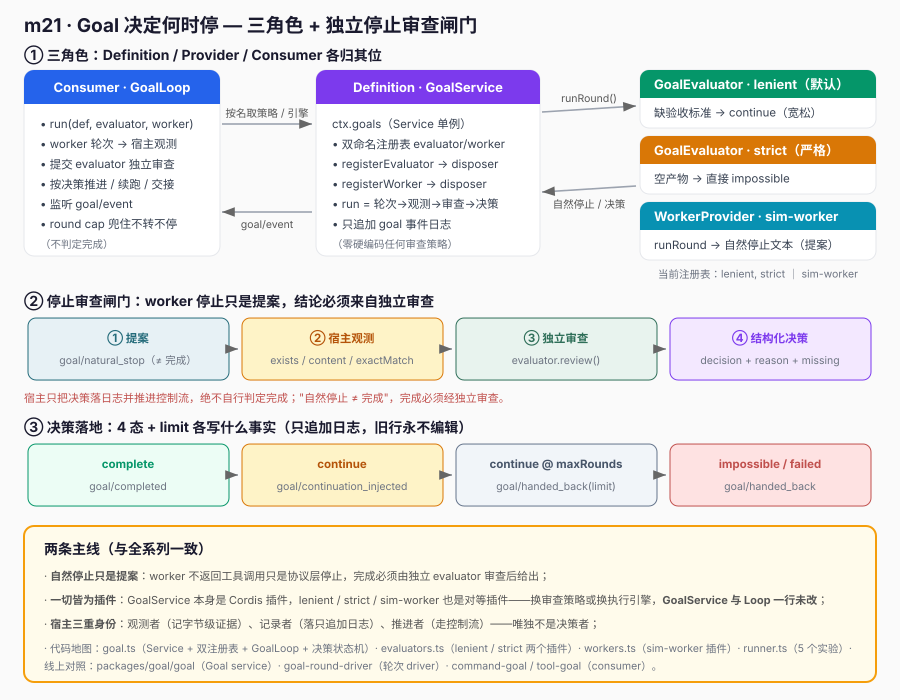
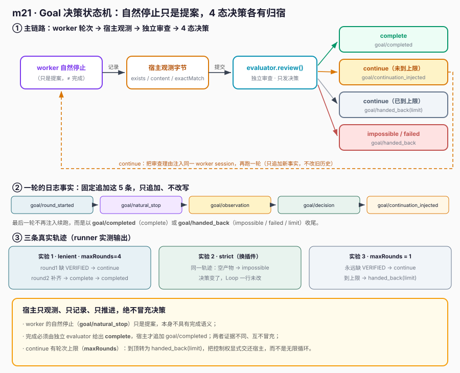

# m21 · Goal 决定何时停

> 把 "停止审查" 从 worker 里抽出来，做成一个**独立的、可替换的闸门**：worker 的自然停止只是一个**提案**，
> 由独立的 `GoalEvaluator` 审查后决定 `complete` / `continue` / `impossible` / `failed`。
> 宿主只做客观观测、绝不冒充审查决策。本课对齐 `deepseek-harness` 的 `packages/goal/goal`（Goal service）、`goal-round-driver`、`command-goal` / `tool-goal`。

---

## 1. 课程目标

- 理解 "**自然停止 ≠ 完成**"：worker 不返回工具调用只是协议层面的停止，不代表目标达成。
- 用 Cordis `Service` 实现 `GoalService`：`run` 跑 GoalLoop、维护只追加 goal 事件日志、实现 4 态 + `limit` 决策状态机。
- 体会 **一切皆为插件**：`GoalEvaluator`（停止审查策略）与 `WorkerProvider`（执行引擎）都是插件，换插件不改 Loop。

## 2. 前置知识

- m05 事件与 `ctx.emit` / `ctx.on`
- m06 `Service` 子类 + `super(ctx, name)` 注册 `ctx.<name>`
- m07 Provider 模式（本课 `GoalEvaluator` / `WorkerProvider` 是标准 Provider）
- m18/m19/m20：同样的"三角色 + 插件注入"思路（Job 单 kind、subagent 命名、workflow 可恢复；本课是停止审查的可替换闸门）

## 3. 核心原理

### 3.1 三角色与"一切皆为插件"



| 角色 | 职责 | 本课落点 |
|------|------|----------|
| **Definition** | 目标文本 + 验收标准 | `GoalDefinition` 数据对象（objective + criteria） |
| **Provider** | 停止审查 / 执行引擎 | `lenient`/`strict` 两个 `GoalEvaluator` 插件；`sim-worker` 一个 `WorkerProvider` 插件 |
| **Consumer** | GoalLoop | `GoalService`（`ctx.goals`）：worker 轮次 → 宿主观测 → 独立审查 → 按决策推进/交接 |

**一切皆为插件的落点**：
- `GoalService` 服务本身是一个 Cordis 插件（`cordis.yml` 声明加载）；
- `lenient` / `strict` 两个 `GoalEvaluator` 是插件，通过 `ctx.effect(() => ctx.goals.registerEvaluator(...))` 注入；
- `sim-worker` 一个 `WorkerProvider` 也是插件，通过 `registerWorker` 注入；
- **换停止审查策略（lenient → strict）或换执行引擎，都无需改 `GoalService` 一行代码**。

> 实验 2 用真实动作验证：同一 worker 轨迹，换 `strict` evaluator 后，对空产物从"可能 continue"变为直接 `impossible`——决策来自插件，Loop 主逻辑不变。实验 5 进一步验证：卸载 `lenient` 插件后 `run` 用其即报"未注册"，`strict` 不受影响仍在。

### 3.2 决策状态机（宿主侧应用）



- **complete**：所有验收标准已满足 → 追加 `goal/completed` 并返回成功。
- **continue**：仍有缺失 → 追加 `goal/continuation_injected`，把审查理由作为新事实注入**同一 worker session** 再跑一轮；到达 `maxRounds` 时 `continue` 变为 `handed_back(limit)`，不无限循环。
- **impossible**：目标在当前约束下无法实现 → `goal/handed_back`（交还控制权）。
- **failed**：执行/证据损坏 → `goal/handed_back`。
- 宿主**只观测字节、只落日志、只推进控制流，绝不自行判定完成**。

## 4. 文件结构

| 文件 | 角色 | 说明 |
|------|------|------|
| `goal.ts` | Definition + Consumer（Service） | `GoalService`：命名 Evaluator/Worker 注册表 + `run`（GoalLoop）+ 只追加日志 + 决策状态机 |
| `evaluators.ts` | Provider（插件 ×2） | `lenient`（默认宽松）、`strict`（严格，演示可替换审查策略） |
| `workers.ts` | Provider（插件 ×1） | `sim-worker`（模拟执行引擎，同样体现一切皆为插件） |
| `runner.ts` | Consumer + 装配 | 主插件，`await ctx.plugin` 加载 evaluator/worker 插件，跑 5 个实验 |
| `cordis.yml` | 配置驱动 | 仅声明 `goals` 服务 + `runner`；evaluator/worker 由插件在运行时贡献 |
| `images/*.svg` | 配图 | 架构图 + 决策状态机图（`#fafafa` 扁平风格） |

## 5. 关键代码

### 5.1 Definition + Consumer：run（GoalLoop + 决策状态机）

```ts
// goal.ts（节选）
run(opts): GoalResult {
  const { def, evaluatorName, workerName, maxRounds = 4 } = opts
  const evaluator = this.evaluators.get(evaluatorName) // 插件贡献的审查者
  const worker = this.workers.get(workerName)
  if (!evaluator || !worker) throw new Error('未注册')

  for (let round = 1; round <= maxRounds; round++) {
    const naturalStop = worker.runRound(round, def, continuation) // 仅提案
    this.append(def.goalId, 'goal/natural_stop', { round, text: naturalStop })
    const observation = { exists: naturalStop.length > 0, content: naturalStop, exactMatch: naturalStop.includes(def.objective), readAfterFinalWrite: true }
    this.append(def.goalId, 'goal/observation', { round, ...observation }) // 宿主只观测
    const decision = evaluator.review({ goal: def, round, naturalStop, observation }) // 独立审查
    this.append(def.goalId, 'goal/decision', { round, ...decision })
    if (decision.decision === 'complete') { this.append(def.goalId, 'goal/completed', { round }); break }
    if (decision.decision === 'continue') {
      if (round === maxRounds) { this.append(def.goalId, 'goal/handed_back', { round, reason: 'limit' }); break }
      const feedback = `Independent goal review chose CONTINUE...`
      this.append(def.goalId, 'goal/continuation_injected', { round, content: feedback })
      continuation = feedback; continue
    }
    this.append(def.goalId, 'goal/handed_back', { round, reason: decision.decision }); break
  }
}
```

### 5.2 一切皆为插件：两个对等 evaluator 插件

```ts
// evaluators.ts（节选）
export const strictEvaluatorPlugin = {
  name: 'goal-evaluator-strict',
  inject: ['goals'],
  apply(ctx: Context): void {
    const disposer = (ctx.goals as GoalService).registerEvaluator(new StrictEvaluator())
    console.log('  [插件] 注册 evaluator="strict"')
    ctx.effect(() => disposer)   // 卸载插件 → disposer → evaluators.delete('strict')
  },
}
// lenient 插件写法完全相同，仅换一个 Evaluator 类。
```

> `GoalService` 对具体 Evaluator 一无所知：新增第三种审查策略（如"LLM 远程审查"）只需复制上面这段代码、换 class，`GoalService` 零改动。

## 6. 运行验证

```bash
node --import tsx ./node_modules/@deepseek-ai/cordis/bin.js
```

输出要点（5 个实验全部 OK）：

```
[注册 evaluator] lenient, strict
[注册 worker] sim-worker

[实验 1] 基础 Loop：部分内容→continue→补齐→complete：
  决策序列： continue -> complete
  最终决策： complete
  有续跑注入： OK
  部分→续跑→完成： OK

[实验 2] 一切皆为插件：换 strict evaluator 改变决策：
  strict 下决策序列： impossible
  strict 对空产物判： impossible
  换策略后决策改变（impossible）： OK

[实验 3] 轮次上限：maxRounds=1 时 continue 变 handed_back(limit)：
  handed_back 原因： limit
  上限交接（不无限循环）： OK

[实验 4] impossible 显式交接： OK

[实验 5] 一切皆为插件：卸载 lenient evaluator 插件后 run 用其即被拒：
  剩余 evaluator： strict
  OK 已消失： [goals] 未知 evaluator="lenient"（未注册）
  strict 不受影响仍在： OK
```

## 7. 心智模型

- **自然停止只是提案**：worker 停了 ≠ 目标成了；完成必须经独立审查。
- **worker 与 evaluator 是分离的审查边界**：前者产出动作，后者判定是否停下；两者证据不同、互不冒充。
- **宿主不冒充决策**：宿主可以观测精确字节、可以投影生命周期证据，但最终 stop 必须由 evaluator 给出。
- **插件即能力/策略**：停止审查策略与执行引擎都是插件；换策略不改 Loop 主逻辑。

## 8. 示例 vs deepseek-harness 真实工程实践

| 维度 | 本课示例（简化） | deepseek-harness 真实工程 |
|------|----------------|---------------------------|
| Goal 服务 | `GoalService`（`ctx.goals`） | `packages/goal/goal`（Goal service） |
| 轮次驱动 | `GoalService.run` 内联 Loop | `packages/goal/goal-round-driver`（独立 driver） |
| 定义 | `GoalDefinition`（objective + criteria） | `command-goal` / `tool-goal` 中的目标与标准 |
| 停止审查 | `GoalEvaluator` 插件（`review` 返回 4 态） | evaluator provider（与 worker 分离的独立请求） |
| 执行引擎 | `WorkerProvider` 插件（sim-worker） | `packages/agent-loop` 等真实 worker |
| 消费者 | `runner.ts` 直接调 `run` | `packages/command-goal`、`packages/tool-goal`（command/tool consumer） |
| 决策状态机 | complete/continue/impossible/failed + `limit` | 同 4 态 + round cap → handed_back |
| 事件 | `goal/started`/`natural_stop`/`observation`/`decision`/`continuation_injected`/`completed`/`handed_back` | 同系列 goal 事件事实（只追加） |
| 可替换性 | 换 evaluator/worker 插件不改 Loop | 审查策略、worker、consumer 均可独立替换而不改 Goal 状态机 |

### 8.1 一个真实工程的"替换审查策略"路径（本课实验 2/5 已实证）

真实 harness 若要改用"远程 LLM 审查"或"更严格的业务规则审查"，做法是新增一个实现了 `GoalEvaluator` 接口的插件包，注册进 `GoalService`，**`packages/goal/goal` 与 round-driver 一行都不用改**。
本课用 `evaluators.ts` 的 `StrictEvaluator` + `strictEvaluatorPlugin` 复刻同一条"替换停止审查策略"路径，并在**实验 2**中真实用 `strict` 跑出不同决策、在**实验 5**中卸载 `lenient` 插件验证"插件即能力、卸载即消失"，而非仅文档文字声明。

### 8.2 与 m18/m19/m20 的对照

| | m18 Job | m19 Subagent | m20 Workflow | m21 Goal |
|---|---------|--------------|--------------|----------|
| 注册表 | 单 kind | 命名 | 命名 + journal | 命名（evaluator/worker） |
| 可恢复 | 无 | 无 | 有（journal 校验） | 无（聚焦停止审查） |
| 一切皆为插件 | ✓ | ✓ | ✓ | ✓（evaluator+worker 双插件） |
| 独特贡献 | 生命周期 | capability 命名分发 | 可中断恢复 | **独立停止审查闸门** |

四者共同印证本系列主线：**运行时只定义契约与注册表，所有"能做什么/如何判定"都由插件在运行时贡献。**
