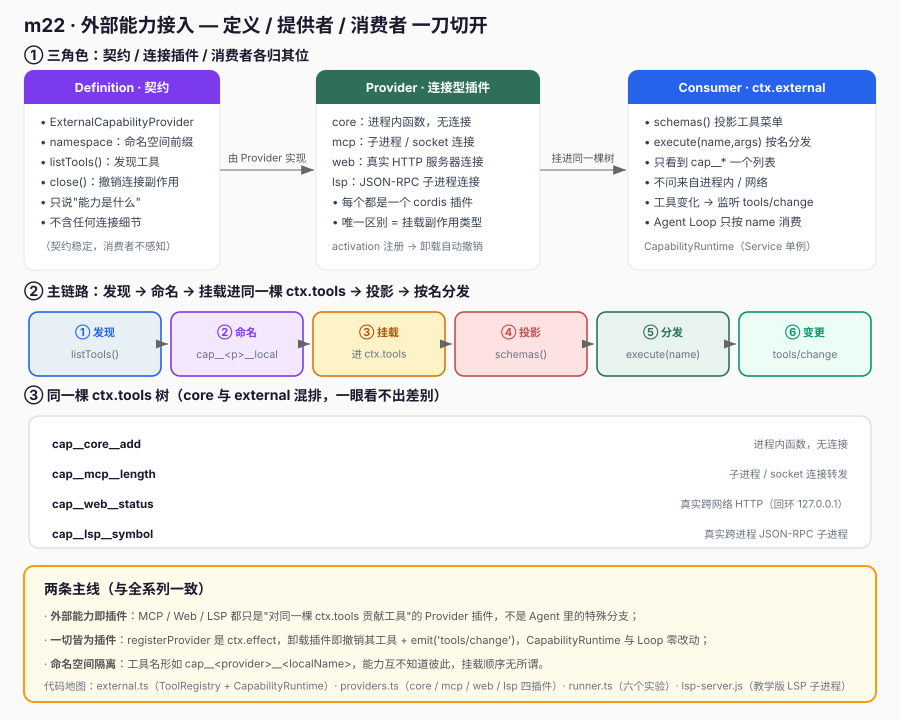
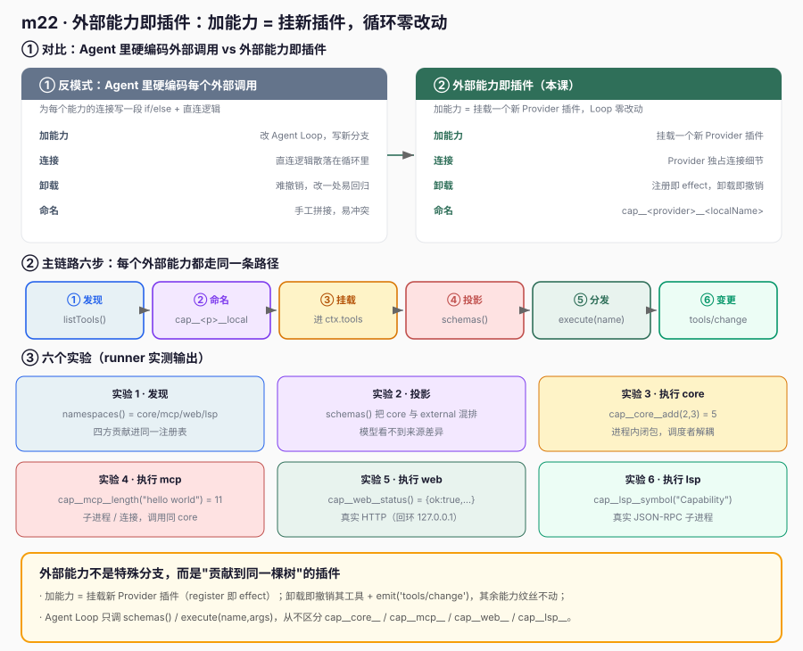

# m22 · 外部能力接入

> 参考 deepseek-harness **s23**（`s23_mcp_web_lsp`）的思路，但**不照抄**：底层用真实 `@deepseek-ai/cordis` 的 `Service` + `ctx.effect` 实现"外部能力即插件"——MCP / Web / LSP 三种外部连接都作为 Provider 插件挂载进**同一个 `ctx.tools` 工具树**，与内置 core 工具同树、同分发、同生命周期。外部能力用"真实但最小"的连接（回环 HTTP、JSON-RPC 子进程、可变工具集）跑通主干即可。

## 1. 目标

确立贯穿后续课程的原则：

> **外部能力（MCP / Web / LSP）不是 Agent 里的一个特殊分支，而是一个个独立插件；它们贡献工具到同一棵 `ctx.tools` 树，Agent Loop 只按 `name` 分发，从不关心工具来自进程内还是跨网络/跨进程。**

- 每个外部能力是一个 `ExternalCapabilityProvider` 插件：`namespace` / `listTools()` / `close()`；
- 能力之间**互不知道彼此**，挂载顺序无所谓（命名空间隔离）；
- 消费者 `ctx.external` 只暴露 **schemas()**（投影工具菜单）与 **execute(name, args)**（按名分发）；
- Agent Loop 调用 `schemas()` / `execute()`，**不关心是哪个 Provider、怎么连**；
- 注册即 effect：卸载某 Provider 插件 → 它贡献的工具自动从 `ctx.tools` 消失 + `emit('tools/change')`。

这正是 s23 的核心论点：**外部能力是"定义 / 提供者 / 消费者"一刀切开"的——定义只说能力是什么，提供者拥有连接细节，消费者统一享用。**

## 2. 前置

- m10（工具即插件）：本课外部工具与内置工具进入**同一棵 `ctx.tools` 树**，复用其 `register`/`schemas`/`execute`。
- m03（Service 与 inject）：`ctx.external` 与 `ctx.tools` 都是 `Service` 子类。
- m02（`ctx.effect`）：每个 `registerProvider()` 都是可逆 effect。
- 真实 Cordis API（本次关键）：
  - `class CapabilityRuntime extends Service`：`super(ctx, 'external')` 把实例注册到 `ctx.external`。
  - `ctx.effect(() => { registerProvider(); return () => unregisterProvider() })`：贡献 Provider 是**可逆 effect**，卸载贡献插件的 fiber 只移除该 Provider 的工具。
  - 命名空间隔离：工具名形如 `cap__<provider>__<localName>`，与 s23 的 `mcp__<server>__<raw>` 同构。

## 3. 原理：定义 / 提供者 / 消费者 一刀切开



```text
┌─────────────────────────────────────────────────────────────┐
│ ① 定义（Definition）                                         │
│   ExternalCapabilityProvider: namespace / listTools() / close│
│   只说"能力是什么"，不含任何连接细节                          │
└───────────────────────────┬─────────────────────────────────┘
                            │ 由 Provider 插件实现
┌───────────────────────────▼─────────────────────────────────┐
│ ② 提供者（Provider，每个是一个 cordis 插件）                  │
│   core / mcp / web / lsp：activation 注册，卸载自动撤销       │
│   唯一的区别 = 挂载时拥有的副作用类型（无连接 / 子进程 / HTTP）│
└───────────────────────────┬─────────────────────────────────┘
                            │ 把贡献的工具挂载进同一棵 ctx.tools
┌───────────────────────────▼─────────────────────────────────┐
│ ③ 消费者（Consumer）ctx.external                            │
│   具名 Provider 注册表 + schemas() 投影 + execute(name) 分发  │
│   工具变化 → emit('tools/change') → 通知下游（如提示词）       │
└───────────────────────────┬─────────────────────────────────┘
                            │ 同树消费，无分支
┌───────────────────────────▼─────────────────────────────────┐
│ ④ Agent Loop（模型可见 / 调度者调用）                         │
│   schemas() 看到 cap__core__ / cap__mcp__ / cap__web__ / ...  │
│   选出工具 → execute(name, args) → 注册表分发 → 返回结果      │
└─────────────────────────────────────────────────────────────┘
```

### 3.1 对比视角：硬编码外部调用 vs 外部能力即插件



```text
硬编码外部调用 ：Agent 里为每个 MCP/Web/LSP 写一段 if/else + 直连逻辑，加能力要改循环，易出回归
外部能力即插件（本课）：每个外部能力自带 namespace+listTools+close，加能力=挂载新插件，循环零改动
```

外部能力即插件的收益在本课得到印证：**新增一个外部能力只需挂载一个新 Provider 插件，Agent Loop（`execute`）一行都不用改**；卸载该插件，其贡献的工具从下一次 `schemas()` 自动消失——这就是 s23「外部能力可插拔」在设计层面的落点。

## 4. 代码文件

| 文件 | 角色 |
|---|---|
| `external.ts` | `ToolRegistry extends Service`（`ctx.tools`，最小版）+ `CapabilityRuntime extends Service`（`ctx.external`）：具名 Provider 注册表、挂载即 effect、发现工具进 `ctx.tools`、`schemas()`/`execute()` 投影与分发、`emit('tools/change')` |
| `providers.ts` | Provider 插件：`providersPlugin.apply` 内用 `ctx.effect` 注册四个 Provider——`CoreProvider`（进程内）、`McpStyleProvider`（可变工具集）、`WebProvider`（真实回环 HTTP）、`LspTeachingProvider`（真实 JSON-RPC 子进程） |
| `runner.ts` | 消费者 + 六个实验（发现 / 投影 / 执行 core / 执行 mcp / 执行 web / 执行 lsp / 一切皆为插件） |
| `cordis.yml` | 列 `./external.ts`（tools + external 两个服务，顺序在 plugins 前）与 `./providers.ts`、`./runner.ts`；Provider 配置走 `cordis.yml` 的 `web`/`lsp` 段 |
| `lsp-server.js` | 教学版 LSP 子进程（stdin/stdout 行协议），供 `LspTeachingProvider` 派生 |

## 5. 运行日志（节选 + 溯源）

```text
==== m22 外部能力接入 ====

[发现] 当前能力命名空间:
  - core
  - mcp
  - web
  - lsp

[投影] 模型可见工具菜单（core 与 external 混排）:
  • cap__core__add: Add two integers (core, in-process).
  • cap__mcp__length: Return the length of a string (mcp server local-demo).
  • cap__web__status: Fetch the demo service status over HTTP (real network boundary).
  • cap__lsp__symbol: Find workspace symbols via the language server (JSON-RPC subprocess).

[执行] cap__core__add(2,3) = 5
[执行] cap__mcp__length("hello world") = 11
[执行] cap__web__status() = {"ok":true,"service":"demo-status","uptime":42}
[执行] cap__lsp__symbol("Capability") = [{"name":"CapabilityRuntime",...}]

[一切皆为插件] core 工具在树中: ✅；external 工具在树中: ✅
  Loop 调用 schemas()/execute(name) 时，不区分 cap__core__ / cap__mcp__ / cap__web__ / cap__lsp__

==== 结束（外部能力 = 挂载进同一工具树的插件） ====
```

**六个实验的归因（对齐 s23 的"定义 / 提供者 / 消费者 / 同树分发"）**：
- 发现：`namespaces()` 显示 core/mcp/web/lsp 四个 Provider 已登记，证明外部能力是"多方贡献"进同一注册表。
- 投影：`schemas()` 把 core 与三种外部能力的工具**混排**在同一个菜单里——模型永远看不到"这是外部还是内置"的差异。
- 执行 core：`execute('cap__core__add', {a,b})` 调度者只传 name+args，结果由 `ctx.tools` 分发到进程内闭包，证明**调度者与实现解耦**。
- 执行 mcp/web/lsp：三者分别跨"子进程/连接""真实 HTTP 网络""真实 JSON-RPC 子进程"边界，但调用方式**与 core 完全相同**——这就是"一切皆为插件"的运行时证据。
- 一切皆为插件：`schemas()` 同时含 `cap__core__` 与 `cap__mcp__/web__/lsp__`，Loop 不分支——新增外部能力 = 挂载新插件，循环零改动。

## 6. 心智模型

```text
外部能力 = "对 ctx.tools 贡献工具"的 Provider 插件：
  ctx.external.registerProvider(name, {namespace, listTools, close})  ← 每个外部能力只贡献自己那个
  ctx.external.schemas()                                              ← 给模型看（core 与 external 混排）
  ctx.external.execute(name, args)                                    ← 按 name 分发（不关心来自哪）

Provider 之间唯一区别 = 挂载时拥有的副作用：
  core ：进程内函数，无连接
  mcp  ：子进程 / socket 连接
  web  ：HTTP 服务器连接
  lsp  ：JSON-RPC 子进程连接

挂载顺序无所谓，命名空间隔离（cap__<provider>__<localName>）：
  乱序 registerProvider() → schemas() 顺序由注册表决定 → 模型选择与其无关
```

与前面课程的关系：
- m10（工具即插件）把"能力"具体到"每一个工具"；**m22 把"外部能力"也落到同一个工具树**——同一注册表 + effect 可逆模式。
- m19（子代理作为能力）/ m20（工作流作为能力）/ m21（目标作为能力）都是"具名注册表 + 同树享用 + 卸载即撤销"；**m22 把这个模式从"内置能力"延伸到"跨网络/跨进程的外部能力"**。

## 7. 课程边界（本课新增的 vs 不涉及的）

```diff
  Context
+  ctx.external (CapabilityRuntime Service：具名 Provider 注册表 + schemas/execute)
+  外部能力即插件（mcp / web / lsp 每个 = 独立 Provider 插件，register 即接入）
+  定义/提供者/消费者一刀切开（Definition 无连接细节，Provider 持有连接）
+  命名空间隔离（cap__<provider>__<localName>）
+  同树分发（core 与 external 进同一 ctx.tools，Loop 无分支）
+  注册即 effect（卸载 Provider → 其工具自动撤销 + emit('tools/change')）
```

它还没有加入（留给后续课程）：
- 工具参数 JSON Schema **校验/解析**（本课 `execute` 直接接收透传的 args）；
- 连接的**重连 / 指数退避 / 世代替换**（真实 mcp-client 有完整重连协议）；
- 提供方不可用时的**结构化错误转译**（真实工程在执行期抛 `WebError`/`MCP`，schema 仍稳定）；
- 工具执行的**并发 / 超时 / 取消**（真实 web 走 `dsh-tool-call-timeout-policy`）；
- 工具结果回灌模型的**多轮 agent loop**（本课只演示单次发现 + 执行，不发真实 LLM 请求）。

> 注意：本示例用"真实但最小"的连接（回环 HTTP、JSON-RPC 子进程、可变工具集）跑通"外部能力即插件"，避免完整 JSON-RPC/initialize 协商/文档同步的依赖。换成真实工程时，**只需把各 Provider 的 `listTools`/`execute` 接上真实 server（如真实 MCP server、真实搜索引擎、真实 LSP），并把 `schemas()` 结果交给 `ctx.llm`**——消费者（Agent Loop）一行都不用改能力结构。

## 8. 真实工程对照（deepseek-harness）

本示例的 `ctx.external` + Provider 插件，对应真实工程的 **MCP / Web / LSP 三个能力包**（`@deepseek-ai/dsh-mcp-client` / `@deepseek-ai/dsh-web` / `@deepseek-ai/dsh-lsp`，即 s23 的 mcp-web-lsp 模块）对接 `@deepseek-ai/dsh-tools` 的 **ToolRuntime**。真实工程里：

- 每个外部能力是一个 cordis 插件，activation 中把远端工具注册到 `ctx.tools`（本课 `registerProvider` 做同一件事，只是把工具先收进 `ctx.external` 再挂载）；
- `schemas()` 投影模型可见字段（真实实现里是把内部 `ToolDefinition` 映射成 `ToolSchema`，排除 execute），与本合同一致；
- `execute(name, args)` 经权威表分发，与本合同一致；
- 注册即 effect：真实实现里 `register()` 返回 **cordis effect 的 disposer**，插件卸载时自动撤销该能力贡献的全部工具——与本合同 `ctx.effect` 注册一致；
- 命名空间：`mcp__<serverName>__<rawName>` 是**纯函数**（`publicToolName`），规范化到 `[A-Za-z0-9_-]` 并带确定性 12 位 hash 防折叠；本课用 `cap__<provider>__<localName>`，同构但简化；
- 变更通知：真实实现在工具变化时 `emit('system-prompt/change')`（工具菜单要写进提示词）；本课独立用 `emit('tools/change')`，语义等价但事件名不同；
- 连接生命周期：真实 mcp-client 有完整 `activate/disconnect/reconnect`（指数退避、世代替换）/dispose，由 Cordis 容器管理；本课只在 Provider 的 `close()` 做一次关闭。

一句话：**本示例把 s23 的主链路（定义/提供者/消费者切开 + 外部能力即插件 + 同树分发 + 可卸载）在真实 Cordis 上完整跑通了**；真实工程只是把这个骨架接上重连协议、结构化错误转译、超时预算与作用域遮蔽。

### 8.1 示例 vs deepseek-harness 真实工程实践

| 维度 | 本示例（m22） | deepseek-harness 真实工程（s23） |
|---|---|---|
| 外部能力定义 | `ExternalCapabilityProvider`：`namespace` / `listTools()` / `close()` | 同一 Definition/Provider/Consumer 拆分，落到 `packages/core/tools` 与具体能力 seam |
| MCP 接入 | `McpStyleProvider`：可变工具集（模拟 server 变更） | `@deepseek-ai/dsh-mcp-client`：真实 `cordis.yml` 插件实例，stdio/streamable-http 传输，连接即 `listTools()`，HMR 热替换 |
| Web 接入 | `WebProvider`：真实回环 `ThreadingHTTPServer` + `urllib` 取 `/status.json` | `packages/web/tool-web` + `web-fetch-http` + `web-search-deepseek`：search/fetch 双工具，并发调度，超时由 `dsh-tool-call-timeout-policy` 强制 |
| LSP 接入 | `LspTeachingProvider`：JSON 行子进程，`workspace/symbol` 子集 | `packages/lsp/tool-lsp` + `lsp-stdio`：goToDefinition/findReferences/goToImplementation/hover 四操作，UTF-16 坐标转换，结果上限 |
| 工具命名 | `cap__<provider>__<localName>` | `mcp__<serverName>__<rawName>`，规范化到 `[A-Za-z0-9_-]` + 确定性 12 位 hash，防折叠 |
| 注册入口 | `ctx.external.registerProvider()` | `ctx.tools.register()`，通过 `cordis.yml` 的 `id`/`name`/`config` 组合装配 |
| 稳定性 | 工具始终可见，注册在发现失败时回滚 | 注册遵循**产品启用状态**而非后端可用性；提供方不可用时执行期返回结构化 `WebError`/`MCP` 错误，schema 仍稳定 |
| 生命周期 | `ctx.effect` 注册，`close()` 关闭 | 插件 activate/disconnect/reconnect（指数退避、世代替换）/dispose 由 Cordis 容器管理 |

**对齐点**：两者的"外部能力没有中心主人、每个能力自带 namespace+listTools+close、消费者只做投影与按名分发、卸载即撤销"这一核心哲学完全一致。

**差异点（真实工程多做的）**：① MCP 走完整传输与 HMR 热替换、Web/LSP 多工具并发与超时预算；② 命名空间是纯函数且带防折叠 hash；③ 工具变更复用 `system-prompt/change` 事件（工具菜单要进提示词）；④ 提供方不可用时返回结构化错误而非污染 schema。本示例刻意省略这四点，只为把"外部能力即插件 + 同树分发 + 可卸载"这条主干讲清楚——它们正是 s23 想传递的设计意图。

**示例 vs 真实工程实践（"一切皆为插件"对照）**：本示例的 `CoreProvider`（进程内函数）与 `McpStyleProvider`/`WebProvider`/`LspTeachingProvider`（连接副作用）走**同一条 `registerProvider` → `ctx.external` → `ctx.tools` 路径**，Agent Loop 调用 `schemas()`/`execute(name)` 时完全不区分来源——这正是真实工程中"model / tools / skills / external 都是同一 `Context` 下插件"的诚实最小实现。真实工程多出的只是连接细节（重连、超时、结构化错误），而**"外部能力与内置能力同构"这一点两者完全一致**。
