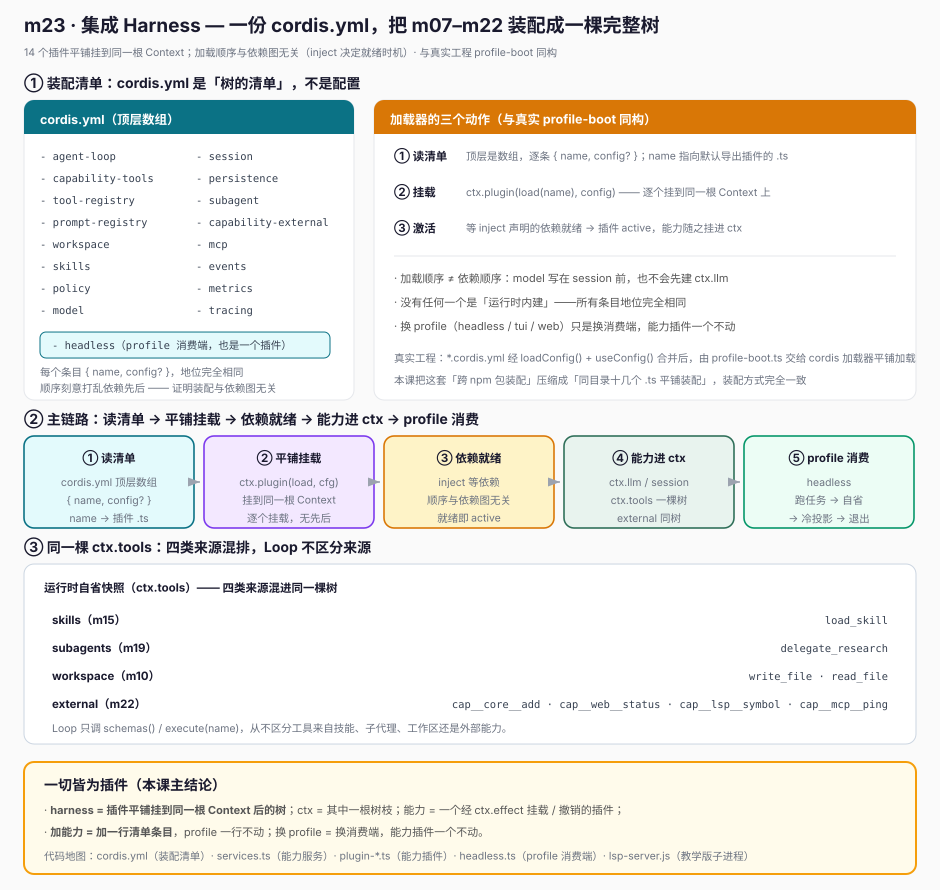
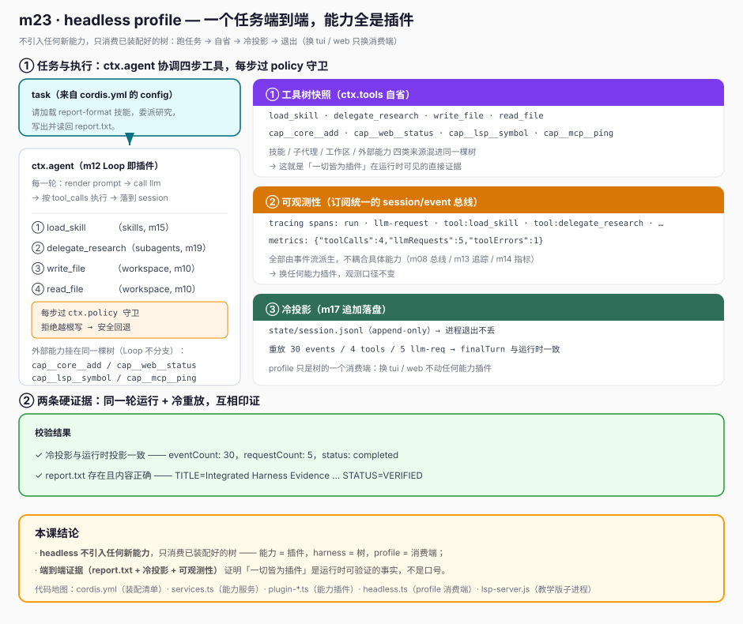

# m23 · 集成 Harness · 用 `cordis.yml` 把 m07–m22 组装成一棵完整树

> 一句话总结：**harness = 一棵由插件组合而成的树，ctx = 其中的一根树枝。**
> 本课用一份 `cordis.yml` 平铺装配 m07–m22 的代表能力（共 14 个插件），
> 由 `headless` profile 加载它、跑一个真实任务端到端，并演示冷投影 / 可观测性。

---

## 1. 目标

- 把前 22 课里分散的"能力"真正**组装成一棵 harness 树**，而不是各写各的 demo。
- 理解 `cordis.yml` 在 deepseek-harness 里的角色：**它是树的装配清单，不是配置**。
- 跑通一个真实任务：`headless` profile 加载能力树 → Agent Loop 协调模型/工具/外部能力/子代理 → 端到端产出。
- 验证核心洞察——**一切皆为插件**：模型、工具、外部能力、子代理、策略、可观测性，甚至 profile 本身，在 `cordis.yml` 里地位完全相同。

---

## 2. 前置

- 已学 m07（模型即 Provider）、m09（提示即贡献）、m10（工具树）、m11（执行前守卫）、m12（Loop 即插件 / 会话 / 提示）、m13（追踪）、m14（指标）、m15（技能）、m17（追加落盘）、m19（子代理即能力）、m22（外部能力即插件）。
- 已安装依赖：`@deepseek-ai/cordis`、`@deepseek-ai/cordis-plugin-include`、`@deepseek-ai/cordis-plugin-loader`、`tsx`（见本目录 `node_modules`）。
- 本机有 `node`（含 `fetch`、`child_process`），用于真实 HTTP 与子进程边界。

```bash
cd learn-dsh-ts/m23-integrated-harness
node --import tsx ./node_modules/@deepseek-ai/cordis/bin.js
```

---

## 3. 原理：`cordis.yml` 是树的装配清单

deepseek-harness 启动时的关键动作只有三步：

1. 读 `cordis.yml`（顶层是数组，每个条目 `{ name, config? }`）；
2. 逐个 `ctx.plugin(load(name), config)` 把插件挂到**同一根 Context** 上；
3. 等依赖就绪（`inject` 声明）后激活插件，能力随之挂载进 `ctx`。

> 注意：加载顺序与依赖图无关。cordis 不会因为你把 `model` 写在 `session` 前面就先建好 `ctx.llm`——
> 它等 `model` 需要的 `ctx.session` 真正就绪再激活它。这正是"树"能随意平铺装配的前提。

### 3.1 本课装配了什么（与 s24 `integrated-course-snapshot` 对齐）

| cordis.yml 条目 | 注册服务 | 对应课程 |
| --- | --- | --- |
| `model` | `ctx.llm` | m07 模型即 Provider |
| `session` | `ctx.session` | m08 会话 / 事件 |
| `prompt-registry` | `ctx.prompt` | m09 提示即有序贡献 |
| `tool-registry` | `ctx.tools` | m10 工具树 |
| `workspace` | `ctx.workspace` | m10 工作区 |
| `policy` | `ctx.policy` | m11 执行前守卫 |
| `skills` | `ctx.skills` | m15 技能 |
| `subagent` | `ctx.subagents` | m19 子代理即能力 |
| `capability-external` | `ctx.external` | m22 外部能力（core/web/lsp） |
| `mcp` | (挂进 `ctx.external`) | m22 延伸：外部 MCP 接入点 |
| `events` | `ctx.bus` | m08 事件总线聚合 |
| `metrics` | `ctx.metrics` | m14 运行期指标 |
| `tracing` | `ctx.tracing` | m13 调用链追踪 |
| `persistence` | `ctx.persistence` | m17 追加落盘 |
| `agent-loop` | `ctx.agent` | m12 Loop 即插件 |
| `headless` | （profile 消费端） | 本课新增雏形 |

所有条目地位完全相同——**没有任何一个是"运行时内建"**。换一个 profile（tui/web）只是把 `headless` 换成另一个消费端，能力插件一个不动。



---

## 4. 代码文件

- `cordis.yml`：顶层数组，平铺装配 14 个插件 + 各自 `config`（顺序打乱依赖先后）。
- `services.ts`：全部能力服务定义（与 m07–m22 同构的 `Service` 子类），通过 `super(ctx, name)` 注册进 `ctx`；默认 Provider 在 Service 构造内注册（避免竞争）。
- `plugin-*.ts`：每个能力一个插件文件，`apply` 内 `ctx.plugin(Service, config)` 注册服务。
- `headless.ts`：`dsh --profile headless` 雏形。它**不引入任何新能力**，只消费已装配好的树（跑任务 → 自省 → 冷投影 → 退出）。
- `lsp-server.js`：教学用 JSON-lines 子进程（证明跨进程边界真实可用）。

### 4.1 体现"一切皆为插件"的一处代码

模型 Provider、core 工具、外部能力 Provider **结构同构**，都是经 `ctx.effect` 挂载/撤销的插件：

```ts
// services.ts —— 模型 Provider 在 ModelService 构造内注册（自身 fiber active 后可安全获取 ctx.session）
class HeadlessModelProvider implements ModelProvider {
  async generate(req: GenerateRequest): Promise<ModelResponse> {
    const session = (this as any)._session as SessionService
    // 根据已发生的工具事件决定下一步调用（Loop 不硬编码停止）
    if (has('load_skill') && !saw('load_skill'))
      return { toolCalls: [{ id: 'c1', name: 'load_skill', arguments: { name: 'report-format' } }], finishReason: 'tool_calls' }
    /* ... delegate → write_file → read_file ... */
    return { text: 'Report completed and verified.', toolCalls: [], finishReason: 'stop' }
  }
}

// services.ts —— 外部能力 Provider 同样是插件，core(进程内)/web(HTTP)/lsp(子进程) 结构同构
class WebProvider implements ExternalCapabilityProvider {
  readonly namespace = 'web'
  async start() { /* 真实回环 HTTP :8765 */ }
  listTools() { return [{ name: 'status', execute: async () => (await fetch(...)).json() }] }
  close() { /* 关 server */ }
}
```

`core`（进程内函数）与 `web`（真实 HTTP）、`lsp`（真实子进程）、`mcp`（外部协议接入点）在 `CapabilityRuntime` 眼里**没有任何区别**——
它们都只是 `listTools()` 返回一组 `MountedTool`，被挂载进**同一棵** `ctx.tools`。Loop 只调 `schemas()/execute(name)`，不区分来源。

---

## 5. 运行日志（节选 + 溯源）

```text
──────── m23 集成 Harness · headless profile ────────
[profile] task: 请加载 report-format 技能，委派研究，写出并读回 report.txt。
[run] agent.loop 接手任务（load_skill → delegate → write_file → read_file）……
[run] Loop 返回: Report completed and verified.

[自省] 工具树快照:
   load_skill, delegate_research, write_file, read_file,
   cap__core__add, cap__web__status, cap__lsp__symbol, cap__mcp__ping

[观测] tracing spans:
   - run (..ms)
   - llm-request (..ms)
   - tool:load_skill (..ms)
   - llm-request (..ms)
   - tool:delegate_research (..ms)
   - ...
[观测] metrics snapshot: {"toolCalls":4,"llmRequests":5,"toolErrors":1}

=========== 冷投影（从 session.jsonl 重新投影这一轮交互）===========
eventCount: 30
toolNames: [load_skill, delegate_research, write_file, read_file]
requestCount: 5
finalTurn: "Report completed and verified."
status: completed
✅ 证据1: 冷投影与运行时投影一致
✅ 证据2: report.txt 存在且内容正确（TITLE=Integrated Harness Evidence ... STATUS=VERIFIED）
──────── headless profile 完成，退出 ────────
```

溯源要点：

- `工具树快照` 含 `load_skill`(技能) / `delegate_research`(子代理) / `write_file`·`read_file`(工作区) / `cap__core__add`·`cap__web__status`·`cap__lsp__symbol`·`cap__mcp__ping`(外部能力)——**三类来源混进同一棵 `ctx.tools`** 的证据。
- `report.txt` 内容正确——`ctx.agent`（m12 Loop）协调 `ctx.llm`（m07）、`ctx.skills`（m15）、`ctx.subagents`（m19）、`ctx.workspace`（m10）的真实结果。
- `tracing spans` / `metrics snapshot` 来自 `ctx.tracing`/`ctx.metrics`，它们**订阅统一的 `session/event` 总线**派生，不耦合具体能力——这就是 m08"事件总线"的价值。
- `冷投影 eventCount:30` 来自 `state/session.jsonl`（append-only）。进程退出不丢，可凭 JSONL 重放整轮交互——这就是 m17 的落地。

---

## 6. 心智模型

```
cordis.yml (装配清单)
   └─ 平铺加载同地位的插件 ─┬─ plugin-model        → ctx.llm (m07)
                           ├─ plugin-session      → ctx.session (m08)
                           ├─ plugin-prompt-...   → ctx.prompt (m09)
                           ├─ plugin-tool-...     → ctx.tools (m10)
                           ├─ plugin-workspace    → ctx.workspace (m10)
                           ├─ plugin-policy       → ctx.policy (m11)
                           ├─ plugin-skills       → ctx.skills (m15)
                           ├─ plugin-subagent     → ctx.subagents (m19)
                           ├─ plugin-capability-* → ctx.external (m22: core/web/lsp/mcp)
                           ├─ plugin-events/metrics/tracing → 可观测性
                           ├─ plugin-persistence  → ctx.persistence (m17)
                           ├─ plugin-agent-loop   → ctx.agent (m12)
                           └─ headless            → profile 消费端（也是插件）

根 Context（harness 树）
   ├─ ctx.llm      (m07 模型即 Provider)
   ├─ ctx.tools    (m10 工具树；m22 外部能力 / m15 技能 / m19 子代理 挂载进同一棵)
   ├─ ctx.external (m22 外部能力消费视图)
   ├─ ctx.agent    (m12 Loop 即插件，只做协调)
   └─ ctx.bus/metrics/tracing (m08/m13/m14 可观测性)

headless profile：读任务 → 跑 Loop → 端到端产出 → 自省 → 冷投影 → 退出
```

> **一切皆为插件**的落地公式：
> `能力 = 一个经 ctx.effect 挂载/撤销的插件`；`harness = 这些插件平铺挂到同一根 Context 后的树`；
> `profile = 树的一个消费端`，换 profile 不动能力。

---

## 7. 课程边界（本课新增的 vs 不涉及的）

**本课新增：**

- `cordis.yml` 作为"装配清单"的端到端用法（平铺 14 个插件，覆盖 m07–m22）。
- `headless` profile 雏形：把"加载树 + 跑任务 + 退出"从能力里剥离出来。
- 一份清单同时容纳模型 / 工具 / 外部能力 / 子代理 / 策略 / 可观测性，证明它们可共存于同一棵树。
- 冷投影（m17）+ 可观测性（m08/m13/m14）演示"树的状态可被消费端重放/度量"。

**本课不涉及：**

- 真实 `dsh` CLI 的 `applyConfig` / `--profile` 解析细节（见 §8，真实工程用 `useConfig` + `loadConfig`）。
- 多 profile 切换、TUI/Web 渲染（后续课程）。
- 真实 Azure/OpenAI Provider、真实 MCP server 接入（m07/m18/m22 已分别讲透）。

---

## 8. 真实工程对照（deepseek-harness）

deepseek-harness 用 `@deepseek-ai/cordis` 作为运行时，profile 装配与本课同构：

- `apps/cli/src/profile-boot.ts`：`boot(ctx, name, profileInput)` → `await bootWithProfile(profileConfig)`，
  其中 `profileConfig` 来自 `loadConfig()`（读 `*.cordis.yml` 后 `useConfig` 合并）。
- `agent.cordis.yml`：真实 agent preset 也是顶层数组，每个条目 `{ name: 包路径, config }`，
  例如 `@deepseek-ai/dsh-llm-azure`、`@deepseek-ai/dsh-mcp-client`、`@deepseek-ai/dsh-subagent` 平铺挂载。
- `bin.ts` 的 `applyProfile`：按 `--profile` 选 preset，交给 cordis 加载器平铺加载。

### 8.1 示例 vs deepseek-harness 真实工程实践

| 维度 | 本示例（m23） | deepseek-harness 真实工程 |
| --- | --- | --- |
| 装配清单 | `cordis.yml` 顶层数组 `{name, config}` | `*.cordis.yml` 顶层数组，经 `loadConfig` + `useConfig` 合并 |
| 加载方式 | `bin.js` 直接平铺 `ctx.plugin` | `profile-boot.ts` 的 `useLoader(loader)` 经 `cordis-plugin-loader` 加载 |
| 模型即 Provider | `HeadlessModelProvider`（脚本实现，构造内注册） | `@deepseek-ai/dsh-llm-azure` 等独立 npm 包，结构同构 |
| 外部能力 | `WebProvider`/`LspTeachingProvider`/`McpProvider` 教学实现 | `@deepseek-ai/dsh-mcp-client` / `dsh-web` / `dsh-lsp` 独立包 |
| 子代理 | `ctx.subagents` + `research` Provider | `@deepseek-ai/dsh-subagent` 独立包，Provider 同构 |
| 可观测性 | `bus`/`metrics`/`tracing` 订阅 `session/event` | 真实 telemetry 同样挂在事件总线派生 |
| profile | `headless.ts` 雏形（读任务→跑→退出） | `bin.ts` 的 `applyProfile` 支持 headless/tui/web 多端 |
| 撤销语义 | `ctx.effect` 闭包（关 server/杀子进程） | 同 `ctx.effect`，profile 卸载即整体撤销 |

> 结论：本课把"真实工程用一坨 npm 包平铺装配"压缩成"同目录十几个 .ts 平铺装配"，
> **装配方式、依赖就绪机制、effect 撤销语义、事件总线消费完全一致**，只是把跨包依赖换成了同模块文件。


